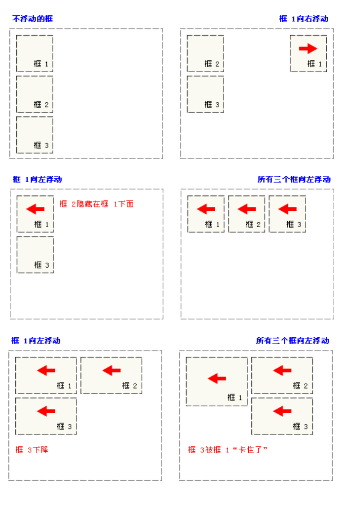

# 浮动和定位

## 浮动

### 先上一张图说话

* 1,没有浮动的时候，三个块级元素，独占一行，一次排开，这也是块级元素的特性

* 2,只有框1向右边浮动，此时框1脱离文档流，框2和框3顶上位置

* 3,只有框1向左浮动，框2和框3顶上位置，而框1脱离文档流向左靠拢在框2的上面，盖住框2

* 4,三个框左浮动，框1先抢占最左边的位置，框2框3一次跟上，条件是在框1+框2+框3的总宽小于外层元素的宽，或者外层元素没有出发BFC

* 5,和4对框3没有在一行的空间，被几下到了第二行

* 6,和5对比框3在被挤下来的过程中被框1的高度挡住，5和6反着看会更好理解

## 定位

* position的几个值（定位:给点想要的定位方式,然后可以使用left、top、right和bottom自由的将一个元素精确的放在任何你想的地方。）

  - position: static(默认值) | relative | absolute | fixed

* 用的比较多的

  - relative:相对定位是以自己为参照物移动的，和父元素无关 没有脱离文档流

  - absolute:绝对定位是相对于祖先元素中离他嵌套层次最近的加了定位的祖先元素去定位，(如果祖先元素中没有定位过得元素，则相对于body去定位,一般子元素如果使用absolute定位,则父元素必须定位,方便使用的做法)

  - fixed:相对于窗口定位，一些一键置顶的按钮，都是用的这哥们，有一点得注意一下，他并不总是相对于窗口定位的，如果他的父级元素中出现了transform不为none的情况，他会相对于有transform的父级定位
    
##### PS:浮动和定位都是比较常见的和比较重要的布局方式，很多经典的布局都是根据他们的原理来做的，像双飞翼布局就是很好的使用浮动来做的，至于定位有人说就单用div和定位就可以写一个静态网站，你非要这么做也是可以的，但是我是不建议这么做的咯！语义话这些东西我们也要考虑一下，当然不仅仅只是语义话的问题咯

<back-to-top />

<gitask />