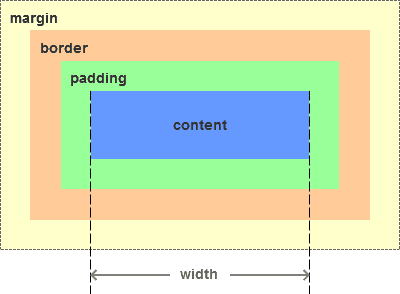

# 盒模型


### 标准盒模型
```css
box-sizing: content-box;
```


- content-box  是默认值。如果你设置一个元素的宽为100px，那么这个元素的内容区会有100px 宽，并且任何边框和内边距的宽度都会被增加到最后绘制出来的元素宽度中。

### IE盒模型
```css
box-sizing: border-box;
```


- border-box 告诉浏览器去理解你设置的边框和内边距的值是包含在width内的。也就是说，如果你将一个元素的width设为100px,那么这100px会包含其它的border和padding，内容区的实际宽度会是width减去border + padding的计算值。大多数情况下这使得我们更容易的去设定一个元素的宽高。
- border-box不包含margin

### MDN
[MDN详解](https://developer.mozilla.org/zh-CN/docs/Web/CSS/box-sizing)

<back-to-top />