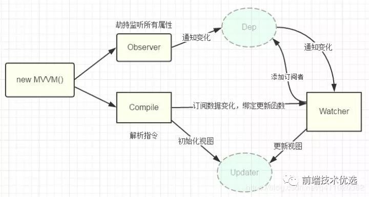

# vue中好的问题

## 什么是MVVM

MVVM最早是由微软提出来，他借鉴了桌面应用程序的MVC思想，在前端页面中，把Model用纯js对象（data）表示，view负责显示（页面），两者做到了最大限度的分离，把Model和view关联起来就是viewmodel。

viewmodel负责把model的数据同步到view显示出来，还负责把view的修改同步会model，view和model之间的同步工作完全是自动的，无需人为干涉

因此开发者只需要关注逻辑，不需要手动操作dom，不需要关注数据状态的同步问题，复杂的数据状态维护完全由mvvm来统一管理

## AMD、CMD、CommonJS、和ES6的对比（模块化开发）

1. AMD --- requireJS（异步模块）

define定义，require引入

2. CMD --- SeaJS（同步模块）

define定义，require引入

3. CommonJS  module.exports（nodeJS）

`exports.DEFAULT_COLOR = '#409eff'`定义，require引入

4. ES6特性 export/import

## vue优点

mvvm优点就是vue优点：

1. 数据和视频之间的的同步工作完全是自动的，无需人为的干涉，所以开发者只需关注业务逻辑

2. 不需要手动操作dom，不需要关注数据状态的同步问题，复杂的数据状态维护完全由mvvm来统一管理，节省了很多精力

## vue的生命周期

## 数据双向绑定原理（自我事项最简单的数据双绑）

[跳转](/JavaScript/对象.html#其他方法)

## v-if和v-show的区别

1. v-if是‘真正’的条件渲染，因为它会确保在切换过程中条件快中的子组件会被销毁和重建

2. v-show知识单纯的控制display，不管true/false都会加载和渲染

选择： 两者来比较就知道，v-if开销比较大，v-show只是在开始的时候有开销，如果是十分频繁的操作，建议使用v-show，如果是加载进入总是默认值加载，建议使用v-if

## 组件传值

1. parent---->child 通过prop

2. child---->parent 通过$emit

3. child---->child 通过eventBus/vuex

## 计算属性（computed）

计算属性的定义：

1. 当依赖的属性发生变化的时候，计算属性会重新计算，反之则使用缓存中的属性值

2. 计算属性和vue中的data的数据一样，都是响应式的，只不过他必须依赖某一个或者多个数据实现，并且只有他依赖的数据值变了。他才会更新

## watch的作用

watch主要作用是监听某个数据值的变化。和计算属性相比除了没有缓存，作用是一样的

## vue-router相关

[跳转](./vue-router的两种mode.html#vue-router)

## keep-alive

[跳转](./keep-alive.html)

## mixins

[跳转](./mixins.html)

## 自定义指令

[跳转](./自定义指令.html)

## diff算法

[跳转](./diff.html)

## vue/react中key的作用

1. 不带key的情况下，对于简单列表页渲染来说diff节点更快，这一点没有错误，但是显然这不是key的作用

2. key的作用是什么呢？
  > 首先一点要知道，key是给每一个vnode的唯一id，可以依靠key更准确更快地拿到oldVnode中对应的vnode节点

  * 更准确：带key就不可以`就地复用`，在sameNode函数` a.key === b.key `对比中可以避免就地复用的情况，所以更加准确
  * 更快：利用key的唯一性生成map对象来获取对应节点，比遍历方式更快（也就是说map是比遍历更快的）

<back-to-top />

<gitask />
