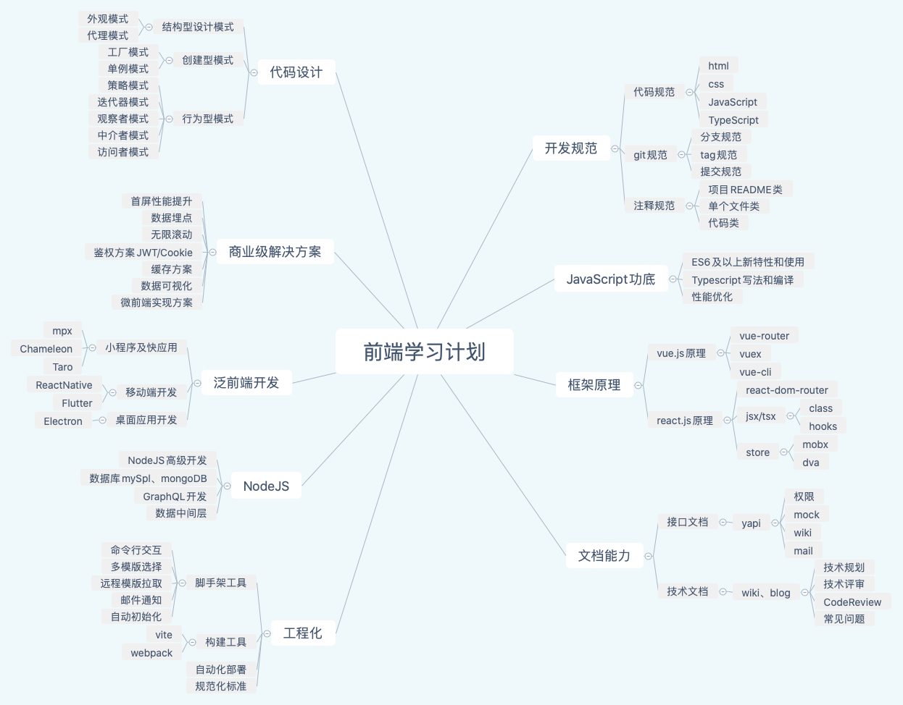

# 20210122

最近突然有个想法想整理一下前端自已涉及到那些技术，之后需要做哪些方面的深度做两个简单的思维导图

[下载原件](https://0227vera.github.io/resources/fe-system.xmind)

很多地方都还需要学习，这是今年有的一个简单的想法，希望今年能够补全一下之前的文档

补充：老龙看完之后觉得有必要添加一个代码设计相关的知识点，我这边今天添加了一个相关的模块，感谢[老龙](https://liujilongObject.github.io)

[代码设计相关来源](https://zhuanlan.zhihu.com/p/133263261)

<back-to-top />

<gitask />
