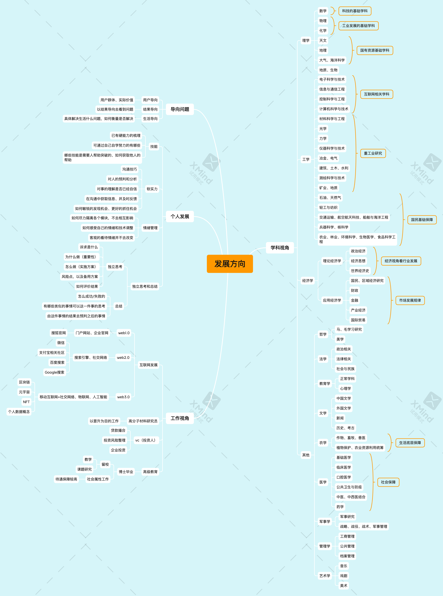

# 20220614

有个小表弟刚高考完，有空一起聊了会天，关于职业发展和专业选择的关系有一些自己的思考，记录一下

[点击下载原件](https://0227vera.github.io/resources/choose.xmind)

这样的图解当然和专业老师的分析还是有一定的差距，这一块主要是站在我的角度去看待报志愿以及对现状和之后的一些思考，可以用来参考，决策还是需要综合各方的信息来判断出一条适合自己的路

我拿我和我的几个朋友的职业来看一下关于对专业对口的要求吧

| 序号 | 职业 | 未来发展方向 | 适合的专业 | 基本技能 | 学历要求 | 不同学历薪资差异 | 信息来源 | 工作时长 | 备注（补充说明） |
| - | ----- | -------- | ------- | ------- | ------- | ------- | ------- | ------- |  ------- |
| 1 | 互联网技术 | web3.0 | 计算机相关专业 | 互联网基础知识、不同技术岗需要的知识 | 本科及以上 | 本科（一本以上）毕业：15~18K/月；研究生：20~30K/月 | 廖轩（二本本科数学专业毕业） | 4年 | 下有互联网其他的工作情况 |
| 2 | 相关产业投资人 | 投资、投行 | 经济相关专业 | 更多是在工作中的学习，学历是门槛 | 211起本科毕业、研究生毕业 |本科毕业：10~12K；研究生：14~20K；博士：30K左右；学校越好工资越高 | mg（大学同学、江财研究生金融专业毕业） | 2年 | mg认为这一行会越来越卷，看学历决定薪资，强烈不建议这一行 |
| 3 | 化工厂研发员 | 基础保障行业，前景一般 | 高分子化学相关专业 | 以学校学习的为主 | 本科、研究生毕业 | 本科毕业：5K~6K；研究生：10K+ | 肥肥（高中同学、杭师研究生高分子材料毕业） | 准备工作 | 基于现状不建议入行 |
| 4 | 高校教育 | 将来可能选择搞研究（进企业、在笑搞课题） | 偏科技的专业比较好 | 肯学习、聪明点 | 博士毕业 | 不用担心薪资问题 | 阿黎（大学同学、211大学博士在读） | 博士在读 | 强烈建议人工智能相关专业 |

备注：

1. 计算机相关专业

* 电子科学与技术
* 信息与通信工程
* 计算机科学与技术
* 计算机网络
* 网络安全

2. 经济相关专业

* 金融
* 应用经济
* 数学
* 财政

3. 高分子材料相关专业

* 化学
* 高分子材料科学

4. 人工智能相关专业

* 控制科学与工程
* 人工智能
* 大数据
* 偏数据和数据处理的专业
