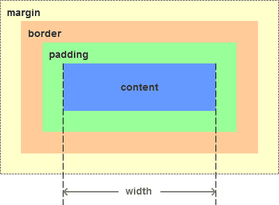

# 基础知识

层叠样式表 (Cascading Style Sheets，缩写为 CSS），是一种 样式表 语言，用来描述 HTML 或 XML（包括如 SVG、MathML、XHTML 之类的 XML 分支语言）文档的呈现。CSS 描述了在屏幕、纸质、音频等其它媒体上的元素应该如何被渲染的问题。

## 选择器

### 基本选择器

* 通配选择器 `*`, `ns|*`, `*|*`, `|*`
* 元素选择器 elementname(元素名称)
* 类选择器 .classname(类名)
* ID 选择器 #idname(ID 名)
* 属性选择器 [属性=值]

### 分组选择器

指定同时选择A（例：div、p） 和 B（例：span、i）元素。这是一种选择多个匹配元素的分组方法。

### 组合选择器

组合选择器是在两个或多个简单选择器之间建立关系的选择器，例如“ A是B的子代”或“ A与B相邻”。

* 相邻兄弟选择器 `A + B`
  * 指定A和B选择的元素具有相同的父元素，并且B选择的元素在水平方向上紧随A选择的元素。

* 普通兄弟选择器 `A ~ B`
  * 指定由A和B选择的元素共享相同的父元素，并指定A选择的元素在B选择的元素之前（但不一定紧接在B之前）。

* 子选择器 `A > B`
  * 指定B选择的元素是A选择的元素的直接子元素。

* 后代选择器 `A B`
  * 指定B选择的元素是A选择的元素的后代，但不一定是直接子代。

### 样式渲染的优先级

！important > 行内样式 > id > class > tag > 属性

### 伪类

CSS 伪类 是添加到选择器的关键字，指定要选择的元素的特殊状态。例如，:hover 可被用于在用户将鼠标悬停在按钮上时改变按钮的颜色。

例如：`:hover`、`:active`、`:visited`等

[更多伪类](https://developer.mozilla.org/zh-CN/docs/Web/CSS/Pseudo-classes)

### 伪元素

伪元素是一个附加至选择器末的关键词，允许你对被选择元素的特定部分修改样式。

例如：`:after`、`:before`

[更多伪元素](https://developer.mozilla.org/zh-CN/docs/Web/CSS/Pseudo-elements)

## 浮动、定位、flex、grid

### 浮动


* 图 1: 没有浮动的时候，三个块级元素，独占一行，一次排开，这也是块级元素的特性
* 图 2: 只有框 1 向右边浮动，此时框 1 脱离文档流，框 2 和框 3 顶上位置
* 图 3: 只有框 1 向左浮动，框 2 和框 3 顶上位置，而框 1 脱离文档流向左靠拢在框 2 的上面，盖住框 2
* 图 4: 三个框左浮动，框 1 先抢占最左边的位置，框 2 框 3 一次跟上，条件是在框 1+框 2+框 3 的总宽小于外层元素的宽，或者外层元素没有出发 BFC
* 图 5: 和 4 对框 3 没有在一行的空间，被几下到了第二行
* 图 6: 和 5 对比框 3 在被挤下来的过程中被框 1 的高度挡住，5 和 6 反着看会更好理解

### 定位

position: `static(默认值)` | `relative` | `absolute` | `fixed` | `sticky`

position属性用于指定一个元素在文档中的定位方式。`top`，`right`，`bottom` 和 `left` 属性则决定了该元素的最终位置

#### 1. relative(相对定位)

相对定位是以自己为参照物移动的，和父元素无关 没有脱离文档流

#### 2. absolute(绝对定位)

绝对定位是相对于祖先元素中离他嵌套层次最近的加了定位的祖先元素去定位，(如果祖先元素中没有定位过得元素，则相对于 body 去定位,一般子元素如果使用 absolute 定位,则父元素必须定位,方便使用的做法)

#### 3. fixed(固定定位)

元素会被移出正常文档流，并不为元素预留空间，而是通过指定元素相对于屏幕视口（viewport）的位置来指定元素位置。元素的位置在屏幕滚动时不会改变。打印时，元素会出现在的每页的固定位置。fixed 属性会创建新的层叠上下文。<font color=red>当元素祖先的 transform, perspective 或 filter 属性非 none 时，容器由视口改为该祖先。</font>

#### 4. sticky(粘性布局)

元素根据正常文档流进行定位，然后相对它的最近滚动祖先（nearest scrolling ancestor）和 containing block (最近块级祖先 nearest block-level ancestor)，包括table-related元素，基于top, right, bottom, 和 left的值进行偏移。偏移值不会影响任何其他元素的位置。

该值总是创建一个新的层叠上下文（stacking context）。注意，一个sticky元素会“固定”在离它最近的一个拥有“滚动机制”的祖先上（当该祖先的overflow 是 hidden, scroll, auto, 或 overlay时），即便这个祖先不是最近的真实可滚动祖先。这有效地抑制了任何“sticky”行为

兼容性比较差,简单的一个例子可以在 chrome 上查看效果
::: details 查看演示代码
<<< @/docs/.vuepress/public/demo/html/sticky.html
:::

### flex

Flexible Box 模型，通常被称为 flexbox，是一种**一维的布局模型**。它给 flexbox 的子元素之间提供了**强大的空间分布和对齐能力**

#### flex父元素

设置： `display: flex | inline-flex;`

主轴：`flex-direction: row(默认) | row-reverse | column(常用) | column-reverse;`

换行： `flex-wrap: nowrap(默认) | wrap(常用) | wrap-reverse;`

主轴对齐方式： `justify-content: stretch(默认) | flex-start | flex-end | center(常用) | space-around(常用) | space-between(常用);`

交叉轴对齐方式： `align-items: stretch(默认) | flex-start | flex-end | center(常用)`

**主轴和换行的简写： `flex-flow: direction(主轴) wrap(换行);`**

#### flex子元素

空间大小： `flex-basis: auto(默认) | <width>`；通常我们用width/height来代替这个属性了

空间分配： `flex-grow: 0(默认) | <number>`；如果有值按照对应的比例分配空间

收缩程度： `flex-shrink: 1(默认) | <number>`；如果有值按照对应的值缩小

**子元素设置简写： `flex: <flex-grow> <flex-shrink> <flex-basis>;`**

[Flex 布局语法教程](https://www.runoob.com/w3cnote/flex-grammar.html)
[MDN-flex](https://developer.mozilla.org/zh-CN/docs/Web/CSS/CSS_Flexible_Box_Layout)

### grid

CSS 网格布局擅长于将一个页面划分为几个主要区域，以及定义这些区域的大小、位置、层次等关系（前提是HTML生成了这些区域）。

像表格一样，网格布局让我们能够按行或列来对齐元素。 然而在布局上，网格比表格更可能做到或更简单。 例如，网格容器的子元素可以自己定位，以便它们像CSS定位的元素一样，真正的有重叠和层次。

设置网格布局： `display: grid;`

设置列数：

1. `grid-template-columns:  <width> <width> <width> ……` 根据数值不同声明不同的列数

2. `grid-template-columns: repeat(x, 50px)` x列，而且行高都为 50px

3. `grid-template-columns: repeat(auto-fill, 200px);`列宽是 200 px，但列的数量是不固定的，只要浏览器能够容纳得下，就可以放置元素

4. `grid-template-columns: 200px 1fr 2fr;`第一个列宽设置为 200px，后面剩余的宽度分为两部分，宽度分别为剩余宽度的 1/3 和 2/3

设置行数：

1. `grid-template-rows: <height> <height> ……`根据数值声明不同的行数

2、3、4 行数同列数

设置间距： `grid-gap: <number>px <number>px;` 行列之间的间距，如果只有一个值，则行列相同

关于子元素：

设置垮占几行： `grid-column-start: span <number>` 占number行

设置垮占几行： `grid-row-start: span <number>` 占number列

以上可以满足基本的日常大部分开发需求，[了解更多](https://developer.mozilla.org/zh-CN/docs/Web/CSS/CSS_Grid_Layout)

demo：

```css
.container{
  display: grid;
  // 声明3列并且每一列的宽度设置
  grid-template-columns: 100px 200px 300px;
  // 声明2行，并设置每一行的高度
  grid-template-rows: 30px 40px;
  /*  2行，而且行高都为 50px  */
  grid-template-rows: repeat(2, 50px);
  /*  表示列宽是 200 px，但列的数量是不固定的，只要浏览器能够容纳得下，就可以放置元素  */
  grid-template-columns: repeat(auto-fill, 200px);
  /* fr 单位代表网格容器中可用空间的一等份 */
  /* 表示第一个列宽设置为 200px，后面剩余的宽度分为两部分，宽度分别为剩余宽度的 1/3 和 2/3 */
  grid-template-columns: 200px 1fr 2fr;
}
/* item占2行3列 */
.item{
  grid-column-start: span 2;
  grid-row-start: span 3;
}
```

## 盒模型

当对一个文档进行布局（lay out）的时候，浏览器的渲染引擎会根据标准之一的 CSS 基础框盒模型（CSS basic box model），将所有元素表示为一个个矩形的盒子（box）

每个盒子有四个边界：内容边界 Content edge、内边距边界 Padding Edge、边框边界 Border Edge、外边框边界 Margin Edge

### 对盒模型的理解

在 CSS 中我们广泛地使用两种"盒子": 块级盒子和内联盒子,这两种盒子会在页面流和元素之间的关系表现出不同的行为

1. 块级盒子

* 盒子会在内联方向向上扩展并占据父容器在该方向上的所有可用空间,在绝大多数情况下意味着盒子会和父容易一样宽
* 每个盒子都会换行
* w/h 属性可以发挥作用
* 内边距,外边距和边框会将其他元素从当前盒子周围"推开"

2. 内联盒子

* 盒子不会产生换行
* w/h 属性不起作用
* 内边距,外边距以及边框会被应用但是不会把其他内联盒子推开


### 标准盒模型

```css
box-sizing: content-box;
```



* content-box 是默认值。如果你设置一个元素的宽为 100px，那么这个元素的内容区会有 100px 宽，并且任何边框和内边距的宽度都会被增加到最后绘制出来的元素宽度中。

### IE 盒模型

```css
box-sizing: border-box;
```


* border-box 告诉浏览器去理解你设置的边框和内边距的值是包含在 width 内的。也就是说，如果你将一个元素的 width 设为 100px,那么这 100px 会包含其它的 border 和 padding，内容区的实际宽度会是 width 减去 border + padding 的计算值。大多数情况下这使得我们更容易的去设定一个元素的宽高。
* border-box 不包含 margin

[MDN 详解](https://developer.mozilla.org/zh-CN/docs/Web/CSS/box-sizing)


<gitask />
