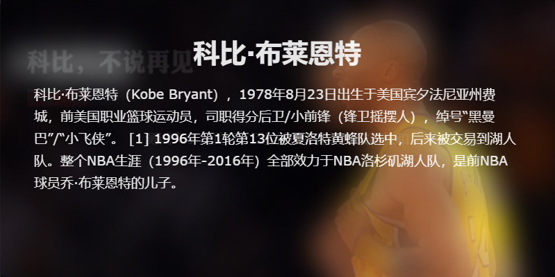
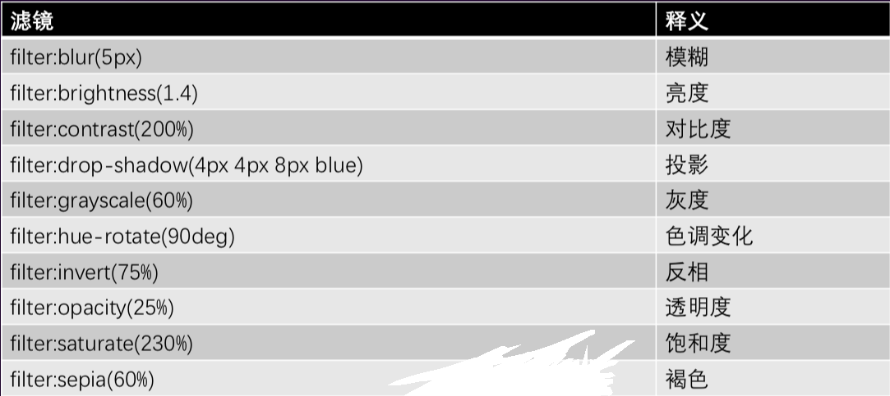
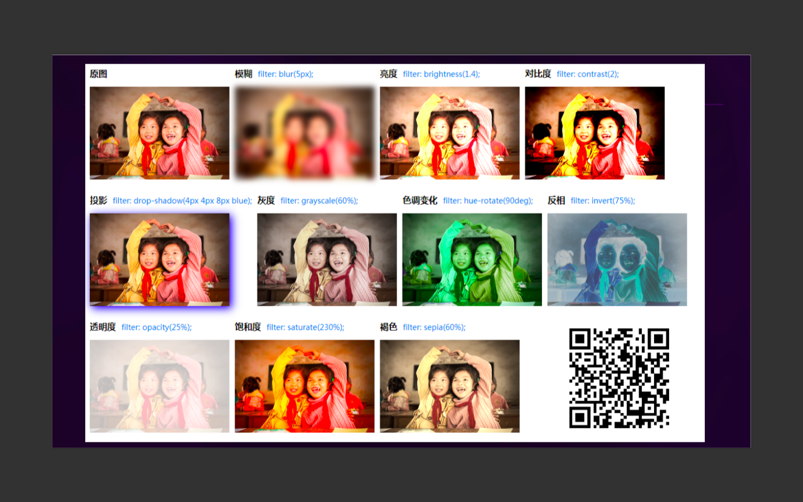

# 常见案例

## 玻璃磨砂效果

- 玻璃磨砂效果主要是用到了 blur()滤镜做出模糊元素的效果
- 通过给元素加伪类相同的背景来产生视觉误差来做到此效果
- 不说废话直接上

::: details 查看演示代码
<<< @/docs/.vuepress/public/demo/html/filterBlur.html
:::



### 关于 filter 的还有一些其他的常用属性



### 具体的简单效果



## 完成一个输入框的效果

<x-input />

## 伪类中的content

```html
<div class="test-after" data-content="test"></div>
```

```scss
.test-after{
  position:relative;
  &::after{
    content:attr(data-content);
    position:absolute;
    top:0;
    left:0;
  }
}
```

## 实现1像素的问题 (伪类+transform)

```css
.scale-1px{
  position: relative;
  border:none;
}
.scale-1px:after{
  content: '';
  position: absolute;
  bottom: 0;
  background: #000;
  width: 100%;
  height: 1px;
  -webkit-transform: scaleY(0.5);
  transform: scaleY(0.5);
  -webkit-transform-origin: 0 0;
  transform-origin: 0 0;
}
```

```css
.scale-1px{
  position: relative;
  margin-bottom: 20px;
  border:none;
}
.scale-1px:after{
  content: '';
  position: absolute;
  top: 0;
  left: 0;
  border: 1px solid #000;
  -webkit-box-sizing: border-box;
  box-sizing: border-box;
  width: 200%;
  height: 200%;
  -webkit-transform: scale(0.5);
  transform: scale(0.5);
  -webkit-transform-origin: left top;
  transform-origin: left top;
}
```

## 单（多行）行文本溢出

::: details 查看演示代码
<<< @/docs/.vuepress/public/demo/css/threedolt.css
:::

## 四周阴影

```css
qureySelect{
 box-shadow: #808080 0px 0px 10px;
}
```

## 滚动条颜色

```less
@primary-color: #449eff;
.changeScrollStyle() {
  &::-webkit-scrollbar {
    width: 4px;
    height: 4px;
    border-radius: 4px;
    transition: 0.3s background;
  }

  &::-webkit-scrollbar-thumb {
    background: none;
  }

  &:hover::-webkit-scrollbar-thumb {
    background: @primary-color;
  }
}
```

<gitask />
