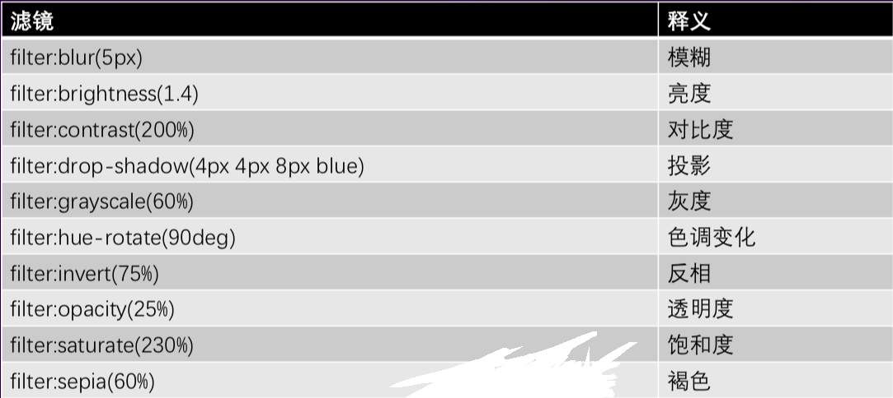

# 玻璃磨砂效果

- 玻璃磨砂效果主要是用到了 blur()滤镜做出模糊元素的效果
- 通过给元素加伪类相同的背景来产生视觉误差来做到此效果
- 不说废话直接上

::: details 查看演示代码
<<< @/docs/.vuepress/public/demo/html/filterBlur.html
:::

## 关于 filter 的还有一些其他的常用属性

## 具体的简单效果

<back-to-top />

<gitask />
