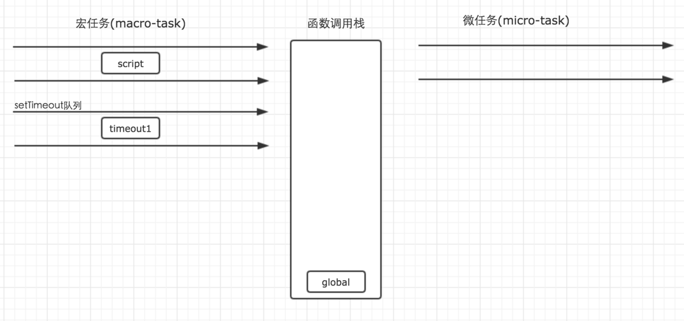
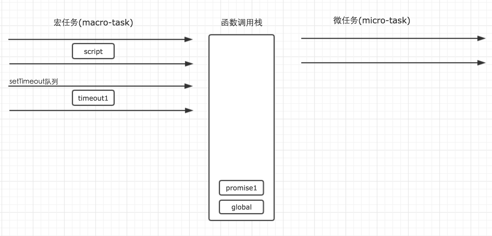
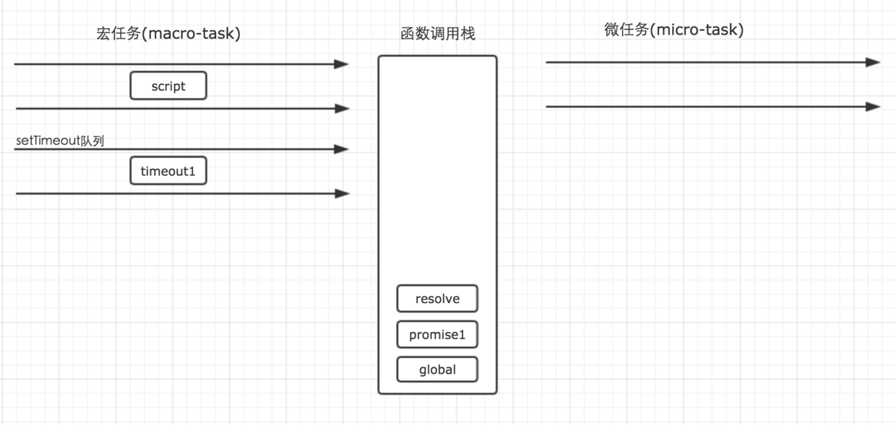
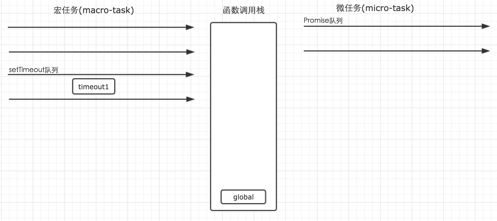
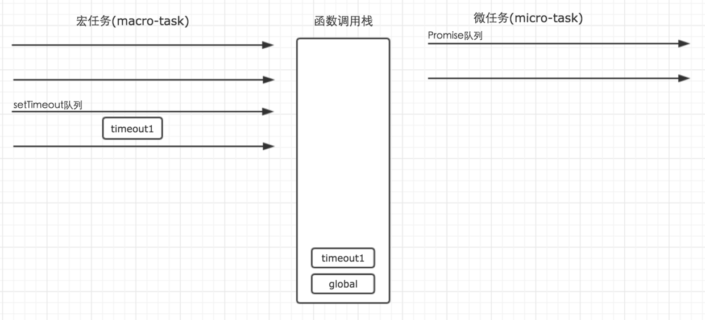

# 基础知识

## 变量定义(var、let、const)

### var

1. 变量提升
2. 全局创建
3. 函数作用域

### let

1. 块级(`{}`)作用域
2. 不可重复声明
3. 无全局创建
4. 暂存死区

### const

1. 块级(`{}`)作用域
2. 不可重复声明
3. 无全局创建
4. 暂存死区
5. 基础数据类型的常量，引用数据类型不能再次赋值，但可以通过其他方法改变

## js的数据类型及其检测

### js的数据类型

* 基础数据类型 ---> null，undefined，string，number，boolean，symbol，object

* 原始类型（Number、String、Boolean）和引用类型（Object、Array、Function）

  * 我的理解：原始类型的值，即它们是最基本的数据类型，不能再细分了，是Number你只可能是数值，是String你就是字符串，是Boolean就只可能是true或者false；但是引用类型的值他们是可以继续往下分的，对象了的值可以是数组，也可以是方法，什么样的值都可合成对象，数组和函数就不用多说了，至于null和undefined，一般将它们看成两个特殊值。

### 常见的检验数据类型的方法

* typeof运算符
* instanceof运算符
* Object.prototype.toString方法

1. typeof运算符

```js
typeof 'a' // 'string'
typeof 325 // 'number'
typeof true // 'boolean'
typeof [1,2,3] // 'object'
typeof { a: 3, b: 5 } // 'object'
typeof function(){console.log(1)} // 'function'
// 可以看的出来typeof在Array和Object上面是不准的，那接下来的两种就直接比较Array和Object
```

2. instanceof运算符

```js
let arr = [1,1,3]
let obj = { a: 1 }
arr instanceof Array // true
arr instanceof Object // true
obj instanceof Object // true
obj instanceof Array // false
// instanceof 可以说也是分不出来的，当然提前已经知道是两种中的一种也是可以分出来的
```

3. Object.prototype.toString方法

```js
Object.prototype.toString.call([]) // "[object Array]"
Object.prototype.toString.call([]) // "[object Object]"
// 所以通过利用Object原型链上面的tuString方法是可以分开的，我们可以封装得到准确的获取类型的方法
function getType (type) {
    return Object.prototype.toString.call(type).match(/\[object (.*?)\]/)[1].toLowerCase()
}
```

## 数组(Array)、对象(Object)

### array

#### 1.push()，pop()  （**）

* push往数组后面推入一个或者多个数据-------返回数组长度
* pop往数组里面推出最后一个数据--------数组的最后一个元素
  * 以上两种方法都会改变数组长度，当两着结合使用的时候构成后进先出的原则 (两者不具有链式操作的功能，从返返回值就可以看出)

```js
let a = []
a.push(1,2,3,4,5) // 5
a // [1,2,3,4,5]
a.pop() // 5

// 使用pop的一个小例子，根据文件名获取文件类型
let filename = 'xx.hhh.heihgei.jpg'
let type = filename.split('.').pop()
```

* 有关空的相关情况

```js
let b = []
b.push(2,4,5,)
b // [2,4,5]
[].pop() // undefined 不报错
```

#### 2.shift()，unshift() （*）

这两位兄弟就和之前的两哥们可以理解是相反的，但是他们也是改变数组长度的

* shift() 把数组的第一个元素推出------返回数组的第一个元素
* unshift() 在数组的前面推入数据------返回数组的长度

```js
// 直接说shift的一个应用，在实现new命名的时候
function _new(){
  let args = [].slice.call(arguments)
  let constructor = args.shift() // 将构造函数推出来
  let context = Object.create(constructor.prototype)
  let result = constructor.apply(constructor,args)
  return  (typeof result === 'object' && result !=null) ? result : context
}
// 使用shift()方法清空一个数组
let list = [1,2,3,4,5,6]
while(list.shift()){ // 可以看出[].shift() 返回undefined
  list.shift()
}
list // []
// 回头来讲这种方法是不可靠的，如果数组中有false或者 x == false 的x都是可以终止循环的，可以自己写两种情况试一下
```

#### 3.join() （*）

* join()方法以指定参数作为分隔符，将所有数组成员连接为一个字符串返回。如果不提供参数，默认用逗号分隔。

```js
let a = [1, 2, 3, 4];
a.join(' ') // '1 2 3 4'
a.join(' | ') // "1 | 2 | 3 | 4"
a.join() // "1,2,3,4"
```

> 注意：join是数组的方法，split是字符串的方法，别搞混

* 特殊情况的处理：如果数组成员是undefined或null或空位，会被转成空字符串。

```js
[undefined, null].join('#') // '#'
['a',, 'b'].join('-') // 'a--b'
```

* 通过call方法，这个方法也可以用于字符串或类似数组的对象。

```js
Array.prototype.join.call('hello', '-') // "h-e-l-l-o"
let obj = { 0: 'a', 1: 'b', length: 2 };
Array.prototype.join.call(obj, '-') // 'a-b'
// 在这个地方是不是将类数组对象转化真正的数组除了Array.prototype.slice.call(objArr)以外也可以使用join和split的结合使用
Array.prototype.join.call(obj, '-').split('-') // ?
```

#### 4.concat() （**）

* concat方法用于多个数组的合并。它将新数组的成员，添加到原数组成员的后部，然后返回一个新数组，原数组不变。

```js
['hello'].concat(['world'])
// ["hello", "world"]
['hello'].concat(['world'], ['!'])
// ["hello", "world", "!"]
[].concat({a: 1}, {b: 2})
// [{ a: 1 }, { b: 2 }]
[2].concat({a: 1})
// [2, {a: 1}]
[1, 2, 3].concat(4, 5, 6)
// [1, 2, 3, 4, 5, 6]
```

```js
// 利用数组的concat()方法对数组进行降维操作 N维 ----> 1维
  function down(arr){
  return isMulti(arr) ? down(Array.prototype.concat.apply([],arr)) : arr // 这个地方返回down的时候属于尾递归
}
function isMulti (arr){
  // let result = false
  // arr.forEach(item => {
  //   if(isArray(item)){
  //     result = true
  //   }
  // })
  // return result
  return arr.some(item => isArray(item))
}
function isArray(data){
  return Object.prototype.toString.call(data).match(/\[object (.*?)\]/)[1].toLowerCase() === 'array'
}
```

#### 5.reverse()（*）

* reverse方法用于颠倒排列数组元素，返回改变后的数组。注意，该方法将改变原数组。

```js
// 一个典型的例子，将字符串颠倒
function str_reverse(str){
  return str.split('').reverse().join('')
}
str_reverse('123456789') // 987654321
```

#### 6.slice()（*）

slice方法用于提取目标数组的一部分，返回一个新数组，原数组不变。

```js
arr.slice(start, end);
```

* 它的第一个参数为起始位置（从0开始），第二个参数为终止位置（但该位置的元素本身不包括在内）。如果省略第二个参数，则一直返回到原数组的最后一个成员。

```js
let a = ['a', 'b', 'c'];
a.slice(0) // ["a", "b", "c"]
a.slice(1) // ["b", "c"]
a.slice(1, 2) // ["b"]
a.slice(2, 6) // ["c"]
a.slice() // ["a", "b", "c"]
// 参数可以为负数
a.slice(-2) // ["b", "c"]
a.slice(-2, -1) // ["b"]
// 参数超出范围
a.slice(4) // []
a.slice(2, 1) // []
```

* 在之前已经说到过的一个应用，将类数组转为数组

```js
  Array.prototype.slice.call({ 0: 'a', 1: 'b', length: 2 })
  // ['a', 'b']
  Array.prototype.slice.call(document.querySelectorAll("div"));
  Array.prototype.slice.call(arguments);  
```

#### 7.splice() （**）

splice方法用于删除原数组的一部分成员，并可以在删除的位置添加新的数组成员，返回值是被删除的元素。注意，该方法会改变原数组。

```js
arr.splice(start, count, addElement1, addElement2, ...);
```

* splice()可以做数组任意位置的增加和删除

```js
// 删除
let a = ['a', 'b', 'c', 'd', 'e', 'f'];
a.splice(4, 2) // ["e", "f"]
a // ["a", "b", "c", "d"]
```

```js
// 增加
let a = [1, 1, 1];
a.splice(1, 0, 2) // []
a // [1, 2, 1, 1]
```

```js
// 只传一个参数
let a = [1, 2, 3, 4];
a.splice(2) // [3, 4]
a // [1, 2] // 参数也可以为负数
```

#### 8.sort()（*）

sort方法对数组成员进行排序，默认是按照字典顺序排序。排序后，原数组将被改变。所以通常我们会去改写他

```js
[10111, 1101, 111].sort(function (a, b) {
  return a - b;
})
```

```js
[
  { name: "张三", age: 30 },
  { name: "李四", age: 24 },
  { name: "王五", age: 28  }
].sort(function (o1, o2) {
  return o1.age - o2.age;
})
```

#### 9.map() （***）

map方法将数组的所有成员依次传入参数函数，然后把每一次的执行结果组成一个新数组返回。 原数组不改变，返回数组的数组长度不变

```js
[
  {uid:'dfa',name:'xx',id:'435dasfsa434'},
  {uid:'fg',name:'yy',id:'qrafasfq345tq34'},
  {uid:'gafdg',name:'zz',id:'43qe4tasfawrq34r'},
].map(item => item.id)
```

```js
let arr = ['a', 'b', 'c'];

[1, 2].map(function (e) {
  return this[e];
}, arr)
// ['b', 'c']
```

#### 10.forEach() （***）

forEach方法与map方法很相似，也是对数组的所有成员依次执行参数函数。但是，forEach方法不返回值，只用来操作数据。这就是说，如果数组遍历的目的是为了得到返回值，那么使用map方法，否则使用forEach方法。

* 在说forEach之前，先简单的用js实现一些forEach,能够懂这个原理就自然能够回使用forEach

```js
Array.prototype._forEach=function(a,b){
  for(let i = 0; i < this.length; i++){
    a.call(b,this[i],i,this) // 将a的上下文指向b，forEach中的三个参数分别是当前值，当前序号，数组本身
  }
}
```

#### 11.filter() （***）

filter方法用于过滤数组成员，满足条件的成员组成一个新数组返回。

它的参数是一个函数，所有数组成员依次执行该函数，返回结果为true的成员组成一个新数组返回。该方法不会改变原数组。

filter返回的新数组的长度是变化的，分清楚filter和map的区别

```js
let obj = { MAX: 3 };
let myFilter = function (item) {
  if (item > this.MAX) return true;
};
let arr = [2, 8, 3, 4, 1, 3, 2, 9];
arr.filter(myFilter, obj) // [8, 4, 9]
```

#### 12.some()，every()（*）

这两个方法类似“断言”（assert），返回一个布尔值，表示判断数组成员是否符合某种条件。

some方法是只要一个成员的返回值是true，则整个some方法的返回值就是true，否则返回false。

```js
var arr = [1, 2, 3, 4, 5];
arr.some(function (elem, index, arr) {
  return elem >= 3;
});
// true
arr.every(function (elem, index, arr) {
  return elem >= 3;
});
// false
```

>注意，对于空数组，some方法返回false，every方法返回true，回调函数都不会执行。

>另外，可通过some/eveny的循环来弥补forEach中无法return的问题

#### 13.reduce()，reduceRight()（*）

reduce方法和reduceRight方法依次处理数组的每个成员，最终累计为一个值。它们的差别是，reduce是从左到右处理（从第一个成员到最后一个成员），reduceRight则是从右到左（从最后一个成员到第一个成员），其他完全一样。

这两个方法在es5的时候没有用过，做统计时候特别好用，之后的开发过程中会尝试使用，也推荐使用

```js
// 累加
[1, 2, 3, 4, 5].reduce( (a, b) => a + b ) // 15
[1, 2, 3, 4, 5].reduce( (a, b) => a + b , 10 ) // 25 // a的初始值是10再挨个累加，最后的出的是25
// 对于空数组
[].redice( (a,b) => a+b ) // 报错
```

reduce方法和reduceRight方法的第一个参数都是一个函数。该函数接受以下四个参数。

1. 累积变量，默认为数组的第一个成员
2. 当前变量，默认为数组的第二个成员
3. 当前位置（从0开始）
4. 原数组

```js
// 实际应用 求数组长度最大的元素
let findLongest = entries =>  entries.reduce( (longest, entry) => entry.length > longest.length ? entry : longest, '');
findLongest(['aaa', 'bb', 'c']) // "aaa"
```

#### 14.indexOf()，lastIndexOf() （**）

indexOf方法返回给定元素在数组中第一次出现的位置，如果没有出现则返回-1。（lastIndexOf先后顺序的问题，这个地方就只说indexOf，lastIndexOf使用同理）

```js
let a = ['a', 'b', 'c'];
a.indexOf('a') // 0
a.indexOf('d') // -1
// 在开发过程中会很有作用
~a.indexOf('a') // 非0 ------------> !!~a.indexOf('a') // true 在数组里面存在a
~a.indexOf('d') // 0---------------> !!~a.indexOf('d') // false在数组里面不存在d
```

~ 会将-1--->0,其他的转化为非0，当然肯定有他自己的转化规则，这个地方不去详细说明

#### 15.链式操作 （***）

上面这些数组方法之中，有不少返回的还是数组，所以可以链式使用。

```js
let users = [
  {name: 'tom', email: 'tom@example.com'},
  {name: 'peter', email: 'peter@example.com'}
];

users
.map( user => user.email)
.filter( email = /^t/.test(email))
.forEach( email => {
  console.log(email)
})
// "tom@example.com"
```

数组的很多方法和es6联合起来使用看起来会简单很多，可以使用链式操作的方法主要看数组的返回值就好，如果返回的是数组则可以使用链式操作，在这儿也特别强调自己一遍一定要注意每一种方法数组的返回值，使用逆向思维去使用数组会清楚很多

#### ES6扩展

##### 1. 扩展运算符（`...`）

###### 含义

  扩展运算符（`spread`）是三个点（`...`），这哥们就好比是`rest`参数的逆运算，将一个数组转为用逗号分隔的参数序列

  ```js
  console.log(...[1,2,3,4,5]) // 1,2,3,4,5
  console.log(0,...[1,2,3,4,5],6) // 0,1,2,3,4,5,6
  ```

  该运算符主要用于函数调用

  ```js
  let push = (array, ...item) => {
    array.push(item)
  }
  let add = (x, y) => x+y
  let nums = [2,3]
  add(...nums) // 5
  ```

  对于空数组

  ```js
  [...[],1] // [1]
  ```

  注意：只有函数调用时，扩展运算符才可以放在圆括号中，否则会报错

  ```js
  (...[0,1,2,3,]) // error
  console.log( (...[0,1,2,3,]) ) // error
  ```

  理解扩展运算符：可以理解为把数组里面的东西拿出来，放在所在的位置

###### 替换函数的apply方法

  由于扩展运算符可以展开数组，有些关于数组上面需要用到apply的方法就可以被取代了

  ```js
  // ES5
  function f(x,y,z){
    // do something
  }
  var args = [1,2,3]
  f.apply(null,args)
  // ES6
  f(...args)
  ```

  类似的还有很多这样的处理

###### 扩展运用符的应用

1. 复制数组

```js
// ES5
let arr1 = [1,2,3,4]
let arr2 = arr1.concat()
// ES6
let arr = [1,2,3,4,5]
let newArr = [...arr]
```

2. 合并数组

```js
let arr1 = [1,2]
let arr2 = [3,4]
let arr = [...arr1, ...arr2]
```

##### 2.Array.from()

`Array.from`方法用于将两类对象转为真正的数组：类似数组的对象（`array-like object`）和可遍历（`iterable`）的对象（包括 `ES6` 新增的数据结构` Set `和`Map`）。

```js
let arrayLike = {
  '0': 'a',
  '1': 'b',
  '2': 'c',
  length: 3
}
// ES5
let arr1 = [].slice.call(arrayLike); // ['a', 'b', 'c']
// ES6
let arr2 = Array.from(arrayLike); // ['a', 'b', 'c']

Array.from([1, 2, 3]) // [1,2,3]
```

值得提醒的是，扩展运算符（`...`）也可以将某些数据结构转为数组

```js
// arguments对象
function foo() {
  const args = [...arguments];
}

// NodeList对象
[...document.querySelectorAll('div')]
```

扩展运算符背后调用的是遍历器接口（`Symbol.iterator`），如果一个对象没有部署这个接口，就无法转换。Array.from方法还支持类似数组的对象。所谓类似数组的对象，本质特征只有一点，即必须有length属性。因此，任何有length属性的对象，都可以通过Array.from方法转为数组，而此时扩展运算符就无法转换。

```js
Array.from({ length: 3 });
// [ undefined, undefined, undefined ]
...{length:3}
// error
```

实现

```js
const toArray = (() =>
  Array.from ? Array.from : obj => [].slice.call(obj)
)();
```

##### 3.Array.of()

`Array.of`方法用于将一组值，转换为数组。

```js
Array.of(3, 11, 8) // [3,11,8]
Array.of(3) // [3]
Array.of(3).length // 1
Array.of() // []
Array.of(undefined) // [undefined]
```

实现

```js
function ArrayOf(){
  return [].slice.call(arguments);
}
```

##### 4.数组实例的copyWithin()

数组实例的copyWithin()方法，在当前数组内部，将指定位置的成员复制到其他位置（会覆盖原有成员），然后返回当前数组。也就是说，使用这个方法，会修改当前数组。

```js
Array.prototype.copyWithin(target, start = 0, end = this.length)
```

参数解读：

1. target（必需）：从该位置开始替换数据。如果为负值，表示倒数。
2. start（可选）：从该位置开始读取数据，默认为 0。如果为负值，表示从末尾开始计算。
3. end（可选）：到该位置前停止读取数据，默认等于数组长度。如果为负值，表示从末尾开始计算。

这三个参数都应该是数值，如果不是会自动转为数值

替换的长度取决于start-end的长度

```js
[1, 2, 3, 4, 5].copyWithin(0, 3)
// [4, 5, 3, 4, 5]
[].copyWithin.call({length: 5, 3: 1}, 0, 3)
// {0: 1, 3: 1, length: 5}
// 将2号位到数组结束，复制到0号位
let i32a = new Int32Array([1, 2, 3, 4, 5]);
i32a.copyWithin(0, 2);
// Int32Array [3, 4, 5, 4, 5]

// 对于没有部署 TypedArray 的 copyWithin 方法的平台
// 需要采用下面的写法
[].copyWithin.call(new Int32Array([1, 2, 3, 4, 5]), 0, 3, 4);
// Int32Array [4, 2, 3, 4, 5]
```

##### 5.数组实例的find()和findIndex()

1. find() 和filter不一样，find是找到第一个满足条件的元素，然后返回这个元素，没有返回undefined
2. findIndex和find只是返回值不一样，返回元素的下标，没有返回-1

##### 6. Array.entries(), keys(), values()  <font color=red>联合for...of使用</font>

1. keys()  遍历键名
2. values() 遍历键值
3. entries() 遍历键值对

```js
for (let index of ['a', 'b'].keys()) {
  console.log(index);
}
// 0
// 1

for (let elem of ['a', 'b'].values()) {
  console.log(elem);
}
// 'a'
// 'b'

for (let [index, elem] of ['a', 'b'].entries()) {
  console.log(index, elem);
}
// 0 "a"
// 1 "b"
```

##### 7.数组实例的 flat()，flatMap()

数组的拉平，降维

数组的成员有时还是数组，`Array.prototype.flat()`用于将嵌套的数组“拉平”，变成一维的数组。该方法返回一个新数组，对原数据没有影响。

可以接收一个参数,默认为1，表示拉平一次，`Infinity` 表示不管多少层，都拉成一维数组

```js
[1, 2, [3, [4, 5]]].flat()
// [1, 2, 3, [4, 5]]
[1, 2, [3, [4, 5]]].flat(2)
// [1, 2, 3, 4, 5]
[1, [2, [3]]].flat(Infinity)
// [1, 2, 3]
[1, 2, , 4, 5].flat()
// [1, 2, 4, 5]
```

flat()会跳过空位，还有说一下注意返回值是一个新数组，没有改变老数组

flatMap()实在没有用到过，如果用到了可以看一下文档

补充说明一下，数组的完全拉平，还有其他的方法

1. 递归

2. `toString`+`split`

```js
let arr = [1, 2, [3, [4, 5]]]
console.log(arr.toString().split(','))
```

3. `replace` + `JSON.parse`

```js
let arr = [1, 2, [3, [4, 5]]]
console.log(JSON.parse(`[${arr.toString()}]`))
```

4. `reduce`方法

```js
function flatten(ary) {
    return ary.reduce((pre, cur) => {
        return pre.concat(Array.isArray(cur) ? flatten(cur) : cur);
    }, []);
}
let ary = [1, 2, [3, 4], [5, [6, 7]]]
console.log(flatten(ary))
```

5. 扩展运算符

```js
//只要有一个元素有数组，那么循环继续
while (ary.some(Array.isArray)) {
  ary = [].concat(...ary);
}
```

##### 8.数组的空位

ES5 对空位的处理，已经很不一致了，大多数情况下会忽略空位。

1. forEach(), filter(), reduce(), every() 和some()都会跳过空位。
2. map()会跳过空位，但会保留这个值
3. join()和toString()会将空位视为undefined，而undefined和null会被处理成空字符串。

```js
[,'a'].forEach((x,i) => console.log(i)); // 1

// filter方法
['a',,'b'].filter(x => true) // ['a','b']

// every方法
[,'a'].every(x => x==='a') // true

// reduce方法
[1,,2].reduce((x,y) => x+y) // 3

// some方法
[,'a'].some(x => x !== 'a') // false

// map方法
[,'a'].map(x => 1) // [,1]

// join方法
[,'a',undefined,null].join('#') // "#a##"

// toString方法
[,'a',undefined,null].toString() // ",a,,"
```

ES6则明确

[ES6数组扩展方法](http://es6.ruanyifeng.com/#docs/array)

### object

#### 对象方法

##### 本身的方法

Object.print = function (o) { console.log(o); }; 这种直接加在对象上的就是对象本身的方法,不可以被实例的对象调用

##### 实例方法

所谓实例方法就是定义在对象Object.prototype上的方法，它可以被Object实例直接使用

```js
Object.print1 = function () {
  console.log(00)
}
Object.print = function () {
  console.log(11)
}
Object.prototype.print = function () {
  console.log(22)
}
let obj = new Object()
obj.print() // 22
obj.print1() // Error
```

##### Object对象的相关方法

###### 1. Object.getPrototypeOf()

返回参数对象的原型

```js
let F = function () {};
let f = new F();
Object.getPrototypeOf(f) === F.prototype // true

// 有一些特殊的情况
// 空对象的原型是 Object.prototype
Object.getPrototypeOf({}) === Object.prototype // true

// Object.prototype 的原型是 null
Object.getPrototypeOf(Object.prototype) === null // true

// 函数的原型是 Function.prototype
function f() {}
Object.getPrototypeOf(f) === Function.prototype // true
```

###### 2. Object.setPrototypeOf()

该方法可以为参数对象设置原型，返回该参数对象，第一个参数是已有的对象，第二个参数是原型对象

```js
let a = {};
let b = {x: 1};
Object.setPrototypeOf(a, b);

Object.getPrototypeOf(a) === b // true
a.x // 1
// new命名除了之前的那种写法，也可使用这个属性
let F = function() {}
let f = Object.setPrototypeOf({}, F.prototype)
f.call(F)
```

###### 3. Object.create()

生成实例对象的方法是，使用new命令让构造函数返回一个实例。但是很多时候，只能拿到一个实例对象，他可能根本不是有构造函数生成，那么能不能从一个实例对象生成另一个实例对象呢？答案肯定是有的，没有的话，我也不会说了

JavaScript提供了Object.create方法，用来满足这种需求，该方法接收一个对象作为参数，然后以他为原型，返回一个实例对象，该实例完全继承原型对象的属性

```js
let A = {
  console:function(){
    console.log('hahahh')
  }
}

let B = Object.create(A)

Object.getPrototypeOf(B) === A // true

B.console() // hahhahh
B.console === A.console // true

```

可以看出Object.create()是以A对象为原型，生成了B对象，B继承了A所有的属性和方法

可以看一下Object.create()方法的实现

```js
if (typeof Object.create !== 'function'){
  Object.create = function (obj){
    function F () {}
    F.prototype = obj
    return new F()
  }
}
```

从上面可以看出实质是利用构造函数返回了一个实例

> ps:如果想要生成一个不继承任何属性（比如没有toString和valueOf方法）的对象，可以将Object.create的参数设为null。

下面的三种方法是一样的

```js
let obj = Object.create()
let obj = Object.create({})
let obj = Object.create(Object.prototype)
```

###### 4.Object.prototype.isPrototypeOf()

看名字就知道这个方法是用来检测某个对象是不是另一个对象的原型
两种情况

1. ----->

```js
let o1 = {}
let o2 = Object.create(o1)
let o3 = Object.create(o2)

o1.isPrototypeOF(o3) // true
o2.isPrototypeOF(o3) // true
```

可以看出可以传递的，o1和o2都是o3的原型。这表明只要实例对象处在参数对象的原型链上，isPrototypeOf方法都返回true
2. ----->

```js
Object.prototype.isPrototypeOf({}) // true
Object.prototype.isPrototypeOf([]) // true
Object.prototype.isPrototypeOf(/xyz/) // true
Object.prototype.isPrototypeOf(Object.create(null)) // false
```

由于Object.prototype处于原型链的最顶端，所以对各种实例都返回true，只有直接继承自null的对象除外。

###### 5.Object.prototype.___proto___ (私有属性)

这个地方吧，我个人觉得搞清楚__proto__和prototype是针对谁而言就好了，__proto__是对象上面操作，而prototype是构造函数上面操作，虽然这样说会有漏洞

> 根据语言标准，__proto__属性只有浏览器才需要部署，其他环境可以没有这个属性。它前后的两根下划线，表明它本质是一个内部属性，不应该对使用者暴露。因此，应该尽量少用这个属性，而是用Object.getPrototypeOf()和Object.setPrototypeOf()，进行原型对象的读写操作。

###### 6.Object.getOwnPropertyNames()

Object.getOwnPropertyNames方法返回一个数组，成员是参数对象本身的所有属性的键名，不包含继承的属性键名。

```js
Object.getOwnPropertyNames(Date)
// ["parse", "arguments", "UTC", "caller", "name", "prototype", "now", "length"] 
// 是本上的所有属性的键名
```

###### 7.Object.prototype.hasOwnProperty()

对象实例的hasOwnProperty方法返回一个布尔值，用于判断某个属性定义在对象自身，还是定义在原型链上。

```js
Date.hasOwnProperty('length') // true
Date.hasOwnProperty('toString') // false
```

上面代码表明，Date.length（构造函数Date可以接受多少个参数）是Date自身的属性，Date.toString是继承的属性。

另外，hasOwnProperty方法是 JavaScript 之中唯一一个处理对象属性时，不会遍历原型链的方法。

###### 8.对象的拷贝

如果要拷贝一个对象，需要做到下面的两件事情

1. 确保拷贝后的对象，与原对象具有相同的原型
2. 确保拷贝后的对象，与原对象具有相同的属性

基于这两点造就完了

```js
function copyObj(oriObj){
var copy = Object.create(Object.getPrototypeOf(oriObj))
  copyOwnPro(copy, oriObj)
  return copy
}
function copyOwnPro (target,source){
  Object.getOwnPropertyNames(source).forEach(function(item){
   var desc = Object.getOwnPropertyDescriptor(source, propKey);
      Object.defineProperty(target, item, desc);
  })
  return target
}
```

##### 构造函数

> 值得注意的是，通过let obj = new Object()的写法生成新对象，与字面量的写法let obj = {}是等价的。或者说，后者只是前者的一种简便写法。

```js
let o1 = {a: 1};
let o2 = new Object(o1);
o1 === o2 // true
let obj = new Object(123);
obj instanceof Number // true
// Object(value)与new Object(value)两者的语义是不同的，Object(value)表示将value转成一个对象，new Object(value)则表示新生成一个对象，它的值是value。
```

##### 静态方法

* Object.keys() (在平常开发中用的还是比较多的)
* Object.getOwnPropertyNames()----这哥们通常来讲会比Object.keys()多一个length，我一般都是用Object.keys()遍历对象属性

```js
// 需求打开一个地址参数是
let obj = {
name: 'salvatore',
id: 'adfhlw452345lahfa1234lha0per8f7',
type: 'new',
area: 'ss'
}
// 这种也可以，但是对于维护起来不是很好，如果加一个字段还要改两个地方，这个时候用Object.keys()
window.open(`/?name=${obj.name}&id=${obj.id}&type=${obj.type}&area=${obj.area}`)
let path = ''
Object.keys(obj).forEach(item => {
path += (path ? `&` : `/?`) + `${item}=${obj[item]}`
})
console.log(path) //---> /?name=salvatore&id=adfhlw452345lahfa1234lha0per8f7&type=new&area=ss
```

#### 其他方法

##### 1. 对象属性模型的相关方法

* Object.getOwnPropertyDescriptor()：获取某个属性的描述对象。
* Object.defineProperty()：通过描述对象，定义某个属性。
* Object.defineProperties()：通过描述对象，定义多个属性。

##### 2. 控制对象状态的方法

* Object.preventExtensions()：防止对象扩展。
* Object.isExtensible()：判断对象是否可扩展。
* Object.seal()：禁止对象配置。
* Object.isSealed()：判断一个对象是否可配置。
* Object.freeze()：冻结一个对象。
* Object.isFrozen()：判断一个对象是否被冻结。

##### 3. 原型链相关方法

* Object.create()：该方法可以指定原型对象和属性，返回一个新的对象。
* Object.getPrototypeOf()：获取对象的Prototype对象。

```js
// 以上这些方法我就用过Object.defineProperty()，其他的我都还没有用过，但Object.freeze()这样的还是用听过的看过的，没有过用过的
// Object.defineProperty()这哥们是做数据双向绑定的基本原理上，上代码
let input = document.getElementById('input')
let span = document.getElementById('span')
let obj = {}
Object.defineProperty(obj, 'text', {
  set(val){
    input.value = val
    span.innerHTML = val
  }
})
input.addEventListener('keyup',(event) => {
  obj.text = event.target.value
})
```

```html
<input id="input">
<span id="span"></span>
```

##### Object的实例方法

* Object.prototype.valueOf()：返回当前对象对应的值。
* Object.prototype.toString()：返回当前对象对应的字符串形式。
* Object.prototype.toLocaleString()：返回当前对象对应的本地字符串形式。
* Object.prototype.hasOwnProperty()：判断某个属性是否为当前对象自身的属性，还是继承自原型对象的属性。
* Object.prototype.isPrototypeOf()：判断当前对象是否为另一个对象的原型。
* Object.prototype.propertyIsEnumerable()：判断某个属性是否可枚举。
* 说两个我用的比较多的属性直接上代码

```js
function getType (type) {
  return Object.prototype.toString.call(type).match(/\[object, (.*?)\]/)[1].toLowerCase()
}
type({}); // "object"
type([]); // "array"
type(5); // "number"
type(null); // "null"
type(); // "undefined"
type(/abcd/); // "regex"
type(new Date()); // "date"

let typeFixed = {}
const arr = ['Null', 'Undefined', 'Object', 'Array', 'String', 'Number', 'Boolean', 'Function', 'RegExp']
arr.forEach(item => {
  typeFixed[`is${item}`] = function (type) {
    return getType(type) === item.toLowerCase()
  }
})

typeFixed.isObject({}) // true
type.isNumber(NaN) // true
type.isRegExp(/abc/) // true
```

```js
let obj = {
  p: 123
};
obj.hasOwnProperty('p') // true
obj.hasOwnProperty('toString') // false
// Object.prototype.hasOwnProperty方法接受一个字符串作为参数，返回一个布尔值，表示该实例对象自身是否具有该属性。
```

### 面向对象

#### new、this

##### new

###### 对象是什么
  
1. 对象是单个事物的抽象
2. 对象是一个容器，封装了属性（property）和方法（method）

* 属性是对象的状态，方法是对象的行为（完成某种任务）

构造函数

* 对于JS来讲，对象体系是基于构造函数（constructor）和原型链（prototype）

```js
let Salvatore = function() {
  this.status = '心态永远年轻'
}
```

从上可以看出，构造函数就是一个普通函数，但是有自己的特征和用法，Salvatore就是构造函数，为了与普通函数区别，构造函数名字的第一个字母通常大写。构造函数的特点有两个。

1. 函数体内部的this关键字，代表了所要生成的对象实例（也可以说是，谁来new它他就是指向谁，关于this的问题马上就会细细了解的）
2. 生成对象的时候，必须使用new命令

###### 如何使用new

```js
let Salvatore = function() {
  this.status = '心态永远年轻'
}
let xuanliao = new Salvatore()
xuanliao.status // '心态永远年轻'
// 再对象内部使用局部的严格模式，如果完了使用new命令直接调用回报错
function Salvatore (name,age){
  'use strict'
  this._name = name
  this._age = age
}
Salvatore() // error
// 或者利用new的target判断是否是new的对象
function Salvatore (name,age) {
  if (new.target === Salvatore) {
    return new Error('请使用new命令声明对象！')
  }
  this._name = name
  this._age = age
}
// 上面的方法是给出报错信息，让开发者能够察觉，一下还有一种办法解决new的问题
function Salvatore (name,age) {
  if (!(this instanceof Salvatore)) { // 在用! || 这样的运算符的时候一定看好范围，是否需要括号
    return new Salvatore(name,age)
  }
  this._name = name
  this._age = age
}
Salvatore('xuanliao', 25) // 可以正常使用
new Salvatore('xuanliao', 25) // 也能够使用
```

###### new命令的原理

* 使用new命令时，4步走
  1. 创建一个空对象，作为将要返回的对象实例。
  2. 将这个空对象的原型，指向构造函数的prototype属性。
  3. 将这个空对象赋值给函数内部的this关键字。
  4. 开始执行构造函数内部的代码。

<!-- todo: 用代码实现 -->
```js
function _new(constructor, params) {
  let args = [].slice.call(arguments) // 将对象转化成数组
  let constructor = args.shift() // 将构造函数取出 shift回改变数组
  let context = Object.create(constructor.prototype) // 创造一个空对象，继承构造函数的prototype的属性
  let result = constructor.apply(context, args)
  return (typyof result === 'object' && result != null) ? result : context
}
let actore = _new(Salvatore,'xuanliao',25)
```

* 对于四步走我的理解是：先生成一个空对象，然后把关于所有this的操作，属性，方法，全部挂在空对象上面，也就是把构造函数的this指向空对象
* 如果构造函数内部有return语句，而且return后面跟着一个对象，new命令会返回return语句指定的对象；否则，就会不管return语句，返回this对象。

```js
let Salvatore = function () {
  this.price = 1000;
  return 1000;
};
(new Salvatore()) === 1000 // false
// 想起分装vue中的Axios中的return new Promise()
```

##### this

###### this的涵义

* this在有些场景可以理解为“当前”的意思

```js
  let obj1 = {
    name: 'salvatore',
    say(){
      console.log(this.name)
    }
  }
  let obj2 = {
    name:'xuanliao'
  }
  obj2.say = obj1.say
  obj2.say() // xuanliao  // 此时say方法的this指向的是当前obj2这个对象
```

```js
let obj1 = {
    name: 'salvatore',
    say(){
      console.log(this.name)
    }
}
let func = obj1.say
func() // undefine this---->全局对象，但全局对象上面没有name的属性
```

* 在JS中，万物皆对象，运行环境也是对象，所以函数都是在某个对象之中运行的，而this就是函数执行时所在的环境，如果只是这样的，是不会让你我觉得云里雾里的，主要是JS的运行环境是动态切换的，导致this的指向是动态的，不可以在刚开始的时候就确定this的指向，在ES6中有了箭头函数就好了，那样就会比较好理解了

###### 绑定this的方法

* call，this，bind，都是改变this的指针，说几个应用场景

```js
<!-- call -->
<!-- 判断type的类型，比typeof,instanceof更精确 -->
Object.prototype.toString.call(type).match(/\[object (.*?)\]/)[1].toLowerCase()
<!-- js实现简易版forEach -->
Array.prototype._forEach = function (a, b) {
  for (let i = 0; i < this.length; i++) {
    <!-- 把上下文指向传进来的b -->
    a.call(b, this[i], i, this) 
  }
}
let a = [1, 1, 2, 3, 3, 4, 5]
a._forEach(function (item, index, arr) {
  console.log(index, '---->', item, arr)
  console.log(this)
}, 33)
```

```js
<!-- apply -->
<!-- 找到arr里面的最大数 最小数同理 -->
Math.max.apply(null,arr)
<!-- 利用Array.prototype.concat.apply([],arr) 多维数组降维 -->
function down(arr){
  return isMulti(arr) ? down(Array.prototype.concat.apply([],arr)) : arr
}
function isMulti (arr){
  let result = false
  arr.forEach(item => {
    if(isArray(item)){
      result = true
    }
  })
  return result
}
function isArray(type){
  return Object.prototype.toString.call(type).match(/\[object (.*?)\]/)[1].toLowerCase() === 'array'
}
<!-- 利用apply将类数组对象转为数组 -->
<!-- 非常典型的将arguments转化成数组方便使用 -->
let args = Array.prototype.slice.apply(arguments)


```

* 用bind(绑定)比较少

现在来看也不能说比较少了,在preact/react的项目中,在锁定this的时候主要还是用的这个方法(当然可以使用箭头函数去解决this指针不稳定的问题)

```js
let counter = {
  count: 0,
  inc(){
    this.count++
  }
}
let func = counter.inc.bind(counter)
<!-- 如果不使用bind，在调用的时候func显而易见的this指向全局，使用bind之后不管在任何地方调用func，this都指向counter -->
func()
counter.count === 1
<!-- bind也可以传入多个参数（锁定传参） -->
function add (x, y) {
  return x * this.m + y * this.m
}
let obj = {
  n: 5,
  m: 5
}
let add2 = add.bind(obj, 5)
add2(5) === 20
<!-- 将add中的x锁定值为5，再次调用add2的时候只需要传y即可 -->
<!-- bind与call连用 -->
let push = Function.prototype.call.bind(Array.prototype.push)
push([1,2,3,4],5)
<!-- 把call的this指向Array.prototype.push,用同样的原理apply会好理解很多 -->
let push = Function.prototypy.apply.bind(Array.prototype.push)
push([1,2,3,4],[5])
<!-- 两个的返回值一样，就是把push的第一个参数就是this，第二个参数就是要push进去的值 -->
```

#### 原型链、继承

##### 原型链

在js中,所有对象都有自己的原型对象(prototype)

  1. 任何一个对象都可以充当其他对象的原型对象
  2. 由于原型对象也是对象,所有他也又有自己的原型对象,因此就有了原型链的说法(prototype chain)

这样一层一层的往上找,总得有个头,这个头就是Object.prototype,也就是说所有对象都是继承了Object.prototype的属性,这就是所有对象都有valueOf和toString等的方法的原型,这些鬼方法都是从Object.prototype上面带过去的,那么Object.prototype这哥们的原型是什么呢?是null,null没有任何的属性和方法,也没有原型,所以原型链的尽头是null

```js
Object.getPrototypeOf(Object.prototype)
// null
```

读取对象的某个属性时，JavaScript 引擎先寻找对象本身的属性，如果找不到，就到它的原型去找，如果还是找不到，就到原型的原型去找。如果直到最顶层的Object.prototype还是找不到，则返回undefined。

如果对象自身和它的原型都定义了一个同名属性，那么优先读取对象自身的属性，这叫做“覆盖”

##### constructor属性

prototype对象有一个constructor属性，默认指向prototype对象所在的构造函数 （这就是为什么每次给prototype赋完值之后还需要把prototype.constructor重新回去自身的构造函数，就是为了保证这一点）

```js
function P() {}
let p = new P();

p.constructor === P // true
P.prototype.constructor === P && p.constructor = P.prototype.constructor // true
p.constructor === P.prototype.constructor // true
p.hasOwnProperty('constructor') // false
```

constructor属性表示原型对象与构造函数之间的关联关系，如果修改了原型对象，一般会同时修改constructor属性，防止引用的时候出错。

```js
function Person(name) {
  this.name = name;
}

Person.prototype.constructor === Person // true

Person.prototype = {
  method: function () {}
};

Person.prototype.constructor === Person // flase

Person.prototype.constructor === Object // true

// 优化的写法
Person.prototype = {
  constructor:Person
  method: function () {}
};
// 简洁并优化
Person.prototype.method = function(){
  // dosomething
}
```

##### 继承

让一个构造函数继承另一个继承函数，这个非常常见，可以分成两步实现

1. 在子类的构造函数中调用父类的构造函数

```js
function Super(name,age){
  this.name = name
  this.age = age
  this.method = function(){
    // dosomething
  }
}
function Sub(value,name,age){
  // 将父类自身的方法和属性拿过来
  Super.call(this,name,age)

  this.value = value
}
```

2. 让子类的原型指向父类的原型，这样子类就可以继承父类的原型了

```js
// 将父类上面的方法和属性也全部拿过来
Sub.prototype = Object.create(Super.prototype)
// 下面的这种写法
Sub.prototype = new Super()
// 将构造函数指向自身，防止之后的调用出现错误
Sub.prototype.constructor = Sub
```

根据以上两个的集合可以得出一种继承的写法是:

```js
function Suber(name, age) {
  this.name = name
  this.age = age
  this.method = function () {
    console.log('this is suber method')
  }
}

Suber.prototype.color = '#333333'
Suber.prototype.sayHello = function () {
  console.log('hi Hello')
}

// 先拿到自身属性和方法
function Sub(name, age, value) {
  Suber.call(this, name, age)
  this.value = value
}
// 再拿原型的属性和方法
Sub.prototype = Suber.prototype
Sub.prototype.constructor = Sub

let s = new Sub('xuanliao', 27, 'nick')
console.log('---------->', s.name, s.age, s.value, s.color)
s.sayHello()
```

3. 多重继承

```js
function S1(){}
function S2(){}
function M(){
  S1.call(this)
  S2.call(this)
}
M.prototype = Object.create(S1.prototype)
Object.assign(M.prototype, S2.prootype)
M.prototype.constructor = M
```

## 正则

什么是正则？正则表达式(regular expression)描述了一种字符串匹配的模式，可以用来检查一个字符串是否含有某种子串、将匹配的子串做替换或者从某个字符串中取出符合某个条件的子串等。说白了正则表达式就是处理字符串的，我们可以用它来处理比较复杂的字符串，别小看正则，这哥们的作用可大了（正则表达式（regular expression）是一种表达文本模式（即字符串结构）的方法，有点像字符串的模板，常常用来按照“给定模式”匹配文本。）

> 关于正则，没有语言限制，前端能用后端也能用,它不属于任何一门语言，但是任何语言都能用它

* 比较两种声明正则的写法

  1. `const regex = /aaa/` 在引擎编译代码时，就会新建正则表达式

  2. `const regex = new Regex('aaa')` 在运行时新建正则表达式

注:1的效率会比较高，而且书写简单，我的用的时候也用第一种

### 正则的实例方法

#### 1. test()

返回Boolean值

```js
const reg = /aa/g
let str = 'abgfahjldf_aa_sdhflgjs_aa_asfas'
reg.lastIndex = 29 // (str.length-2) // 这个地方注意，只有带有g修饰符的时候，这儿可以指定开始位置 ，否则这句等于没有,没有lastIndex话。每次都从0的位置重新开始
reg.test(str) // false
// ps：用于表单提交前验证检查还是比较多的
```

#### 2. exec()

返回: true--->Array,false---->null

```js
const reg1 = /a/
const reg2 = /b/
let str = '__aaacc'
reg1.exec(str) // [ 'a', index: 0, input: 'aaacc' ] 并不是像我想的二维数组，显然修饰符g在这个地方是没有用的,index表示从什么位置开始的，input表示被检测的字符串
reg2.exec(str) // null
// 而exec实际上的作用更大的是组合的使用
const reg3 = /a(b+)a/
str = 'abba_abbbba'
reg3.exec(str) // [ 'abba', 'bb', index: 0, input: 'abba_abbbba' ]

```

这个还是用的比较少的，要说真的在开发中我用的比较多的还是字符串上面的一些实例方法

### 字符串的实例方法

（注意str，reg的写法位置的不一样，不要搞混）

#### 1. match

返回: true--->Array,false---->null

* 单从返回值来看和exec()还挺像的,但是match可以带修饰符g

```js
let str = 'afhalusdfhasdbnfz'
const reg = /a/g
str.match(reg)  //  [ 'a', 'a', 'a' ] 可以检测字符中某个字符出现过几次
reg.exec(str) // [ 'a', index: 0, input: 'afhalusdfhasdbnfz' ]
```

#### 2. search

返回Number 和数组上面的indexof规则一样

```js
'ababab-aaa'.search(/a/) // 0
if(~'ababab-aaa'.search(/a/)){
  console.log('字符串上面有a')
}
```

#### 3. replace

在字符串操作的方法的情况比较复杂的情况，也是用的最多的一个

* 字符串对象的replace方法可以替换匹配的值。它接受两个参数，第一个是正则表达式，表示搜索模式，第二个是替换的内容。

```js
'aaa'.replace(/a/,'b') // 'baa'
'aaa'.replace(/a/g,'b') // 'bbb'
var str = '   #id div.class   '; // 去除dom中的前后的空格
str.replace(/^\s+|\s+$/g,'') 
// ^\s+：^以什么开头，\s空格，+多个；|：或者；\s+$：$以什么结尾
```

* replace中比较麻烦的也是比较有用的替换，replace方法的第二个参数可以使用美元符号$，用来指代所替换的内容。

  * $&：匹配的子字符串。
  * $`：匹配结果前面的文本。
  * $'：匹配结果后面的文本。
  * $n：匹配成功的第n组内容，n是从1开始的自然数。(注意组的概念)
  * $$：指代美元符号$。（在这个地方$的转义不一样）

```js
'hello world'.replace(/(\w+)\s(\w+)/, '$2 $1') // "world hello" (\w+)单词，\w文字
'abc'.replace('b', '[$`-$&-$\']')   // "a[a-b-c]c"
```

* replace第二个参数也可以是一个函数

```js
let prices = {
  'p1': '$1.99',
  'p2': '$9.99',
  'p3': '$5.00'
}
let template = '<span id="p1"></span><span id="p2"></span><span id="p3"></span>';
template = template.replace(/(<span id=")(.*?)(">)(<\/span>)/g, (match,$1,$2,$3,$4) =>{
  return $1 + $2 + $3 + prices[$2] + $4
})
// $n表示每个()里面的匹配值
```

#### 4. split

返回Array

* 这哥们其实平常用的很多，在后端数据传输和获取的时候会用到很多eg:

```js
// 获取文件名类型
let filename = 'adfdas.fadf.asdfasdfasf.png'
let type = filename.split('.').pop()
const ids = 'fasdhf;laskjdf;agasdg;fadfasdfa;asdfasdf;asdfasdf'
let arrID = ids.split(';')
```

* 以上就了解了一些方法，检测和替换的写法，其实正则最该去了解还是正则本身怎么写，有一些什么样的字符，或者特殊的字段呢

### 匹配规则

* 点字符（.）
* 位置字符（^, $）
  * ^ 表示字符串的开始位置
  * $ 表示字符串的结束位置

```js
let url = 'www.afsdfa.com.cn/?asdfa=324&asdfas=asdf'
console.log(/^((http|https):\/\/)/.test(url) ? 'a'+url : `http://${url}`)
let pathname = 'www.afsdfa.com.cn'
console.log(/\/$/.test(pathname) ? pathname : `${pathname}/`)
```

* 选择符（|）

```js
/11|22/.test('911') // true 11或者22中的一个
/fred|barney|betty/ // fred，barney，betty中的一个，而不是d或者b,y或者b
```

* 转义符 （\）

  * 需要转义的字符一共12个： `^` 、 `.` 、 `[` 、 `$` 、 `(` 、 `)` 、 `|` 、 `*` 、 `+` 、 `?` 、 `{` 、 `\`

  注: 在用`new Rexexp()`的时候需要转义两次

  > gExp作为构造函数，参数是一个字符串。但是，在字符串内部，反斜杠也是转义字符，所以它会先被反斜杠转义一次，然后再被正则表达式转义一次，因此需要两个反斜杠转义。
  
### 预定义模式(简写)

* 数字类

1. \d 匹配0-9之间的任一数字，相当于[0-9]。( d------>digit )
2. \D 匹配所有0-9以外的字符，相当于[^0-9]。

```js
let path = 'www.xxxx.com.cn/?icon=static/img/icon-xx/icon1.png'
path.match(/\d/)[0] // '1'
let n = path.replace(/\D/g,'') // '1'
```

* 词类

3. \w 匹配任意的字母、数字和下划线，相当于[A-Za-z0-9_]。( w----->word )
4. \W 除所有字母、数字和下划线以外的字符，相当于[^A-Za-z0-9_]。

```js
/\s\w*/.exec('hello world') // [" world"]
'hello world'.replace(/(\w+)\s+(\w+)/, '$2 $1') 'world hello'
```

* 空格回车类

5. \s 匹配空格（包括换行符、制表符、空格符等），相等于[ \t\r\n\v\f]。( s----->space )
6. \S 匹配非空格的字符，相当于[^ \t\r\n\v\f]。

```js
let str = 'afhjasd ashflajs afdhjas '
str.replace(/\s/,'') // 'afhjasdashflajsafdhjas'
```

* 边界值

7. \b 匹配词的边界。 ( b----->boundary )
8. \B 匹配非词边界，即在词的内部。

```js
// \b 的例子
/\bworld/.test('hello world') // true
/\bworld/.test('hello-world') // true
/\bworld/.test('helloworld') // false

// \B 的例子
/\Bworld/.test('hello-world') // false
/\Bworld/.test('helloworld') // true
```

### 字符类

* [xyz]表示：x，y，z之中任选一个匹配

```js
/[abc]/.test('asdjfkhlasj') // true
/[abc]/.test('sdjfkhlsj') // false
```

* 脱字符（^）

```js
/[^abc]/.test('asdjfkhlasj') // false
/[^abc]/.test('sdjfkhlsj') // true
// 如果方括号内的第一个字符是[^]，则表示除了字符类之中的字符，其他字符都可以匹配。比如，[^xyz]表示除了x、y、z之外都可以匹配。
// [^]表示非空，也就是说可以匹配所有的字符
```

>值得注意的是：脱字符（^）只有在字符类的第一个位置才有特殊含义，否则就是字面含义。
  
* 连字符（-）

```js
/a-z/.test('b') // false
/[a-z]/.test('b') // true
// 意思就是连字符联合[]使用的作用是更大的
// 这些简写都是合法的
[0-9.,]
[0-9a-fA-F]
[a-zA-Z0-9]
[0-31]
```

### 重复和量词

1. {n}表示恰好重复n次
2. 量词符

* ? 问号表示某个模式出现0次或1次，等同于{0, 1}。
* \* 星号表示某个模式出现0次或多次，等同于{0,}。
* \+ 加号表示某个模式出现1次或多次，等同于{1,}。

```js
// ?
let str = 'asdsaadfsg'
/(\w+)a?(\w+)/.test(str) // true
/(\w+)a*(\w+)/.test(str) // true
/(\w+)z+(\w+)/.test(str) // false
//  最好的用法还是和组()或者[]连用
```

> 关于还有很多东西可以用但是正则这东西能够了解以上的这些基本的东西，主要是方法的使用和正则怎么写就能够满足工作上面的很多需求的，当然如果还想了解更多的记录了一个链接，写的还挺好的,(贪婪模式，组之类的)

[正则相关](https://wangdoc.com/javascript/stdlib/regexp.html)

## 事件循环机制之宏任务(队列)和微任务(队列)

1. macro-task(task) --- 宏任务---script（整体代码），setTimeout，setInterval,setImmediate，I/O，UI rendering
2. micro-task(jobs) --- 微任务--- process.nextTick，Promise，Object.observe，MutationObserver
   

* 来自不同任务源的任务会进入到不同的任务队列，其中 setTimeout 与 setInterval 是同源

* 事件循环的顺序，决定了 JavaScript 代码的执行顺序。它从 script（整体代码）开始第一次循环。之后全局上下文进入函数调用栈。直到调用栈清空（只剩全局），然后执行所有的 micro-task。当所有可执行的 micro-task 执行完毕之后。循环再次从 macro-task 开始，找到其中一个队列执行完毕，然后在执行所有的 micro-task，这样一直循环下去

* 其中每一个人物的执行，无论是 macro-task 还是 micro-task，都是借助函数调用栈来完成

举一个例子来说明问题

```js
setTimeout(function () {
  console.log("timeout1");
});

new Promise(function (resolve) {
  console.log("promise1");
  for (var i = 0; i < 1000; i++) {
    i == 99 && resolve();
  }
  console.log("promise2");
}).then(function () {
  console.log("then1");
});

console.log("global1");

// 结果 promise1--->promise2--->global1--->then1--->timeout1
```

首先，事件循环从宏任务开始，这个时候，宏任务队列中，只有一个 script（整体代码）任务。每一个任务的执行顺序，都依靠函数调用栈来搞定，而当遇到任务源时，则会分发任务到对应的队列中，所以

(一)图解


第二步：script 任务执行时首先遇到了 setTimeout，setTimeout 为一个宏任务源，那么他的作用就是将任务分发到它对应的队列中。

```js
setTimeout(function () {
  console.log("timeout1");
});
```

(二)图解


第三步：script 执行时遇到 Promise 实例。Promise 构造函数中的第一个参数，是在 new 的时候执行，因此不会进入任何其他的队列，而是直接在当前任务直接执行了，而后续的.then 则会被分发到 micro-task 的 Promise 队列中去。

因此，构造函数执行时，里面的参数进入函数调用栈执行。for 循环不会进入任何队列，因此代码会依次执行，所以这里的 promise1 和 promise2 会依次输出。
(三)图解




第四步：第一个宏任务 script 执行完毕之后，就开始执行所有的可执行的微任务。这个时候，微任务中，只有 Promise 队列中的一个任务 then1，因此直接执行就行了，执行结果输出 then1，当然，他的执行，也是进入函数调用栈中执行的。


第五步：当所有的 micro-tast 执行完毕之后，表示第一轮的循环就结束了。这个时候就得开始第二轮的循环。第二轮循环仍然从宏任务 macro-task 开始。


这个时候，我们发现宏任务中，只有在 setTimeout 队列中还要一个 timeout1 的任务等待执行。因此就直接执行即可。



<gitask />
