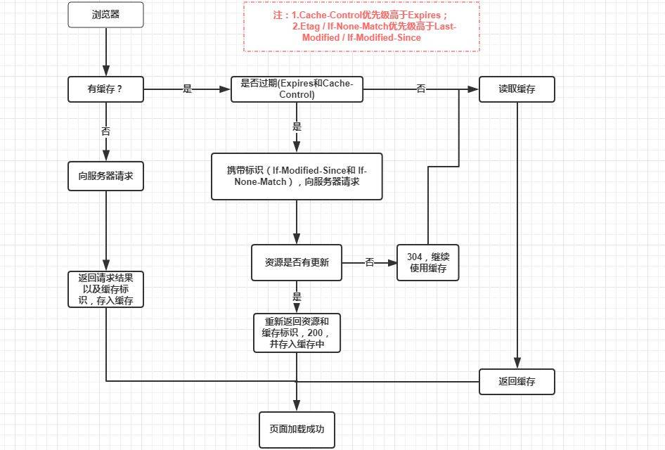

# js 中一些比较好的问题

## target 和 currentTarget 区别

1. target 返回触发事件的元素

2. currentTarget 返回绑定事件的元素

## 事件委托

事件委托利用了事件冒泡，只指定一个事件处理程序，就可以管理某一类型的所有事件。所有用到按钮的事件（多数鼠标事件和键盘事件）都适合采用事件委托技术， 使用事件委托可以节省内存。

## 事件循环

事件循环是一个单线程的循环，用于监视调用堆栈并检查是否有工作即将在任务队列中完成。如果调用堆栈为空并且任务中有回调函数，则将回调函数出堆并推送到调用堆栈中执行

[详情+例子](./task-jobs.html)

## 如何自定义事件（原生 js 提供的事件）

1. createEvent，设置事件类型，是 html 事件还是鼠标事件
2. initEvent，初始化事件，事件名称，是否允许冒泡，是否阻止自定义事件
3. dispatchEvent，触发事件

## 基础数据类型，原始数据类型，引用数据类型

[跳转](./变量.html#js的数据类型)

## var、let 和 const 的问题

[跳转](./变量.html#变量)

## 数据类型判断

[跳转 1](./变量.html#js的数据类型)

[跳转 2](./对象.html#object的实例方法)

## 数组去重

[跳转](./基本算法.html#_3-1数组去重)

## 对象的深拷贝和浅拷贝

[跳转](./js开发常用的工具函数.html#_13-object-assign-对象属性的复制，浅拷贝)

## prototype 和 proto 的关系式什么

所有的对象都有 proto 属性，他指向对象的构造函数的 prototype

## new 一个对象经历了什么，手写 new 关键字

[跳转](./面向对象.html#new命令的原理)

## this

[跳转](./面向对象.html#this)

## bind、call、apply 区别

call 和 apply 其实是一样的，区别就在于传参时参数是一个一个传或者是以一个数组的方式来传。call 和 apply 都是在调用时生效，改变调用者的 this 指向。

bind 也是改变 this 指向，不过不是在调用时生效，而是返回一个新函数。

## 继承问题

[跳转](./面向对象.html#继承)

## 闭包问题

闭包是指有权访问另一个函数作用域中的变量的函数。桥梁的概念

## cookie、localStorage、sessionStorage 区别

| 特性           | cookie                                                                       | localStorage       | sessionStorage                   |
| -------------- | ---------------------------------------------------------------------------- | ------------------ | -------------------------------- |
| 由谁初始化     | 客户端或服务器，服务器可以使用 Set-Cookie 请求头。                           | 客户端             | 客户端                           |
| 数据的生命周期 | 一般由服务器生成，可设置失效时间，如果在浏览器生成，默认是关闭浏览器之后失效 | 永久保存，可清除   | 仅在当前会话有效，关闭页面后清除 |
| 存放数据大小   | 4KB                                                                          | 5MB                | 5MB                              |
| 与服务器通信   | 每次都会携带在 HTTP 头中，如果使用 cookie 保存过多数据会带来性能问题         | 仅在客户端保存     | 仅在客户端保存                   |
| 用途           | 一般由服务器生成，用于标识用户身份                                           | 用于浏览器缓存数据 | 用于浏览器缓存数据               |
| 访问权限       | 任意窗口                                                                     | 任意窗口           | 当前页面窗口                     |

## 防抖和节流

1. 防抖(debounce)：在函数需要频繁触发时，只有当有足够空闲的时间时，才执行一次。就好像在百度搜索时，每次输入之后都有联想词弹出，这个控制联想词的方法就不可能是输入框内容一改变就触发的，他一定是当你结束输入一段时间之后才会触发。

2. 节流(thorttle)：预定一个函数只有在大于等于执行周期时才执行，周期内调用不执行。就好像你在淘宝抢购某一件限量热卖商品时，你不断点刷新点购买，可是总有一段时间你点上是没有效果，这里就用到了节流，就是怕点的太快导致系统出现 bug。

区别：在发生持续触发事件时，防抖设置事件延迟并在空闲时间去触发事件，而节流则是隔一定的时间触发一次。

## Ajax

Ajax 是使用客户端上的许多 web 技术，创建一个 web 应用的一种 web 开发技术，借助 Ajax，web 应用可以异步（在后台）向服务器发送数据和从服务器检索数据，而不会干扰现有页面的显示和行为，将数据交换与表示层分离，Ajax 允许网页和扩展 web 应用程序动态更改内容，而无需重新加载整个页面，实际上，现在通常将 json 替换为 xml，因为 js 对 json 有原生优势

使用 xml 如何封装

```js
let xmlhttp;
if (window.XMLHttpRequest) {
  xmlhttp = new XMLHttpRequest();
} else {
  xmlhttp = ActiveXObject("Microsoft.XMLHTTP"); // IE5,6
}
xmlhttp.onreadystatechange = () => {
  xmlhttp.readyState === 4 &&
  xmlhttp.status === 200 &&
  document.getElementById("myDiv").innerHTML = xmlhttp.responseText;
};

xmlhttp.open("GET", "/xxx/xxx.txt", true);
xmlhttp.send();
```

使用 Ajax 的优缺点

优点：

1. 交互性更好，来自服务端的新内容可以动态更新，无需重新加载整个页面
2. 减少与服务器的连接，因为脚本和样式只需要被请求一次
3. 状态可以维护在一个页面，js 变量和 dom 状态将得到保持，因为主容器未被重新加载
4. 基本上包括大部分 SPA 的优点

缺点：

1. 动态网页很难收藏
2. 网页 js 不能使用，则 Ajax 也不能使用
3. 有些网络爬虫不执行 js，也不会看到 js 的加载内容
4. 基本上也包括了大部分 SPA 的缺点

比较一下 Ajax 和 Fetch

1. Fetch 书写比 ajax 简单
2. fetch 基于 Promise，不可以取消，因为 Promise 做不到
3. 在默认情况下面，fetch 不接受和发送 cookies
4. fetch 只对网络报错
5. 兼容性就不用多说了

ajax 中的 post 提交数据

1. 默认是：application/x-www-form-urlencoded（可以加上 ;charset=UTF-8）key-value 字符串的提交

2. 有文件上传时候：multipart/form-data

3. 现代一点的是：application/json，可以传送各种格式的数据

## 同源策略

同源策略可防止 js 发生跨域请求，源被定义为 URI，主机名和端口号的组合。此策略可防止页面的恶意脚本通过该页面的文档对象模型，访问另一个网页上的敏感数据

## 跨域

1. jsonp: 通过回调函数的形式，执行请求之后的方法，思想来源 script 的 src

2. 后端配置允许访问（access-control-allow-origin）请求头的设置

3. webpack 中的 proxyTable

## HTTP 问题

[跳转](/网络/)

## 基本算法

[跳转](./基本算法.html#_1-排序算法)

## forEach return 的问题

我们知道`forEach` 中 `return`是无法终止循环的，但是有些之后我们又想要他停下来，又不想使用`for`循环写，有方法吗？那必须有，如果没有我还说个啥，不说了，上代码

```js
/**
 * 需求：打印3以下的数字3，之后就循环终止
 * 除了for循环，我能想到有如下三种
 */

let arr = [1, 2, 3, 4, 5, 6, 7];
// 1. forEach + try catch
try {
  arr.forEach((item) => {
    if (item > 3) throw "循环终止";
    else console.log(item);
  });
} catch (error) {
  console.log(error);
}
// 2. 利用every return false就终止的特性
arr.every((item) => {
  if (item > 3) {
    console.log("循环终止");
    return false;
  } else {
    console.log(item);
    return true;
  }
});
// 3. 利用some return true就终止的特性
arr.some((item) => {
  if (item > 3) {
    console.log("循环终止");
    return true;
  } else {
    console.log(item);
    return false;
  }
});
```

## 如何理解面向对象，以及如何理解函数式编程

## 浏览器的渲染过程

1. DNS 的查询(也就是根据域名去找对应的 ip 地址)
2. TCP 的连接(连接建立、数据传送以及连接释放)
3. HTTP 请求即响应
4. 服务端响应
5. 客户端渲染

渲染过程如下：

1. 解析 html 生成 dom 树
2. 解析 css 生成 cssom 树
3. 将 dom 树和 cssom 树规则合并在一起生成渲染树
4. 遍历渲染树开始布局，计算每一个节点的位置信息等
5. 将渲染树每个节点绘制到屏幕

## 浏览器的缓存机制

浏览器的缓存机制也就是我们说的 HTTP 缓存机制，其机制是根据 HTTP 抱文的缓存标识进行的，HTTP 抱文分为两种：

1. HTTP 请求(Request)抱文
2. HTTP 响应(Response)抱文

浏览器与服务器通信的方式为应答模式，即为：[浏览器发起 HTTP 请求 – 服务器响应该](/posts/internet/TCP的3次握手)请求，那么浏览器第一次向服务器发起该请求后拿到请求结果，会根据响应报文中 HTTP 头的缓存标识，决定是否缓存结果，是则将请求结果和缓存标识存入浏览器缓存中

1. 浏览器每次发起请求，都会先在浏览器缓存中查找该请求的结果以及缓存标识
2. 浏览器每次拿到返回的请求结果都会将该结果和缓存标识存入浏览器缓存中

缓存分为强制缓存和协商缓存

- 强制缓存

  - HTTP 响应报文中的 expires--`expires: Wed, 21 Oct 2020 03:25:41 GMT`，这个是一个绝对时间，在指定的时间前请求缓存生效
  - HTTP 响应报文中的 Cache-Control--`cache-control: max-age=600`，这是一个相对值，单位 s，也就是 600s 之内再次请求会直接使用缓存，强制缓存生效
    > 在无法确定客户端的时间是否与服务端的时间同步的情况下，Cache-Control 相比于 expires 是更好的选择，所以同时存在时，只有 Cache-Control 生效

  强制缓存的返回状态码为： 200

  但是看返回值中的 size 栏中有`from memory cache`和`from disk cache`：分别是内存中的缓存和硬盘中的缓存，浏览器对与两者的读取顺序是： memory -> disk

  1. 内存缓存：快速读取（直接写入进程的内存中，方便下次使用和快速读取）和时效性（也就是一旦关闭进程关闭，内存就会清空）

  2. 直接将缓存写入硬盘文件中，读取缓存需要对硬盘文件进行 I/O 操作，读取是复杂的，速度也是比内存慢的

- 协商缓存(协商缓存就是强制缓存失效后，浏览器携带缓存标识向服务器发起请求，由服务器根据缓存标识决定是否使用缓存的过程)
  - 协商缓存生效，返回 304
  - 协商缓存失效，返回 200 和请求结果结果

协商缓存的表示在响应的报文中为：`Last-Modified / If-Modified-Since` 和 `Etag / If-None-Match`， 其中 `Etag / If-None-Match` > `Last-Modified / If-Modified-Since`

- 也就是说： 强制缓存优先于协商缓存进行，若强制缓存(Expires 和 Cache-Control)生效则直接使用缓存，若不生效则进行协商缓存(Last-Modified / If-Modified-Since 和 Etag / If-None-Match)，协商缓存由服务器决定是否使用缓存，若协商缓存失效，那么代表该请求的缓存失效，重新获取请求结果，再存入浏览器缓存中；生效则返回 304，继续使用缓存



## 浏览器的垃圾回收机制与内存泄漏

浏览器对 js 具有自动垃圾回收机制(GC: Garbage COllecation)，也就是说，执行环境会负责管理代码执行过程中使用的内存，其原理：_垃圾收集器会定期（周期性）找出那些不再继续使用的变量，然后释放其内存_。但是这个过程不是实时的，因为其开销比较大并且 GC 时停止响应其他操作，所以垃圾回收器会按照固定的时间间隔周期性的执行。

两种实现方式：`标记清除`和`引用计数`。引用计数不太常用，标记清除较为常用。

### 1. 标记清除

js 中最常用的垃圾回收方式就是标记清除。当变量进入环境时，变量“进入环境”，被标记，离开环境时，被回收

垃圾回收器在运行的时候会给存储在内存中的所有变量都加上标记，然后它会去掉环境中的变量以及被环境中的变量引用的变量的标记（闭包），而在此之后再被加上标记的变量将被视为准备删除的变量，原因是环境中的变量已经无法访问到这些变量了。最后垃圾回收器完成内存清除工作，销毁那些带标记的值并回收它们所占用的内存空间。
到目前为止，IE9+、Firefox、Opera、Chrome、Safari 的 js 实现使用的都是标记清除的垃圾回收策略或类似的策略，只不过垃圾收集的时间间隔互不相同。

### 2. 引用计数

引用计数的含义是跟踪记录每个值被引用的次数。当声明了一个变量并将一个引用类型值赋给该变量时，则这个值的引用次数就是 1。如果同一个值又被赋给另一个变量，则该值的引用次数加 1。相反，如果包含对这个值引用的变量又取得了另外一个值，则这个值的引用次数减 1。当这个值的引用次数变成 0 时，则说明没有办法再访问这个值了，因而就可以将其占用的内存空间回收回来。这样，当垃圾回收器下次再运行时，它就会释放那些引用次数为 0 的值所占用的内存。

```js
function test() {
  var a = {}; //a的引用次数为0
  var b = a; //a的引用次数加1，为1
  var c = a; //a的引用次数再加1，为2
  var b = {}; //a的引用次数减1，为1
}
```

使用这种方法看起来好像很好理解，但当遇到循环引用的时候就很难受了

```js
var element = document.getElementById("some_element");
var myObject = new Object();
myObject.e = element;
element.o = myObject;
```

```js
window.onload = function outerFunction() {
  var obj = document.getElementById("element");
  obj.onclick = function innerFunction() {};
};
```

第二个例子：obj 引用了 `document.getElementById('element')`，onclick 方法会引用外部环境中的变量，自然也包括 obj，这种隐蔽的循环引用很难发现的

遇到这样的情况我们需要手动去解除

```js
myObject.element = null;
element.o = null;

window.onload = function outerFunction() {
  var obj = document.getElementById("element");
  obj.onclick = function innerFunction() {};
  obj = null;
};
```

在 `IE8-`格外需要注意这些事情，不过现在我们开发需要兼容 `IE8-`的情况正在一步步减少

### 内存管理

1. 何时触发垃圾回收？

垃圾回收器周期性运行，如果分配的内存非常多，那么回收工作也会很艰巨，确定垃圾回收时间间隔就变成了一个值得思考的问题。IE6 的垃圾回收是根据内存分配量运行的，当环境中存在 256 个变量、4096 个对象、64k 的字符串任意一种情况的时候就会触发垃圾回收器工作，看起来很科学，不用按一段时间就调用一次，有时候会没必要，这样按需调用不是很好吗？但是如果环境中就是有这么多变量等一直存在，现在脚本如此复杂，很正常，那么结果就是垃圾回收器一直在工作，这样浏览器就没法儿玩儿了。

微软在 IE7 中做了调整，触发条件不再是固定的，而是动态修改的，初始值和 IE6 相同，如果垃圾回收器回收的内存分配量低于程序占用内存的 15%，说明大部分内存不可被回收，设的垃圾回收触发条件过于敏感，这时候把临街条件翻倍，如果回收的内存高于 85%，说明大部分内存早就该清理了，这时候把触发条件置回。这样就使垃圾回收工作职能了很多

2. 合理的 GC 方案

- 基本方案
  Javascript 引擎基础 GC 方案是（simple GC）：mark and sweep（标记清除），即：

  1. 遍历所有可访问的对象。
  2. 回收已不可访问的对象。

- GC 缺陷
  和其他语言一样，javascript 的 GC 策略也无法避免一个问题：GC 时，停止响应其他操作，这是为了安全考虑。而 Javascript 的 GC 在 100ms 甚至以上，对一般的应用还好，但对于 JS 游戏，动画对连贯性要求比较高的应用，就麻烦了。这就是新引擎需要优化的点：避免 GC 造成的长时间停止响应。

- GC 优化策略

  1. 分代回收：区分“临时”与“持久”对象，多回收“临时对象”区（young generation），少回收“持久对象”区（tenured generation），减少每次需要遍历的对象
  2. 增量 GC：增加回收次数，牺牲的是中断次数

<back-to-top />

<gitask />
