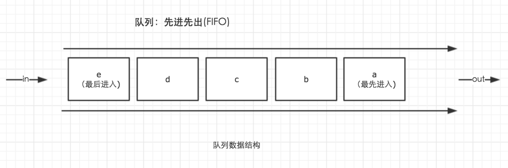
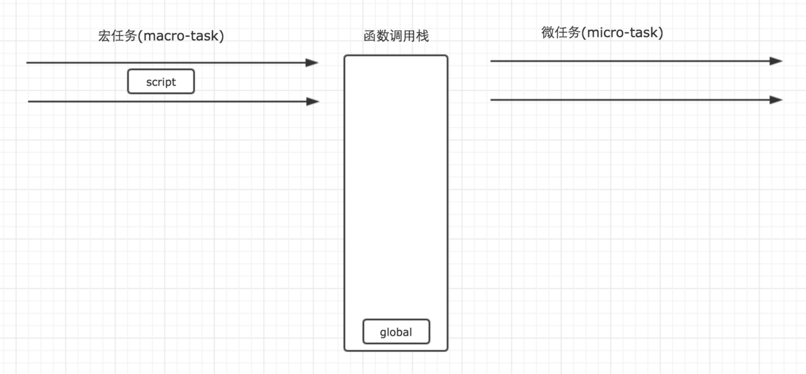
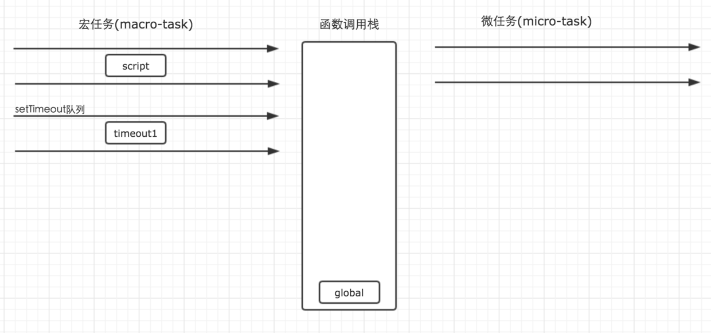
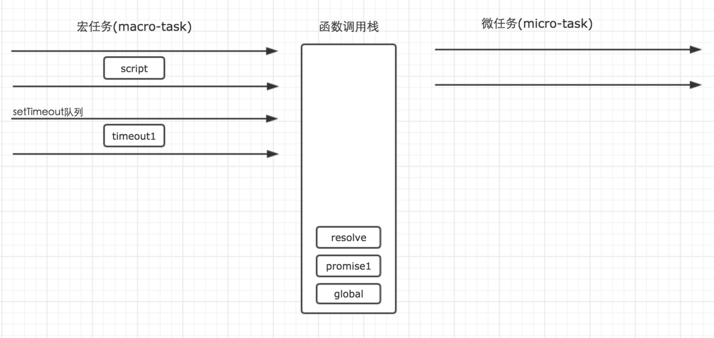
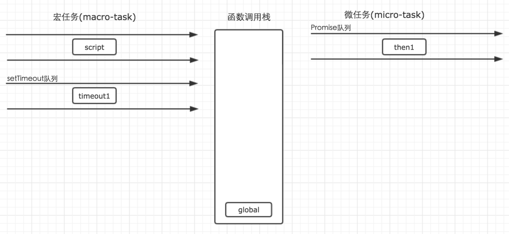
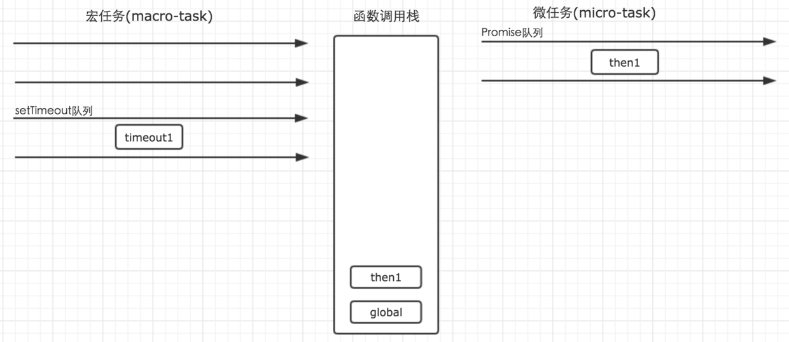
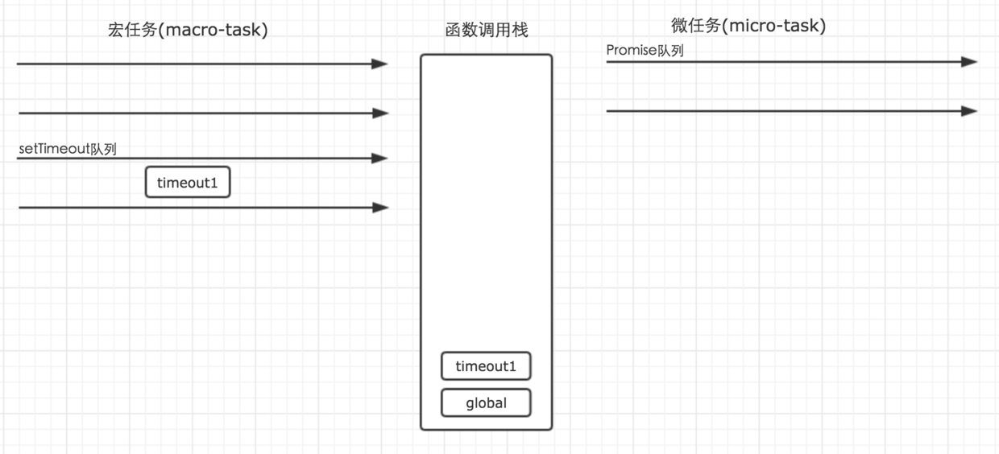

# 事件循环（EventLoop）

1. macro-task(task) --- 宏任务---script（整体代码），setTimeout，setInterval,setImmediate，I/O，UI rendering
2. micro-task(jobs) --- 微任务--- process.nextTick，Promise，Object.observe，MutationObserver
   

* 来自不同任务源的任务会进入到不同的任务队列，其中 setTimeout 与 setInterval 是同源

* 事件循环的顺序，决定了 JavaScript 代码的执行顺序。它从 script（整体代码）开始第一次循环。之后全局上下文进入函数调用栈。直到调用栈清空（只剩全局），然后执行所有的 micro-task。当所有可执行的 micro-task 执行完毕之后。循环再次从 macro-task 开始，找到其中一个队列执行完毕，然后在执行所有的 micro-task，这样一直循环下去

* 其中每一个人物的执行，无论是 macro-task 还是 micro-task，都是借助函数调用栈来完成

举一个例子来说明问题

```js
setTimeout(function () {
  console.log("timeout1");
});

new Promise(function (resolve) {
  console.log("promise1");
  for (var i = 0; i < 1000; i++) {
    i == 99 && resolve();
  }
  console.log("promise2");
}).then(function () {
  console.log("then1");
});

console.log("global1");

// 结果 promise1--->promise2--->global1--->then1--->timeout1
```

首先，事件循环从宏任务开始，这个时候，宏任务队列中，只有一个 script（整体代码）任务。每一个任务的执行顺序，都依靠函数调用栈来搞定，而当遇到任务源时，则会分发任务到对应的队列中，所以

(一)图解


第二步：script 任务执行时首先遇到了 setTimeout，setTimeout 为一个宏任务源，那么他的作用就是将任务分发到它对应的队列中。

```js
setTimeout(function () {
  console.log("timeout1");
});
```

(二)图解


第三步：script 执行时遇到 Promise 实例。Promise 构造函数中的第一个参数，是在 new 的时候执行，因此不会进入任何其他的队列，而是直接在当前任务直接执行了，而后续的.then 则会被分发到 micro-task 的 Promise 队列中去。

因此，构造函数执行时，里面的参数进入函数调用栈执行。for 循环不会进入任何队列，因此代码会依次执行，所以这里的 promise1 和 promise2 会依次输出。
(三)图解




第四步：第一个宏任务 script 执行完毕之后，就开始执行所有的可执行的微任务。这个时候，微任务中，只有 Promise 队列中的一个任务 then1，因此直接执行就行了，执行结果输出 then1，当然，他的执行，也是进入函数调用栈中执行的。


第五步：当所有的 micro-tast 执行完毕之后，表示第一轮的循环就结束了。这个时候就得开始第二轮的循环。第二轮循环仍然从宏任务 macro-task 开始。


这个时候，我们发现宏任务中，只有在 setTimeout 队列中还要一个 timeout1 的任务等待执行。因此就直接执行即可。



