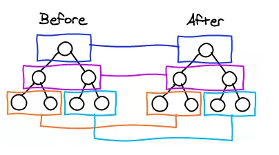
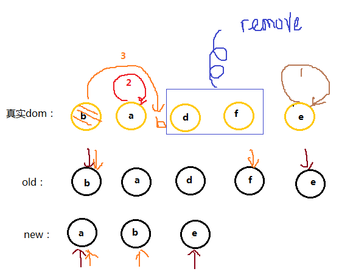
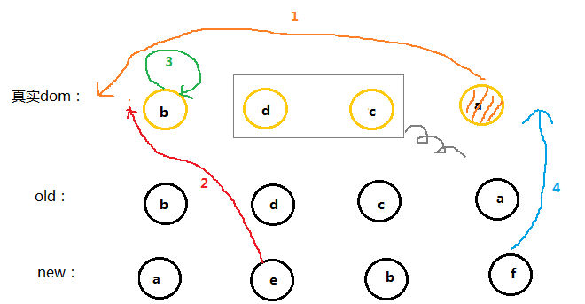

# 基础知识

因为在所有我读过的记文档中，我认为vue的文档是写的最好的；

1. [vue2.x](https://cn.vuejs.org/)

2. [vue3.x](https://v3.cn.vuejs.org/)

## vue2.x

### vue-router

前后端不分离的项目 利用 Ajax 可以在不刷新浏览器的情况下异步数据请求交互

SPA --- 单页面应用（只有一个 html 文件，整个网站的所有内容都这一个 html 里，通过 js 来处理）

页面交互式是无刷新的，<font color=red>页面跳转也是无刷新的</font>

实现单页面应用的就是现在要说的前后端分离+前端路由

实现前端路由其实就是匹配不同的 url 路径，进行解析，加载不同的组件，然后动态的渲染在指定的 html 容器中

#### 1. vue-router 中的两种模式（mode）

##### 1. hash 模式

- 在 vue 项目中的地址中一般会有一个`#`，<font color=red>这个`#`后面就是`hash`值，`hash`的变化，并不会导致浏览器向服务器发送请求，浏览器不发出请求，页面就不会刷新。</font> 但是`hash`变化会促发`hashchange`这个事件，通过这个事件我们可以知道`hash`发生了哪些变化，然后监听`hashchange`来实现页面更新的部分

`hash`模式背后的原理就是在 window 上面监听`onhaschange`事件

```js
window.onhashchange = function (event) {
  console.log(event.oldURL, event.newURL);
  // do something
  // eg:
  let hash = location.hash.slice(1);
  document.body.color = hash; // 通过页面hash来改变页面的颜色
};
```

图解如下：


根据上图，选择`mode`之后，程序根据你选择的`mode`类型创建不同的`history`对象（`hash：HashHistory`，或者`history：HTML5History`或者`abstract：AbstractHistory`）

```js
switch (mode) {
  case "history":
    this.history = new HTML5History(this, options.base);
    break;
  case "hash":
    this.history = new HashHistory(this, options.base, this.fallback);
    break;
  case "abstract":
    this.history = new AbstractHistory(this, options.base);
    break;
  default:
    if (process.env.NODE_ENV !== "production") {
      assert(false, `invalid mode: ${mode}`);
    }
}
```

`HashHistory`有两个方法：`HashHistory.push()`将新路由添加到浏览器访问历史的栈顶；和`HashHistory.replace()`替换掉当前栈顶的路由


因为 hash 发生变化的 url 会被浏览器记录（历史访问栈）下来，所以浏览器的前进后退都可以用 ===> 浏览器没有请求服务器，但是页面状态和 url 一一关联起来

##### 2. history

因为 HTML5 标准发布，多了两个 API，pushState()和 replaceState()。

<font color=red>1.通过这两个 API 可以改变 url 地址而且不会发送请求</font>

2. 不仅可以读取历史记录栈，还可以对浏览器历史记录进行修改

除此之外，还有 popState()事件，当浏览器跳转到新的状态时，将触发 popState 事件

- 修改历史状态

  1. window.history.pushState(stateObject, title, URL)
  2. window.history.replaceState(stateObject, title, URL)

- 切换历史状态

  1. history.go(-2) -------> 后退两次
  2. history.go(2) -------> 前进两次
  3. history.back() -------> 后退
  4. history.forward() -------> 前进

##### 区别

- hashchange 只能改变`#`后面的 url 片段。而 pushState()设置的新的 URL 可以式与当前 URL 同源的任意 URL

- history 模式则会将 URL 修改得就和正常请求后端 URL 一样，如果后端没有配置对应得/user/id 的路由处理，则会返回 404 错误

当刷新页面之类的操作时候，浏览器会给服务器发送请求，所以这个实现需要服务器的支持，需要把所有都重定向到根页面，这也是为什么 history 模式下面刷新总是会报 404 的问题

#### 2. router 和 route 的区别

- $router式vue-router的实例，想要导航到不同URL，则使用$router.push 或者$router.replace()或者$router.go()

- $route 是从当前跳转对象里面可以获取 name、path、query、params 等

#### 3. query 和 params 的使用区别(动态组件传参)

1. `query`参数传递，在跳转的时候是既可以使用`name`跳转也可以是使用`path`跳转的 ，（这个地方也有人说 query 只能够是 path 跳转，亲测之后用 name 也是可以的），不会在url上显示参数信息
2. `params`是路由的一部分，必须要在路由后面添加参数名，`query`是直接拼接在 url 后面的参数，没有也没有关系
3. `params`一旦设置在路由，`params`就是路由的一部分，如果路由有`params`传参，但是跳转的时候没有这个参数，会导致跳转失败，或者页面没有内容

#### 4. vue-router 的钩子函数

##### （1） 全局钩子

主要包括 beforeEach 和 afterEach

- beforeEach 函数有三个参数：

  - to：router 即将进入的路由对象
  - from：当前导航即将离开的的路由
  - next：Function，进行管道中的一个钩子，如果执行完了，则导航的状态就是 confirmed（确认的），否则为 false，终止导航

- afterEach 函数不用传 next()参数

这类钩子只要作用于全局，一般来判断权限，以及页面丢失的操作

```js
router.afterEach(( to, from, next ) => {
  const role = window.sessionStorage.getItem('querystring)
  if (!role && to.path !== '/login' ) {
    next('./login') // 如果没有身份认证则会跳到登陆页面
  } else if(to.mate.permission){ // 是否许可进入的情况
    role === 'some if' ? next() : next('/403')
  } else {
    if (!'版本判断') {
      alert('版本过低，请先升级浏览器)
    } else {
      next()
    }
  }
})
```

##### （2） 单个路由里面的钩子

主要在某个指定路由跳转时候的执行的逻辑，参数和意义和之前的一样

```js
{
  path:'/banch',
  name:'Banch',
  component:import('@/page/bamch/'),
  mate:{
    index:1
  },
  beforeEnter: (to, from, next) => { // 进路由之前

  },
  beforeLeave: (to, from, next) => { // 离开路由之前

  }
}
```

##### （3） 组件里面路由钩子

只要包括 beforeRouteEnter、beforeRouteUpdate、boforeRouteLeave，参数和意义和之前的一样

```js
beforeRouteEnter: (to, from, next) => { // 进组件之前

},
beforeRouteUpdate: (to, from, next) => { // 组件更新之前（因为路由跳转影响的组件更新）

},
boforeRouteLeave: (to, from, next) => { // 离开组件之前

},
```

### vuex

### keep-alive

前两天项目中有一个需要缓存的需求，使用了一把keep-alive，那叫一个艰难啊，开始在别人的`demo`上面模仿着写,出了各种问题还不好解决，最后还是决定撸文档来解决

`vue keep-alive`官方文档先附上，文档在这个上面就好[`vue keep-alive`](https://cn.vuejs.org/v2/api/#keep-alive)

我说一下我自己遇到的坑吧

1. name的问题，因为自己平常写代码，习惯不是很好，在写组件的时候不喜欢加上`name`属性，在文档中有明显的说明 <font color=red>匹配首先检查组件自身的`name`选项，如果`name`选项不可用，则匹配它的局部注册名称 (父组件`components`选项的键值)。匿名组件不能被匹配。</font>也即是说我自己写的组件是匿名组件，`keep-alive`不会识别，也不会缓存，<font color=red> `include`中的name为组件内部的name而非router中的name</font>

2. 路由钩子函数使用的问题，缓存肯定是要动态的，所以肯定是要结合路由钩子去实现动态缓存，哪些组件需要缓存哪些不要，什么情况需要什么情况不要缓存，这些都需要考虑，不说其中的设计问题了，给出最后的解决方案吧

```js
routes: [
    {
      path: '/',
      name: '...',
      component: () => import('@/...'),
      meta: {
        index: 1,
        keepAlive: false
      }
    },
    {
      path: '/...',
      name: '...',
      component: () => import('@/...'),
      meta: {
        index: 2,
        keepAlive: false
      }
    },
    {
      path: '/...',
      name: '...',
      component: () => import('@/...'),
      meta: {
        index: 2,
        keepAlive: true
      }
    },
    {
     path: '/...',
      name: '...',
      component: () => import('@/...'),
      meta: {
        index: 3,
        keepAlive: true
      }
    }
  ]
```

有可能需要使用缓存的情况`keepAlive`均设置为`true`

在全局的守卫中进行一次判断

```js
router.beforeEach((to, from, next) => {
  if (to.meta.keepAlive) {
    store.commit('keepAlive', to.name)
  }
  next()
})
```

上面不难看出使用store在动态存储需要使用缓存组件的名字

3. 在组件中使用路由钩子的时候next和store先后顺序的问题，一定要先将`store`里面的值修改之后再执行`next`,否则无效，这个其实很好理解，如果先跳进页面了，即使修改缓存组件也不再生效了

```js
beforeRouteEnter: (to, from, next) => {
  if (to.query.type !== Store.state.currentType && Store.state.currentType) {
    Store.commit('deleteKeepAlive', from.name)
  }
  next()
},
```

上面的业务代码不用管，只需要知道先后顺序就好

### mixins

API文档上面的讲解：

`minxins`选项接收一个混入对象的数组，这些混入实例对象可以像正常的实例对象一样包含选项，他们将在`Vue.extend()`里最终使用相同的选项合并逻辑合并。举例：如果你的混入包含一个钩子而创建组件本身也有一个，两个函数将被调用。

<font color=color>Mixins钩子按照传入顺序一次调用，并在调用组件自身的钩子之前调用</font>

为什么要使用mixins

- 和写组件的原因比较像，混入就是为了将方法提取，方便维护

使用例子：

@/mixin/sign.js

```js
import services from '@/services'
import { mapState } from 'vuex'
export default {
  data () {
    return {
      isNeedPass: false
    }
  },
  computed: {
    ...mapState({
      whoInfo: state => state.whoInfo
    })
  },
  methods: {
    getSignData (password, isNeedPass) {
      this.isNeedPass = isNeedPass
      services.getSign({ password })
        .then(res => {
          if (res.data.sweepUrl) { // 表示上传过静态图片
            this.fillData(`${res.data.sweepUrl}__${this.whoInfo.userName}__${new Date().getTime()}`)
          } else if (res.data.sweepCode) { // 表示上传过手写签批 在这个地方是需要旋转的
            this.rotateImg(res.data.sweepCode)
          } else { // 表示没有信息，这个时候需要打开手写办进行书写
            window.callDrawingBoardFun = base64Str => {
              let data = `${base64Str}__${this.whoInfo.userName}__${new Date().getTime()}`
              this.fillData(data)
            }
            window.mCall.callDrawingBoard('callDrawingBoardFun')
          }
        }).catch(err => this.$notify(err.msg || '获取手写签批失败'))
    },
    rotateImg (base64) {
      let _this = this
      let canvas = document.createElement('canvas')
      let image = new Image()
      image.onload = function () {
        canvas.height = this.width
        canvas.width = this.height
        let ctx = canvas.getContext('2d')
        ctx.rotate(-Math.PI / 180 * 90)
        ctx.drawImage(this, -canvas.height, 0)
        let base = canvas.toDataURL('image/png')
        _this.fillData(`${base}__${this.whoInfo.userName}__${new Date().getTime()}`)
      }
      image.src = base64
    },
    fillData (data) {
      if (this.isNeedPass) {
        this.closePopup(data)
      } else {
        this.$emit('CLOSE_POPUP', data)
        this.showPass = false
      }
    }

  }
}

```

在写mixin文件的时候，如果不需要data就不要写data，如果写了data或者其他的钩子之类的，一定要写对，因为`vue.extend`的时候格式不对是会报错的

@/page/form-view.vue

```vue
import sign from '@/mixin/sign.js'
export default {
  name:'form-view',
  mixins: [sign],
  data(){
    return {
      // ...
    }
  }
}
```

此处只做一个简单的demo使用，在之后的项目中如果又需要我会继续使用

### 自定义指令

在自定义指令中，我觉得可以看一下[elementUI](https://element.eleme.cn/#/zh-CN/component/installation)源码是如何实现的，学会这些在我们的项目中是很有必要的

在前两天的一个移动端项目开发中，需要一个loading，但是我们使用的组件库[vant](https://youzan.github.io/vant/#/zh-CN/intro)中的loading用起来太不方便，样式也觉得不是我们想要的，老葛就自己参照element自己封装了一个`v-loading`，借花献佛的附上代码，以便使用

loading.vue

```vue
<template>
  <transition name="fade">
    <div
      class="loading-mask"
      v-show="visible"
      :style="{ backgroundColor: background || '' }"
    >
      <van-loading type="spinner" color="#1989fa"/>
    </div>
  </transition>
</template>

<script>
export default {
  data () {
    return {
      background: null,
      visible: false
    }
  }
}
</script>

<style scoped lang="scss">
  .fade-enter-active, .fade-leave-active {
    transition: opacity .5s;
  }
  .fade-enter, .fade-leave-to {
    opacity: 0;
  }
  .loading-mask {
    position: absolute;
    z-index: 2000;
    background-color: rgba(255,255,255,.9);
    margin: 0;
    top: 0;
    right: 0;
    bottom: 0;
    left: 0;
    -webkit-transition: opacity .3s;
    transition: opacity .3s;
    & > div {
      top: 50%;
      transform: translateY(-50%);
      width: 100%;
      text-align: center;
      position: absolute;
    }
  }
</style>
```

在loading.vue中主要相当于书写样式和动画部分，这个地方和我们平常写组件比较像，没什么好说的

index.js

```js
import Vue from 'vue'
import Loading from './loading'
import { addClass, removeClass, getStyle } from '@/utils/dom.js'

// Loading构造函数
const Mask = Vue.extend(Loading)
// extend 创造一个子类

const loadingDirective = {}
// 如果想要在main.js里面Vue.use(loading) 则需要一个对象并且上面必须要有一个install方法

loadingDirective.install = Vue => {
  // 切换组件状态函数
  const toggleLoading = (el, binding) => {
    if (binding.value) {
      Vue.nextTick(() => {
        ['height', 'width'].forEach(property => {
          el.maskStyle[property] = el.getBoundingClientRect()[property] + 'px'
        })
        el.originalPosition = getStyle(el, 'position')
        insertDom(el, el, binding)
      })
    } else {
      let timer
      clearTimeout(timer)
      timer = setTimeout(() => {
        removeClass(el, 'loading-parent--relative')
        clearTimeout(timer)
      }, 300)
      el.instance.visible = false
    }
  }

  // 插入Loading
  const insertDom = (parent, el) => {
    Object.keys(el.maskStyle).forEach(property => {
      el.mask.style[property] = el.maskStyle[property]
    })
    if (el.originalPosition !== 'absolute' && el.originalPosition !== 'fixed') {
      addClass(parent, 'loading-parent--relative')
    }
    parent.appendChild(el.mask)
    el.instance.visible = true
  }

  Vue.directive('loading', {
    bind: function (el, binding) {
      const backgroundExr = el.getAttribute('loading-background')
      const mask = new Mask({
        el: document.createElement('div'),
        data: {
          background: backgroundExr
        }
      })
      el.instance = mask
      el.mask = mask.$el // mask.$el --- loading本身最外层的dom
      el.maskStyle = {} // 样式

      binding.value && toggleLoading(el, binding)
    },

    update: function (el, binding) {
      if (binding.oldValue !== binding.value) {
        toggleLoading(el, binding)
      }
    },

    unbind: function (el) {
      if (el.mask.parentNode) {
        el.mask.parentNode.removeChild(el.mask)
      }
      el.instance && el.instance.$destroy()
    }
  })
}

export default loadingDirective

```

这个js文件才是整个注册中最重要的文件，也解释一下这个文件

- loadingDirective: 最终要导出的对象，名字自定义，能看懂就行，需要挂在该对象的至少要有install方法，这个是固定写法没什么好争议的

- Vue.directive: vue指令，意思也是很明确，说一下三个方法
  - bind 绑定
  - update 值的刷新
  - unbind 解绑

- 其他关于dom操作的问题，要搞清楚dom上面的父子节点的一些关系，就很好理解了

main.js

```js
import loading from './components/loading'
Vue.use(loading)
```

### vue的nextTick

首先检查是否支持MutationObserver，如果支持，就用这个。(MutationObserver支持为IE11+)

然后判断是否支持setImmediate，如果支持，则用这个(setImmediate IE10支持)

否则就用setTimeout

> 可能你还没有注意到，`Vue`在更新` DOM `时是异步执行的。只要侦听到数据变化，`Vue`将开启一个队列，并缓冲在同一事件循环中发生的所有数据变更。如果同一个` watcher `被多次触发，只会被推入到队列中一次。这种在缓冲时去除重复数据对于避免不必要的计算和` DOM `操作是非常重要的。然后，在下一个的事件循环“tick”中，`Vue`刷新队列并执行实际 (已去重的) 工作。`Vue`在内部对异步队列尝试使用原生的`Promise.then`、`MutationObserver`和`setImmediate`，如果执行环境不支持，则会采用` setTimeout(fn, 0) `代替。[资料来源](https://cn.vuejs.org/v2/guide/reactivity.html#%E5%BC%82%E6%AD%A5%E6%9B%B4%E6%96%B0%E9%98%9F%E5%88%97)

```js
if (typeof MutationObserver !== 'undefined' && !(isWechat && isIos)) {
  var counter = 1
  var observer = new MutationObserver(nextTickHandler)
  var textNode = document.createTextNode(counter)
  observer.observe(textNode, {
    characterData: true
  })
  timerFunc = function () {
    counter = (counter + 1) % 2
    textNode.data = counter
  }
} else {
  const context = inBrowser
      ? window
      : typeof global !== 'undefined' ? global : {}
    timerFunc = context.setImmediate || setTimeout
}
return function (cb, ctx) {
    var func = ctx
      ? function () { cb.call(ctx) }
      : cb
    callbacks.push(func)
    if (pending) return
    pending = true
    timerFunc(nextTickHandler, 0)
  }
```

### diff 算法

#### 1. 当数据发生变化时，vue 是怎么样更新节点的？

渲染真是 DOM 的开销是非常大的，比如有些时候我们修改了某个数据，如果直接渲染到真是的 dom 树上会引起整个 dom 树的重绘和重排，但是我们理想状态只是需要一小块的 dom 更新

virtual DOM：先根据真是的 dom 树生成一棵虚拟的 dom 树，当 virtual DOM 某个节点的数据改变后会生成一个新的 Vnode。然后 Vnode 和 oldVnode 做对比，发现不一样的地方就直接修改真是的 dom 上，然后 oldVnode 的值为 Vnode

实际上，diff 的过程就是调用 patch 的函数，比较新旧节点，一边比较一边给真实的 dom 打补丁

#### 2. virtual DOM 和真实的 DOM 的区别

1. virtual DOM 的表现

```js
var Vnode = {
  tag: 'div',
  children: {
    { tag: 'p', text: '123' }
  }
}
```

2. 真实的 DOM

```html
<div>
  <p>123</p>
</div>
```

#### 3. diff 的比较方式

看虚拟的 dom 中的结构就知道，diff 的比较只会在同层级进行比较，不会跨层级进行比较

```html
<div>
  <p>123</p>
</div>

<div>
  <span>456</span>
</div>
```

根据上面的代码，比较同一层的两个 div 以及第二层的 p 和 span，但是不会拿 div 和 span 进行比较，如下图的成对比较的情况：



#### 4. diff 的流程图


#### patch 方法

```js
function patch(oldVnode, vnode) {
  // some code
  if (sameVnode(oldVnode, vnode)) {
    patchVnode(oldVnode, vnode);
  } else {
    const oEl = oldVnode.el; // 当前oldVnode对应的真实元素节点
    let parentEle = api.parentNode(oEl); // 父元素
    createEle(vnode); // 根据Vnode生成新元素
    if (parentEle !== null) {
      api.insertBefore(parentEle, vnode.el, api.nextSibling(oEl)); // 将新元素添加进父元素
      api.removeChild(parentEle, oldVnode.el); // 移除以前的旧元素节点
      oldVnode = null;
    }
  }
  // some code
  return vnode;
}
```

先判断是否值得去比较这个节点，如果值得去比较的话，如果值得比较的话执行 patchVnode（值得比较说明这个节点没有改变，如果改变了直接替换掉旧节点）
不值得比较的话直接替换掉 oldVnode

那么有一个问题，如果父节点不一样，子节点之后的全部一样呢？这种情况会直接替换父节点，在 diff 也有一种数据单向流，上级修改了下级不管是否修改都会直接上级替换

```js
function sameVnode(a, b) {
  return (
    a.key === b.key && // key值
    a.tag === b.tag && // 标签名
    a.isComment === b.isComment && // 是否为注释节点
    // 是否都定义了data，data包含一些具体信息，例如onclick , style
    isDef(a.data) === isDef(b.data) &&
    sameInputType(a, b) // 当标签是<input>的时候，type必须相同
  );
}
```

如果两个节点值得去比较的时候 patchVnode 方式是什么呢？

```js
patchVnode (oldVnode, vnode) {
    const el = vnode.el = oldVnode.el
    let i, oldCh = oldVnode.children, ch = vnode.children
    if (oldVnode === vnode) return
    if (oldVnode.text !== null && vnode.text !== null && oldVnode.text !== vnode.text) {
        api.setTextContent(el, vnode.text)
    }else {
        updateEle(el, vnode, oldVnode)
        if (oldCh && ch && oldCh !== ch) {
            updateChildren(el, oldCh, ch)
        }else if (ch){
            createEle(vnode) //create el's children dom
        }else if (oldCh){
            api.removeChildren(el)
        }
    }
}
```

实际上 patchVnode 需要完成的事情是：

1. 找到对应真是的 dom--->el
2. 判断 Vnode 和 oldVnode 是否指向同一个对象，如果是，就是没有改变
3. 如果是文本且文本不一样，赋值
4. 如果 oldVnode 有子节点而 Vnode 没有，直接删除子节点
5. 如果 oldVnode 没有子节点，而 Vnode 有，则将 Vnode 真实化之后添加到 el
6. 如果都有子节点，执行 updateChildren 函数比较子节点

可想而知道上面的 1->5 都是比较好实现，但是第 6 点想想都是一个恶心的过程

```js
updateChildren (parentElm, oldCh, newCh) {
  let oldStartIdx = 0, newStartIdx = 0
  let oldEndIdx = oldCh.length - 1
  let oldStartVnode = oldCh[0]
  let oldEndVnode = oldCh[oldEndIdx]
  let newEndIdx = newCh.length - 1
  let newStartVnode = newCh[0]
  let newEndVnode = newCh[newEndIdx]
  let oldKeyToIdx
  let idxInOld
  let elmToMove
  let before
  while (oldStartIdx <= oldEndIdx && newStartIdx <= newEndIdx) {
    if (oldStartVnode == null) {   // 对于vnode.key的比较，会把oldVnode = null
      oldStartVnode = oldCh[++oldStartIdx]
    } else if (oldEndVnode == null) {
      oldEndVnode = oldCh[--oldEndIdx]
    } else if (newStartVnode == null) {
      newStartVnode = newCh[++newStartIdx]
    } else if (newEndVnode == null) {
      newEndVnode = newCh[--newEndIdx]
    } else if (sameVnode(oldStartVnode, newStartVnode)) {
      patchVnode(oldStartVnode, newStartVnode)
      oldStartVnode = oldCh[++oldStartIdx]
      newStartVnode = newCh[++newStartIdx]
    } else if (sameVnode(oldEndVnode, newEndVnode)) {
      patchVnode(oldEndVnode, newEndVnode)
      oldEndVnode = oldCh[--oldEndIdx]
      newEndVnode = newCh[--newEndIdx]
    } else if (sameVnode(oldStartVnode, newEndVnode)) {
      patchVnode(oldStartVnode, newEndVnode)
      api.insertBefore(parentElm, oldStartVnode.el, api.nextSibling(oldEndVnode.el))
      oldStartVnode = oldCh[++oldStartIdx]
      newEndVnode = newCh[--newEndIdx]
    } else if (sameVnode(oldEndVnode, newStartVnode)) {
      patchVnode(oldEndVnode, newStartVnode)
      api.insertBefore(parentElm, oldEndVnode.el, oldStartVnode.el)
      oldEndVnode = oldCh[--oldEndIdx]
      newStartVnode = newCh[++newStartIdx]
    } else {
        // 使用key时的比较
      if (oldKeyToIdx === undefined) {
        oldKeyToIdx = createKeyToOldIdx(oldCh, oldStartIdx, oldEndIdx) // 有key生成index表
      }
      idxInOld = oldKeyToIdx[newStartVnode.key]
      if (!idxInOld) {
          api.insertBefore(parentElm, createEle(newStartVnode).el, oldStartVnode.el)
          newStartVnode = newCh[++newStartIdx]
      } else {
          elmToMove = oldCh[idxInOld]
          if (elmToMove.sel !== newStartVnode.sel) {
              api.insertBefore(parentElm, createEle(newStartVnode).el, oldStartVnode.el)
          }else {
              patchVnode(elmToMove, newStartVnode)
              oldCh[idxInOld] = null
              api.insertBefore(parentElm, elmToMove.el, oldStartVnode.el)
          }
          newStartVnode = newCh[++newStartIdx]
      }
    }
  }
  if (oldStartIdx > oldEndIdx) {
    before = newCh[newEndIdx + 1] == null ? null : newCh[newEndIdx + 1].el
    addVnodes(parentElm, before, newCh, newStartIdx, newEndIdx)
  } else if (newStartIdx > newEndIdx) {
    removeVnodes(parentElm, oldCh, oldStartIdx, oldEndIdx)
  }
}
```

先解释这个函数做了什么

1. 将 Vnode 的子节点 Vch 和 oldVnode 的子节点 oldCh 提取出来
2. oldCh 和 vCh 各有两个变量，StartInx 和 EndIdx，他们的两个变量相互比较，一共 4 中比较方式，如果 4 种比较都没有匹配，如果设置了 key，就用 key 比较，在比较的过程中，变量会往中间靠，一旦 StartIdx > EndIdx 表明 oldCH 至少有一个已经遍历完了，结束比较

<font color=red>单看代码，容易睡着，建议先看图解，弄懂什么原理之后再去看代码</font>

红色为 oldCh 和 vCh：


把他们提取出来跟别用 s 和 e 表示头 child 和尾 child


现在分别对 oldS、oldE、S、E 两两做 sameVnode 比较，有四种比较方式，当其中两个能够匹配上那么真实 dom 中的相应节点会移到 Vnode 相应的位置

- 如果是 oldS 和 E 匹配上了，那么真是 dom 中的第一个节点会移到最后
- 如果 oldE 和 S 匹配上了，那么真实 dom 中的最后一个节点移到最前，匹配上的两个指针向中间移动
- 如果四种匹配没有一对成功的，那么遍历 oldChild，S 挨个和他们匹配，匹配成功旧再真实 dom 将成功移到最前面，如果没有成功，那么旧插入到 dom 中的 oldS 的位置，oldS 和 S 指针向中间移动


1. 第一步

```js
oldS = a;
oldE = d;
S = a;
E = b;
```

oldS 和 S 匹配，则将 dom 中的 a 节点放到第一个，已经是第一个了就不管了，此时 dom 的位置为：a b d

2. 第二步

```js
oldS = b;
oldE = d;
(S = c), (E = b);
```

oldS 和 E 匹配，就将原本的 b 节点移动到最后，因为 E 是最后一个节点，他们位置要一致，这就是上面说的：当其中两个能匹配上那么真实 dom 中的相应节点会移到 Vnode 相应的位置，此时 dom 的位置为：a d b

3. 第三步

```js
oldS = d;
oldE = d;
S = c;
E = d;
```

oldE 和 E 匹配，位置不变此时 dom 的位置为：a d b

4. 第四步

```js
oldS++;
oldE--;
oldS > oldE;
```

遍历结束，说明 oldCh 先遍历完。就将剩余的 vCh 节点根据自己的的 index 插入到真实 dom 中去，此时 dom 位置为：a c d b

这个匹配过程的结束有两个条件

- oldS > oldE 表示 oldCh 先遍历完，那么就将多余的 vCh 根据 index 添加到 dom 中去（如上图）
- S > E 表示 vCh 先遍历完，那么就在真实 dom 中将区间为[oldS, oldE]的多余节点删掉





### 使用脚手架初始化项目

前两天vv同学让我帮他初始化一个vue+element-ui+echarts的项目，我就直接简单的写一下这个地方的方法，希望对vv有帮助

#### 1. 使用vue-cli2的初始化方法

1. `vue init webpack vue-name`然后根据自己的实际需要选择Y/N，一般情况下是可以一路回车的

如果全局没有vue和vue-name这两个包，请先全局安装这两个包 `npm i vue webpack -g`

如果当前的脚手架的版本是3，请先执行`npm install -g @vue/cli-init`拉取一下旧版本

2. 根据自己项目中的需求去修改build和config文件夹下面的相关文件，eg:proxy,打包的配置文件等

3. 我的习惯将axios再封装一层services，封装方法见详情[axios在vue中的使用](./axios.html)，这一步可以根据自己的习惯去完成，也可以不要

4. 然后根据相关官网可以添加相关的项目依赖，以及是全局引入还是按需引入

#### 2. 使用vue-cli3的初始化方法

1. `vue create vue-name`第一项选择`Manually select features`之后就是按照自己的需求是填写

如果全局没有vue-vli3的话，请先`npm install -g @vue/cli`

2. 添加`vue.config.js`,用户配置的覆盖，和vue-cli2中的道理是一样的,附上一个我常做的一种覆盖

```js
const path = require('path')
const config = require('./package.json')
const autoprefixer = require('autoprefixer')
const pxtoviewport = require('postcss-px-to-viewport')

module.exports = {
  publicPath: './',
  indexPath: path.resolve(__dirname, './dist/' + config.version + '/index.html'),
  outputDir: path.resolve(__dirname, './dist/' + config.version),
  assetsDir: 'static',
  chainWebpack: config => {
    config.module
      .rule('images')
      .use('url-loader')
      .loader('url-loader')
      .tap(options => Object.assign(options, {
        limit: 10000
      }))
    config.plugin('version')
      .use(require.resolve('copy-webpack-plugin'), [
        [{
          from: './version',
          to: '../'
        }]
      ])
    // 移除 prefetch 插件
    config.plugins.delete('prefetch')
    // 移除 preload 插件
    config.plugins.delete('preload')
  },
  css: {
    loaderOptions: {
      postcss: {
        plugins: [
          autoprefixer(),
          pxtoviewport({
            viewportWidth: 375,
            selectorBlackList: ['van-circle__layer']
          })
        ]
      }
    }
  },
  devServer: {
    open: true,
    port: 3000,
    https: false,
    hotOnly: false,
    proxy: require('./proxy')
  },
  // devtool: 'eval-source-map',
  transpileDependencies: [ 'vue-echarts', 'resize-detector' ]
}

```

3,4和第一种方法是一样的

### Axios 在 Vue 中的使用

#### Axios 是一个基于 promise 的 HTTP 库，可以用在浏览器和 node.js 中

##### 安装

- 使用 npm:

```sh
npm install axios
```

- 使用 yarn

```sh
yarn add axios
```

- 使用 cdn:

```html
<script src="https://unpkg.com/axios/dist/axios.min.js"></script>
```

##### 在 Vue 中封装 Axios (salvatore 的写法)

```js
// (Axios.js)
import axios from 'axios'
import qs from 'qs'
const reg = /^[\u0391-\uFFE5%]+$/ // 中文的正则检验，如果在传输过程中遇到需要将中文转码传输
axios.interceptors.request.use(request => { // 这个会在每次调取axios的时候都会调用
  if (request.data && request.headers['Content-Type'] === 'application/x-www-form-urlencoded') {
    request.data = qs.stringify(request.data, { allowDots: true }) // 将传入的json格式的参数序列化复制给data
  }
  if (request.method === 'get' && request.params) { // 当为get请求的时候 在参数中如果有需要中文转码的需求可以使用
    let params = request.params
    for (let key in params) {
      let value = params[key]
      if (typeof value === 'string') {
        let newS = ''
        for (let i = 0; i < value.length; i++) {
          if (reg.test(value.charAt(i))) {
            newS += encodeURI(value.charAt(i))
          } else {
            newS += value.charAt(i)
          }
        }
        params[key] = newS
      }
      params['nocha'] = new Date().getTime() // 加入时间戳，防止缓存
    }
  }
  return request
})
// 在AXios中 需要传入的必要的参数
window.CONTEXT = '/xxxx' // 接口的上下文
export function Axios ({ method, url, params, data, baseURL = window.CONTEXT }) {
  // axios的baseUrl默认是主项目的上下文，但是如果有时候一个前端项目需要调取多个后端的接口文档的时候就需要传入不同的上下文
  return new Promise((resolve, reject) => {
    axios({
      method,
      url,
      params,
      data,
      baseURL
    }).then(
      { data } => { data.success ? resolve(data) : reject(data) },
      err => { reject(err) }
      ).catch(
        err => { reject(err) }
      )
  })
}
// PS: Promise主要是用来封装异步请求的方法
```

##### 统一的接口管理文件

```js
// (servers.js)
import { Axios } from "./Axios";
export default {
  auth(params = {}) {
    return Axios({
      method: "get",
      name: "who接口",
      url: "/who.do",
      params,
    });
  },
  A(params = {}) {
    return Axios({
      method: "get",
      name: "主项目的get请求",
      url: "/xxxx",
      params,
    });
  },
  B(data) {
    return Axios({
      method: "post",
      name: "主项目的post请求",
      url: "/xxxx",
      data,
    });
  },
  C(data) {
    return Axios({
      method: "get",
      url: `/xxx/${xxx}/xxx`,
      name: "获取另外一个项目的接口",
      baseURL: "/xxx/xxx",
      data,
    });
  },
};
```

###### 在项目中的使用

```js
import services from "@/services";
services
  .A({ a: 5, b: 12 })
  .then((res) => {
    // do something
  })
  .catch((err) => console.log(err));
```

##### 在 Vue 中封装 Axios (老龙的写法)

###### 生成 axios 实例

```js
const $axios = axios.create({
  baseURL: API_ROOT,
  headers: {
    "Content-Type": "application/json",
  },
  timeout: 5000,
});

/* request interceptor */
$axios.interceptors.request.use(
  (config) => {
    // do something
    return config;
  },
  (error) => {
    console.warn(error);
    return Promise.reject(error);
  }
);

/* response interceptor */
$axios.interceptors.response.use(
  (res) => {
    // do something
    if (Number(res.data.code) === 0) {
      return res.data;
    } else {
      return false;
    }
  },
  (error) => {
    return Promise.reject(error);
  }
);

export default $axios;
```

###### 将接口请求归类并写到统一的 js 文件

```js
export default ($axios) => {
  return {
    /* 登录 */
    login({ zoneCode, phoneNumber, password }) {
      return $axios.post("/api/v1/user/login", {
        zoneCode,
        phoneNumber,
        password,
      });
    },
  };
};
```


###### 新建 Api 类

```js
import $axios from "./config";
import User from "./user"; /* 分文件引入api */

class Api {
  constructor($axios) {
    this.$axios = $axios || {};
  }
  get user() {
    const user = User(this.$axios);
    return {
      ...user,
    };
  }
}

export default new Api($axios);
```

###### 全局注册

```js
import Vue from "vue";
import api from "@/api";

export default Vue.use({
  install(_Vue) {
    if (!Vue.prototype.hasOwnProperty("$api")) {
      Object.defineProperty(_Vue.prototype, "$api", {
        get() {
          return api;
        },
      });
    }
  },
});
```

###### 组件中使用

```js
this.$api.user.login();
```

##### Axios 配置文档

[Axios](https://www.axios-http.cn/)

## vue3.x

vue3是可以完全兼容vue2的写法的，我们说一下vue3的一些新的特性吧，以及和vue2有差异点的地方

### setup的使用

#### 1. `ref`为我们的值创建了一个**响应式引用**

```js
import { ref } from 'vue'
const counter = ref(0)
```

#### 2. 暴露`watch`的方法来侦听响应式的改变

```js
import { watch } from 'vue'
watch(counter, (newValue, oldValue) => {
  console.log(newValue, oldValue)
})
```

#### 3. 暴露`computed`提供技术属性

```js
import { ref, computed } from 'vue'
const counter = ref(0)
const double = computed(() => counter.value * 2)
```

#### 4. 提供相关的钩子函数

```js
import { onBeforeMount, onMounted, onBeforeUpdate, onUpdated, onBeforeUnmount, onUnmounted, onErrorCaptured, onRenderTracked, onRenderTriggered, onActivated, onDeactivated } from 'vue'

onBeforeMount(() => {
  console.log('onBeforeMount')
})
```

#### 5. 提供`toRefs`来使变量接受的时候变成响应式

```js
import { toRefs } from 'vue'
const { user } = toRefs(props)
```

### html模板问题

在vue2.0中template里面的html必须要存在一个根元素来包住其他的dom结构，但是在vue3中不再有这个限制

### 自定义事件的使用问题

提供defineEmits方法来emit事件

```js
const emit = defineEmits(['update:modelValue'])
emit('update:modelValue', newValue)
```

### 单文件的语法糖

#### 1. 基本用法

```js
<script setup>
  console.log('hello script setup')
</script>
```

#### 2. 响应式

```js
<script setup>
  import { ref } from 'vue'
  const count = ref(0)
</script>
<template>
  <button @click="count++">{{ count }}</button>
</template>
```

#### 3. 组件使用

```js
<script setup>
  import MyComponent from './MyComponent.vue'
</script>
<template>
  <MyComponent />
</template>
```

#### 4. 动态组件的使用

```js
<script setup>
import Foo from './Foo.vue'
import Bar from './Bar.vue'
</script>
<template>
  <component :is="Foo" />
  <component :is="someCondition ? Foo : Bar" />
</template>
```

#### 5. 获取`props`和`emit`事件

```js
<script setup>
const props = defineProps({
  foo: String
})

const emit = defineEmits(['change', 'delete'])
// setup code
</script>
```

#### 6. 父组件通过`ref`获取到子组件的方法或者变量

子组件

```js
<script setup>
import { ref } from 'vue'

const a = 1
const b = ref(2)

defineExpose({
  a,
  b
})
</script>
```

#### 7. 顶层`await`

```js
<script setup>
const post = await fetch(`/api/post/1`).then(r => r.json())
</script>
```

#### 8. 不可导入Src

在单文件的编写中，vue3不允许使用`script`导入js或者ts

### 单文件组件样式特性

#### 1. `<style scoped>`

关于scoped和vue2.0是一样的

#### 2. 子组件的根元素

在带有 `scoped` 的时候，父组件的样式将不会泄露到子组件当中。不过，子组件的根节点会同时被父组件的作用域样式和子组件的作用域样式影响。这是有意为之的，这样父组件就可以设置子组件根节点的样式，以达到调整布局的目的。

#### 3. 深度选择器

修改第三方组件库的样式的时候的方式

```vue
<style scoped>
.a :deep(.b) {
  /* ... */
}
</style>
```

#### 4. 修改全局的样式

```vue
<style scoped>
:global(.red) {
  color: red;
}
</style>
```

#### 4. `<style module>`和自定义名称注入

module方式

```vue
<template>
  <p :class="$style.red">
    This should be red
  </p>
</template>

<style module>
.red {
  color: red;
}
</style>
```

自定义module名称

```vue
<template>
  <p :class="classes.red">red</p>
</template>

<style module="classes">
.red {
  color: red;
}
</style>
```

#### 5. 通过js修改css的值，方便做主题的方法

```vue
<script setup>
const theme = {
  color: 'red'
}
</script>

<template>
  <p>hello</p>
</template>

<style scoped>
p {
  color: v-bind('theme.color');
}
</style>
```

### 不兼容vue2.0的变化

#### 组件上的v-model的变化

- 在自定义组件的时候，`v-model` prop和事件默认名称已更改：
  - prop：`value`----> `modelValue`
  - 事件：`input`----> `update: modelValue`
- `v-bind`的`.sync`修饰符和组件的model选项已移除，可在v-model上加一个参数代替

#### 关于v-for中key的用法

#### v-if和v-for的优先级

#### 组件时间的声明方式

#### 异步组件的创建方式

#### 插槽的问题$slots


