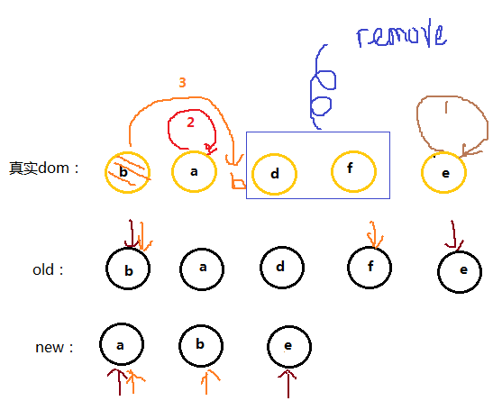
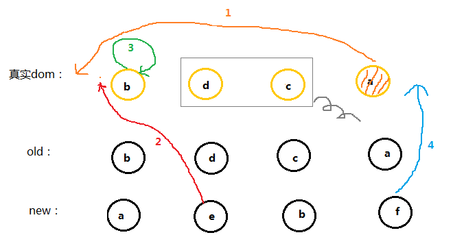

# diff 算法

## 1. 当数据发生变化时，vue 是怎么样更新节点的？

渲染真是 DOM 的开销是非常大的，比如有些时候我们修改了某个数据，如果直接渲染到真是的 dom 树上会引起整个 dom 树的重绘和重排，但是我们理想状态只是需要一小块的 dom 更新

virtual DOM：先根据真是的 dom 树生成一棵虚拟的 dom 树，当 virtual DOM 某个节点的数据改变后会生成一个新的 Vnode。然后 Vnode 和 oldVnode 做对比，发现不一样的地方就直接修改真是的 dom 上，然后 oldVnode 的值为 Vnode

实际上，diff 的过程就是调用 patch 的函数，比较新旧节点，一边比较一边给真实的 dom 打补丁

## 2. virtual DOM 和真实的 DOM 的区别

1. virtual DOM 的表现

```js
var Vnode = {
  tag: 'div',
  children: {
    { tag: 'p', text: '123' }
  }
}
```

2. 真实的 DOM

```html
<div>
  <p>123</p>
</div>
```

## 3. diff 的比较方式

看虚拟的 dom 中的结构就知道，diff 的比较只会在同层级进行比较，不会跨层级进行比较

```html
<div>
  <p>123</p>
</div>

<div>
  <span>456</span>
</div>
```

根据上面的代码，比较同一层的两个 div 以及第二层的 p 和 span，但是不会拿 div 和 span 进行比较，如下图的成对比较的情况：


## 4. diff 的流程图


## patch 方法

```js
function patch(oldVnode, vnode) {
  // some code
  if (sameVnode(oldVnode, vnode)) {
    patchVnode(oldVnode, vnode);
  } else {
    const oEl = oldVnode.el; // 当前oldVnode对应的真实元素节点
    let parentEle = api.parentNode(oEl); // 父元素
    createEle(vnode); // 根据Vnode生成新元素
    if (parentEle !== null) {
      api.insertBefore(parentEle, vnode.el, api.nextSibling(oEl)); // 将新元素添加进父元素
      api.removeChild(parentEle, oldVnode.el); // 移除以前的旧元素节点
      oldVnode = null;
    }
  }
  // some code
  return vnode;
}
```

先判断是否值得去比较这个节点，如果值得去比较的话，如果值得比较的话执行 patchVnode（值得比较说明这个节点没有改变，如果改变了直接替换掉旧节点）
不值得比较的话直接替换掉 oldVnode

那么有一个问题，如果父节点不一样，子节点之后的全部一样呢？这种情况会直接替换父节点，在 diff 也有一种数据单向流，上级修改了下级不管是否修改都会直接上级替换

```js
function sameVnode(a, b) {
  return (
    a.key === b.key && // key值
    a.tag === b.tag && // 标签名
    a.isComment === b.isComment && // 是否为注释节点
    // 是否都定义了data，data包含一些具体信息，例如onclick , style
    isDef(a.data) === isDef(b.data) &&
    sameInputType(a, b) // 当标签是<input>的时候，type必须相同
  );
}
```

如果两个节点值得去比较的时候 patchVnode 方式是什么呢？

```js
patchVnode (oldVnode, vnode) {
    const el = vnode.el = oldVnode.el
    let i, oldCh = oldVnode.children, ch = vnode.children
    if (oldVnode === vnode) return
    if (oldVnode.text !== null && vnode.text !== null && oldVnode.text !== vnode.text) {
        api.setTextContent(el, vnode.text)
    }else {
        updateEle(el, vnode, oldVnode)
        if (oldCh && ch && oldCh !== ch) {
            updateChildren(el, oldCh, ch)
        }else if (ch){
            createEle(vnode) //create el's children dom
        }else if (oldCh){
            api.removeChildren(el)
        }
    }
}
```

实际上 patchVnode 需要完成的事情是：

1. 找到对应真是的 dom--->el
2. 判断 Vnode 和 oldVnode 是否指向同一个对象，如果是，就是没有改变
3. 如果是文本且文本不一样，赋值
4. 如果 oldVnode 有子节点而 Vnode 没有，直接删除子节点
5. 如果 oldVnode 没有子节点，而 Vnode 有，则将 Vnode 真实化之后添加到 el
6. 如果都有子节点，执行 updateChildren 函数比较子节点

可想而知道上面的 1->5 都是比较好实现，但是第 6 点想想都是一个恶心的过程

```js
updateChildren (parentElm, oldCh, newCh) {
    let oldStartIdx = 0, newStartIdx = 0
    let oldEndIdx = oldCh.length - 1
    let oldStartVnode = oldCh[0]
    let oldEndVnode = oldCh[oldEndIdx]
    let newEndIdx = newCh.length - 1
    let newStartVnode = newCh[0]
    let newEndVnode = newCh[newEndIdx]
    let oldKeyToIdx
    let idxInOld
    let elmToMove
    let before
    while (oldStartIdx <= oldEndIdx && newStartIdx <= newEndIdx) {
        if (oldStartVnode == null) {   // 对于vnode.key的比较，会把oldVnode = null
            oldStartVnode = oldCh[++oldStartIdx]
        }else if (oldEndVnode == null) {
            oldEndVnode = oldCh[--oldEndIdx]
        }else if (newStartVnode == null) {
            newStartVnode = newCh[++newStartIdx]
        }else if (newEndVnode == null) {
            newEndVnode = newCh[--newEndIdx]
        }else if (sameVnode(oldStartVnode, newStartVnode)) {
            patchVnode(oldStartVnode, newStartVnode)
            oldStartVnode = oldCh[++oldStartIdx]
            newStartVnode = newCh[++newStartIdx]
        }else if (sameVnode(oldEndVnode, newEndVnode)) {
            patchVnode(oldEndVnode, newEndVnode)
            oldEndVnode = oldCh[--oldEndIdx]
            newEndVnode = newCh[--newEndIdx]
        }else if (sameVnode(oldStartVnode, newEndVnode)) {
            patchVnode(oldStartVnode, newEndVnode)
            api.insertBefore(parentElm, oldStartVnode.el, api.nextSibling(oldEndVnode.el))
            oldStartVnode = oldCh[++oldStartIdx]
            newEndVnode = newCh[--newEndIdx]
        }else if (sameVnode(oldEndVnode, newStartVnode)) {
            patchVnode(oldEndVnode, newStartVnode)
            api.insertBefore(parentElm, oldEndVnode.el, oldStartVnode.el)
            oldEndVnode = oldCh[--oldEndIdx]
            newStartVnode = newCh[++newStartIdx]
        }else {
           // 使用key时的比较
            if (oldKeyToIdx === undefined) {
                oldKeyToIdx = createKeyToOldIdx(oldCh, oldStartIdx, oldEndIdx) // 有key生成index表
            }
            idxInOld = oldKeyToIdx[newStartVnode.key]
            if (!idxInOld) {
                api.insertBefore(parentElm, createEle(newStartVnode).el, oldStartVnode.el)
                newStartVnode = newCh[++newStartIdx]
            }
            else {
                elmToMove = oldCh[idxInOld]
                if (elmToMove.sel !== newStartVnode.sel) {
                    api.insertBefore(parentElm, createEle(newStartVnode).el, oldStartVnode.el)
                }else {
                    patchVnode(elmToMove, newStartVnode)
                    oldCh[idxInOld] = null
                    api.insertBefore(parentElm, elmToMove.el, oldStartVnode.el)
                }
                newStartVnode = newCh[++newStartIdx]
            }
        }
    }
    if (oldStartIdx > oldEndIdx) {
        before = newCh[newEndIdx + 1] == null ? null : newCh[newEndIdx + 1].el
        addVnodes(parentElm, before, newCh, newStartIdx, newEndIdx)
    }else if (newStartIdx > newEndIdx) {
        removeVnodes(parentElm, oldCh, oldStartIdx, oldEndIdx)
    }
}
```

先解释这个函数做了什么

1. 将 Vnode 的子节点 Vch 和 oldVnode 的子节点 oldCh 提取出来
2. oldCh 和 vCh 各有两个变量，StartInx 和 EndIdx，他们的两个变量相互比较，一共 4 中比较方式，如果 4 种比较都没有匹配，如果设置了 key，就用 key 比较，在比较的过程中，变量会往中间靠，一旦 StartIdx > EndIdx 表明 oldCH 至少有一个已经遍历完了，结束比较

<font color=red>单看代码，容易睡着，建议先看图解，弄懂什么原理之后再去看代码</font>

红色为 oldCh 和 vCh：


把他们提取出来跟别用 s 和 e 表示头 child 和尾 child


现在分别对 oldS、oldE、S、E 两两做 sameVnode 比较，有四种比较方式，当其中两个能够匹配上那么真实 dom 中的相应节点会移到 Vnode 相应的位置

- 如果是 oldS 和 E 匹配上了，那么真是 dom 中的第一个节点会移到最后
- 如果 oldE 和 S 匹配上了，那么真实 dom 中的最后一个节点移到最前，匹配上的两个指针向中间移动
- 如果四种匹配没有一对成功的，那么遍历 oldChild，S 挨个和他们匹配，匹配成功旧再真实 dom 将成功移到最前面，如果没有成功，那么旧插入到 dom 中的 oldS 的位置，oldS 和 S 指针向中间移动


1. 第一步

```js
oldS = a;
oldE = d;
S = a;
E = b;
```

oldS 和 S 匹配，则将 dom 中的 a 节点放到第一个，已经是第一个了就不管了，此时 dom 的位置为：a b d

2. 第二步

```js
oldS = b;
oldE = d;
(S = c), (E = b);
```

oldS 和 E 匹配，就将原本的 b 节点移动到最后，因为 E 是最后一个节点，他们位置要一致，这就是上面说的：当其中两个能匹配上那么真实 dom 中的相应节点会移到 Vnode 相应的位置，此时 dom 的位置为：a d b

3. 第三步

```js
oldS = d;
oldE = d;
S = c;
E = d;
```

oldE 和 E 匹配，位置不变此时 dom 的位置为：a d b

4. 第四步

```js
oldS++;
oldE--;
oldS > oldE;
```

遍历结束，说明 oldCh 先遍历完。就将剩余的 vCh 节点根据自己的的 index 插入到真实 dom 中去，此时 dom 位置为：a c d b

这个匹配过程的结束有两个条件

- oldS > oldE 表示 oldCh 先遍历完，那么就将多余的 vCh 根据 index 添加到 dom 中去（如上图）
- S > E 表示 vCh 先遍历完，那么就在真实 dom 中将区间为[oldS, oldE]的多余节点删掉





<back-to-top />

<gitask />
