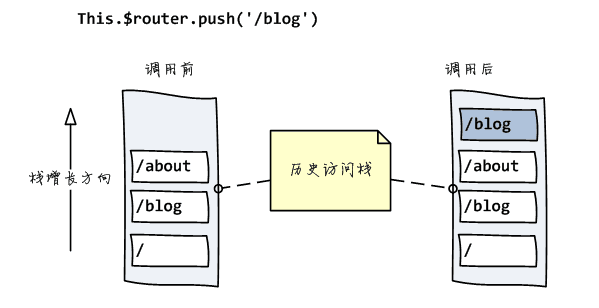
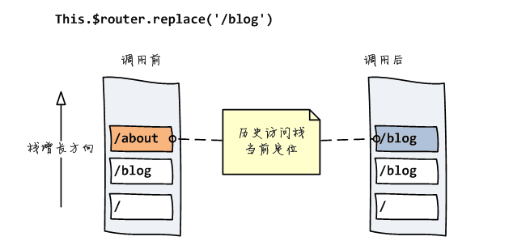

# vue-router

前后端不分离的项目 利用 Ajax 可以在不刷新浏览器的情况下异步数据请求交互

SPA --- 单页面应用（只有一个 html 文件，整个网站的所有内容都这一个 html 里，通过 js 来处理）

页面交互式是无刷新的，<font color=red>页面跳转也是无刷新的</font>

实现单页面应用的就是现在要说的前后端分离+前端路由

实现前端路由其实就是匹配不同的 url 路径，进行解析，加载不同的组件，然后动态的渲染在指定的 html 容器中

## 1. vue-router 中的两种模式（mode）

### 1. hash 模式

- 在 vue 项目中的地址中一般会有一个`#`，<font color=red>这个`#`后面就是`hash`值，`hash`的变化，并不会导致浏览器向服务器发送请求，浏览器不发出请求，页面就不会刷新。</font> 但是`hash`变化会促发`hashchange`这个事件，通过这个事件我们可以知道`hash`发生了哪些变化，然后监听`hashchange`来实现页面更新的部分

`hash`模式背后的原理就是在 window 上面监听`onhaschange`事件

```js
window.onhashchange = function (event) {
  console.log(event.oldURL, event.newURL);
  // do something
  // eg:
  let hash = location.hash.slice(1);
  document.body.color = hash; // 通过页面hash来改变页面的颜色
};
```

图解如下：


根据上图，选择`mode`之后，程序根据你选择的`mode`类型创建不同的`history`对象（`hash：HashHistory`，或者`history：HTML5History`或者`abstract：AbstractHistory`）

```js
switch (mode) {
  case "history":
    this.history = new HTML5History(this, options.base);
    break;
  case "hash":
    this.history = new HashHistory(this, options.base, this.fallback);
    break;
  case "abstract":
    this.history = new AbstractHistory(this, options.base);
    break;
  default:
    if (process.env.NODE_ENV !== "production") {
      assert(false, `invalid mode: ${mode}`);
    }
}
```

`HashHistory`有两个方法：`HashHistory.push()`将新路由添加到浏览器访问历史的栈顶；和`HashHistory.replace()`替换掉当前栈顶的路由





因为 hash 发生变化的 utl 会被浏览器记录（历史访问栈）下来，所以浏览器的前进后退都可以用 ===> 浏览器没有请求服务器，但是页面状态和 url 一一关联起来

### 2. history

因为 HTML5 标准发布，多了两个 API，pushState()和 replaceState()。

<font color=red>1.通过这两个 API 可以改变 url 地址而且不会发送请求</font>

2. 不仅可以读取历史记录栈，还可以对浏览器历史记录进行修改

除此之外，还有 popState()事件，当浏览器跳转到新的状态时，将触发 popState 事件

- 修改历史状态

  1. window.history.pushState(stateObject, title, URL)
  2. window.history.replaceState(stateObject, title, URL)

- 切换历史状态

  1. history.go(-2) -------> 后退两次
  2. history.go(2) -------> 前进两次
  3. history.back() -------> 后退
  4. history.forward() -------> 前进

### 区别

- hashchange 只能改变`#`后面的 url 片段。而 pushState()设置的新的 URL 可以式与当前 URL 同源的任意 URL

- history 模式则会将 URL 修改得就和正常请求后端 URL 一样，如果后端没有配置对应得/user/id 的路由处理，则会返回 404 错误

当刷新页面之类的操作时候，浏览器会给服务器发送请求，所以这个实现需要服务器的支持，需要把所有都重定向到根页面，这也是为什么 history 模式下面刷新总是会报 404 的问题

## 2. router 和 route 的区别

- $router式vue-router的实例，想要导航到不同URL，则使用$router.push 或者$router.replace()或者$router.go()

- $route 是从当前跳转对象里面可以获取 name、path、query、params 等

## 3. query 和 params 的使用区别(动态组件传参)

1. `query`参数传递，在跳转的时候是既可以使用`name`跳转也可以是使用`path`跳转的 ，（这个地方也有人说 query 只能够是 path 跳转，亲测之后用 name 也是可以的），不会在url上显示参数信息
2. `params`是路由的一部分，必须要在路由后面添加参数名，`query`是直接拼接在 url 后面的参数，没有也没有关系
3. `params`一旦设置在路由，`params`就是路由的一部分，如果路由有`params`传参，但是跳转的时候没有这个参数，会导致跳转失败，或者页面没有内容

## 4. vue-router 的钩子函数

### （1） 全局钩子

主要包括 beforeEach 和 afterEach

- beforeEach 函数有三个参数：

  - to：router 即将进入的路由对象
  - from：当前导航即将离开的的路由
  - next：Function，进行管道中的一个钩子，如果执行完了，则导航的状态就是 confirmed（确认的），否则为 false，终止导航

- afterEach 函数不用传 next()参数

这类钩子只要作用于全局，一般来判断权限，以及页面丢失的操作

```js
router.afterEach(( to, from, next ) => {
  const role = window.sessionStorage.getItem('querystring)
  if (!role && to.path !== '/login' ) {
    next('./login') // 如果没有身份认证则会跳到登陆页面
  } else if(to.mate.permission){ // 是否许可进入的情况
    role === 'some if' ? next() : next('/403')
  } else {
    if (!'版本判断') {
      alert('版本过低，请先升级浏览器)
    } else {
      next()
    }
  }
})
```

### （2） 单个路由里面的钩子

主要在某个指定路由跳转时候的执行的逻辑，参数和意义和之前的一样

```js
{
  path:'/banch',
  name:'Banch',
  component:import('@/page/bamch/'),
  mate:{
    index:1
  },
  beforeEnter: (to, from, next) => { // 进路由之前

  },
  beforeLeave: (to, from, next) => { // 离开路由之前

  }
}
```

### （3） 组件里面路由钩子

只要包括 beforeRouteEnter、beforeRouteUpdate、boforeRouteLeave，参数和意义和之前的一样

```js
beforeRouteEnter: (to, from, next) => { // 进组件之前

},
beforeRouteUpdate: (to, from, next) => { // 组件更新之前（因为路由跳转影响的组件更新）

},
boforeRouteLeave: (to, from, next) => { // 离开组件之前

},
```


<gitask />
