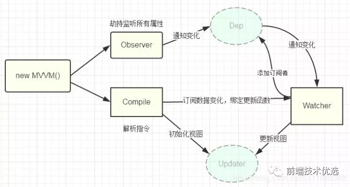

# 面试

## 什么是 MVVM

MVVM 最早是由微软提出来，他借鉴了桌面应用程序的 MVC 思想，在前端页面中，把 Model 用纯 js 对象（data）表示，view 负责显示（页面），两者做到了最大限度的分离，把 Model 和 view 关联起来就是 viewmodel。

viewmodel 负责把 model 的数据同步到 view 显示出来，还负责把 view 的修改同步会 model，view 和 model 之间的同步工作完全是自动的，无需人为干涉

因此开发者只需要关注逻辑，不需要手动操作 dom，不需要关注数据状态的同步问题，复杂的数据状态维护完全由 mvvm 来统一管理



## MVVM 与 MVC 的区别

MVC----有一个 Controller（C），使用 Model 通过控制 Controller 去控制 view 的更新，只是做到了 Model 层级的变化去实时改变 view 层的变化

MVVM---就是 Model 层和 View 层只互通的，两者任何一个修改都会试对方发生变化，并且两者做到了最大限度的分离

## AMD、CMD、CommonJS、和 ES6 的对比（模块化开发）

1. AMD --- requireJS（异步模块）

define 定义，require 引入

2. CMD --- SeaJS（同步模块）

define 定义，require 引入

3. CommonJS module.exports（nodeJS）

`exports.DEFAULT_COLOR = '#409eff'`定义，require 引入

4. ES6 特性 export/import

## vue 优点

mvvm 优点就是 vue 优点：

1. 数据和视频之间的的同步工作完全是自动的，无需人为的干涉，所以开发者只需关注业务逻辑

2. 不需要手动操作 dom，不需要关注数据状态的同步问题，复杂的数据状态维护完全由 mvvm 来统一管理，节省了很多精力

## vue 的生命周期


## 数据双向绑定原理（自我实现最简单的数据双绑）

[跳转](/JavaScript/对象.html#其他方法)

## v-if 和 v-show 的区别

1. v-if 是‘真正’的条件渲染，因为它会确保在切换过程中条件快中的子组件会被销毁和重建

2. v-show 知识单纯的控制 display，不管 true/false 都会加载和渲染

选择： 两者来比较就知道，v-if 开销比较大，v-show 只是在开始的时候有开销，如果是十分频繁的操作，建议使用 v-show，如果是加载进入总是默认值加载，建议使用 v-if

## 组件传值

1. parent---->child 通过 prop

2. child---->parent 通过\$emit

3. child---->child 通过 eventBus/vuex

## 计算属性（computed）

计算属性的定义：

1. 当依赖的属性发生变化的时候，计算属性会重新计算，反之则使用缓存中的属性值

2. 计算属性和 vue 中的 data 的数据一样，都是响应式的，只不过他必须依赖某一个或者多个数据实现，并且只有他依赖的数据值变了。他才会更新

## watch 的作用

watch 主要作用是监听某个数据值的变化。和计算属性相比除了没有缓存，作用是一样的

## vue-router 相关

[跳转](./vue-router的两种mode.html#vue-router)

## keep-alive

[跳转](./keep-alive.html)

## mixins

[跳转](./mixins.html)

## 自定义指令

[跳转](./自定义指令.html)

## diff 算法

[跳转](./diff.html)

## vue/react 中 key 的作用

1. 不带 key 的情况下，对于简单列表页渲染来说 diff 节点更快，这一点没有错误，但是显然这不是 key 的作用

2. key 的作用是什么呢？
   > 首先一点要知道，key 是给每一个 vnode 的唯一 id，可以依靠 key 更准确更快地拿到 oldVnode 中对应的 vnode 节点

- 更准确：带 key 就不可以`就地复用`，在 sameNode 函数`a.key === b.key`对比中可以避免就地复用的情况，所以更加准确
- 更快：利用 key 的唯一性生成 map 对象来获取对应节点，比遍历方式更快（也就是说 map 是比遍历更快的）

## 1. 说下Vue数据双向绑定的原理

- vue内部通过Object.defineProperty方法属性拦截方式，把data对象里每个数据的读写转化成`getter/seeter`

## 2. 说说Vuex的作用以及应用场景

- vuex作用：
  - Vuex 是一个专为 Vue.js 应用程序开发的状态管理模式。它采用集中式存储管理应用的所有组件的状态，并以相应的规则保证状态以一种可预测的方式发生变化。

- 应用场景：
  - 中大型当页面应用

## 3. 说说Vue组件的数据通信方式

- 父---->子
  - 父属性绑定，子props接收
- 父---->子孙
  - 父`provide:{}`，后代`inject:{}`，注意当父中的属性为Object的时候变化的时候，后代组件不会跟随变化，还有vue官网不推荐这样去做传参
- 子---->父
  - 子`this.$emit('eventname')`，父`v-on:(@)eventname`，也可以通过ref直接调用自己的方法
- 兄弟组件
  - `eventBus`，注意需要`new vue()`，使用完成时候记得off，以免在之后的操作中多次提交，或者在监听的时候用`once`

## 4. Vue的源码有看过吗？说说vuex工作原理

- vuex工作原理：vuex中的store本质就是没有template的隐藏着的vue组件

## 5. 为什么说虚拟 dom会提高性能，解释一下它的工作原理

- 虚拟DOM的工作原理：通过JavaScript对象来描述真实的DOM
- 提高性能，当数据发生变化的时候，只需要局部刷新页面（这也是为什么尽量不要去操作dom的原因，真是的dom操作会引起模块元素的重排/重绘（重新渲染））

## 6. 请你详细介绍一些 package.json 里面的配置

- name：项目名称
- version：版本
- repository：仓库
- scripts：脚本运行
- dependencies：生产环境依赖（npm i -S (name)）
- devDependencied：开发环境依赖（npm i -D (name)）
- browserslist：js、css等兼容版本情况
- proxy：如果接口情况比较简单的时候可以直接在这个地方做代理

## 7. 为什么说Vue是一套渐进式框架

- 个人理解：
  - 视图模板引擎/组件系统/客户端路由/大规模状态管理/构建工具，这些功能都是非强制性的，用到什么时候引入什么，不一定需要全部整合
  - 没有多做职责之外的事情，绝非侵入式框架

## 8. vue-cli提供的几种脚手架模板有哪些，区别是什么

- 这个问题可以查看脚手架模板的[网站](https://github.com/vuejs-templates)

1. `webpack`：使用最多的vue-cli的模板
2. `pwa`：因为没有使用，了解的不是很多，有一次要是用缓存的时候，在选择使用`pwa`或者`keep-alive`的时候,选择了后者
3. `webpack-simple`：低配版webpack
4. `simple`
5. `browserify`
6. `browserify-simple`

## 9. 计算属性的缓存和方法调用的区别

- 两者返回的最终的结果是完全一样的

- 如何使用这两者取决于是否需要缓存，在vue中如果某个属性需要多个属性大量的计算得到，建议使用计算属性，利用缓存（这样可以少的执行getter）

- 计算属性根据所依赖的属性自动执行，方法调用是必须要手动去处理调用的

## 10. axios、fetch与ajax有什么区别

- ajax；最早出现的发送后端请求技术，隶属于原始js中，核心使用XMLHttpRequest对象，多个请求之间如果有先后关系的话，就会出现回调地狱。（无法确定哪个先完成先返回）
- axios：axios不是原生JS的，需要进行安装，它不带可以在客户端使用，也可以在nodejs端使用。Axios也可以在请求和响应阶段进行拦截。同样也是基于`promise`对象的。
- fetch：fetch号称是AJAX的替代品，是在ES6出现的，使用了ES6中的promise对象。Fetch是基于promise设计的。Fetch的代码结构比起ajax简单多了，参数有点像jQuery ajax。但是，一定记住fetch不是ajax的进一步封装，而是原生js。Fetch函数就是原生js，没有使用XMLHttpRequest对象。当下的兼容性比较差

## 11. vue中央事件总线的使用

- Event Bus

## 12. 你做过的Vue项目有哪些，用到了哪些核心知识点

1. 散装vue，没什么技术可讲的

2. 工作流H5:vue+vue-cli2+vue-router+vue-store+axios(Promise再次封装统一管理)+vux

3. 公文流转web端:vue+vue-cli2+vue-router+vue-store+axios(Promise再次封装统一管理)+element-ui

4. 公文流转H5:vue+vue-cli3+vue-router+vue-store+axios(Promise再次封装统一管理)+vant+keep-alive+mixins

## 13. 实现MVVM的思路分析

[详解](./vue中学习的问题.html#什么是mvvm)

## 14. 批量异步更新策略及 nextTick 原理

[详解](./nextTick.html)

## 15. 说说Vue开发命令 npm run dev 输入后的执行过程

1. 运行`package.json`脚本
2. 运行`webpack.conf.js`,entry和output确定入口文件和出口文件，根据相关的module里面的loader解析不同的文件
3. vue中常用的loader（为什么需要loader？因为webpack只识别js）有：

- bable-loader：处理js兼容问题的
- uer-loader：处理图片和字体图标，通常会设置一个限制大小，转化base64
- css-loader+less-loader/(node-loader+sass-loader)：处理css以及css预处理器的解析
- vue-loader：解析`.vue`的文件

4. plugins：运行相关插件的功能
5. devServer：根据devServer里面的相关配置起一个服务

## 16. vue-cli中常用到的加载器有哪些

- 除了上面15上面说的之外，还有`postcss`以及配置
  - 使用下一代css语法
  - 自动补全浏览器浅醉
  - 自动将px-->rem
  - css代码压缩
- autoprefixer：补全兼容样式写法的前缀

## 17. Vue中如何利用 keep-alive 标签实现某个组件缓存功能

- keep-alive加在全局中的include可以为数组，<font color=red>注意name所指的是组件的name，不是在router里面的name</font>
- 全局路由钩子beforeEach+meta中设置的属性判断是否需要缓存
- 当个组件的路由钩子beforeRouteEnter/beforeRouteLeave判断什么情况需要缓存以及在缓存的时候什么时候需要刷新页面

[详解](./keep-alive.html)

## 18. pc端页面刷新时如何实现vuex缓存

- 使用localstorage？

## 19. vue-router如何响应 路由参数 的变化(动态组件传参)

[详解](./vue-router的两种mode.html#vue-router)

## 20. Vue 组件中 data 为什么必须是函数

- 因为如果是Object的话，Object是引用数据类型，引用它的组件其中一个改变，其他的组件的指都会发生改变,这个和`vue`的设计没有关系，是js本身的特性带来的，也就是说，如果某个组件只供使用一次也可以使用`Object`，举个例子就很好说明了

Object

```js
const MyComponent = function(){}
MyComponent.prototype.data = {
  a:1,
  b:2
}
const component1 = new MyComponent()
const component2 = new MyComponent()
component1.data.a = 5
component2.data.a // ---->5
```

Function

```js
const MyComponent = function(){}
MyComponent.prototype.data = function(){
  return {
    a:1,
    b:2
  }
}
const component1 = new MyComponent()
const component2 = new MyComponent()
component1.data.a = 5
component2.data.a // ---->1
```

## 21. vue源码相关面试题

> vue源码面试的时候总是问各种细节，说实话，一般看源码是不会详细记得这些细节的，只记得一个大概，但面试又总被问。在这里，用文字的方式把源码面试的答案整理出来。

### 21.1 说说vue如何实现mv模型的

vue提供了一个方法叫做`defineReactive`的方法, 这个方法就是把对象的某个属性（也就是vue的data）实现成响应式的。

在defineReactive中做了如下几件事：

1. 在`defineReactive`里面，首先创建了一个可观察的对象(`observable: true`)---`Dep`。
2. 然后使用`Object.defineProperty`定义这个属性`get`和`set`方法(ps:还设置了configurable和enumerable为true)
3. 在get中，使用`dep.depend()`将当前的watcher（`Dep.target`）添加到dep的subs里面（添加的过程在有一个去重的操作）
4. 在set中，首先会调用get获取value(这里也会触发get)，比较value发生了变化之后，调用`dep.notify()`,是可观察对象通知观察者发生变更。
5. `dep.notify`会通知其所有的watcher触发update方法，执行watcher对象创建的时候的回调方法`cb`, 这个`cb`方法会执行`vm._update(vm._render(), hydrating)`

### 21.1.2 vue2和vue3实现mv的区别

* 1. vue2是使用object.defineProperty实现的，对属性key的拦截，必须先知道key的值；vue3是使用proxy去实现，使用get的方法不用关心key是什么，将data上的所有的key均拦截
* 2. 对于数组的修改，vue主要是遍历后做出修改，这也是为什么vue提供$set、$delete这样的方法，vue3根本不需要这些方法，而是直接修改对应的值

### 21.2 vue源码中什么时候调用`defineReactive`

`defineReactive`在很多地方都可以调用，比如`initProps`和`initState`。例如在`initState`中，通过`vm.$options.data`获取data对象，然后使用`observe(data)`，在方法`observe`中会使用`new Observer`创建观察者，然后在创建观察者的同时，会使用`Object.keys(data)`将data对象的所有的属性获取出来，然后使用for循环对每个属性进行defineReactive调用。

在initRender(vm)中也会调用`defineReactive`

### 21.3 那watcher是什么时候创建的，为什么`Dep.target`会是当前的watcher

watcher有一个或者多个，首先是每个vue实例对象都会创建一个watcher,这个watcher在vue生命周期的`beforeMount`和`Mount`之间创建的。
还有就是每个computed和$watch也会各自创建一个watcher。在创建watcher的时候，在get方法中，会调用`pushTarget(this)`将当前的watcher设置为`Dep.target`，然后再调用`this.getter.call(vm, vm)`触发get的时候就把这个watcher加入dep对象里面了。

### 21.4 watcher是怎么触发到DOM修改的

watcher在update方法中会触发创建的时候的回调方法,方法里面会调用`vm._update`

Vue.prototype._update方法会调用`vm.__patch__`方法，这个`vm.__patch__`方法就是`core.vdom.patch.js`暴露的虚拟DOM更新方法。

### 21.5 vue源码中的patch方法有什么用

patch中，首先会判断是否有`oldVnode`,如果没有，这调用`createElm`创建元素节点，`createElm`包括了`createComponent`,`createElement`创建element元素，并将元素放到vnode.elm上，最后通过`insert(parentElm, vnode.elm, refElm)`将组件插入DOM。
如果有，则通过`patchVnode`来判断是否可以复用。

在`patchVNode`中有一个`updateChildren`方法，这个方法会比较新老Vnode, 最有新的vnode才会创建dom,如果key一样则会复用vnode.

### 21.6 vue是如何判断两个节点不一样的？判断两个节点的key、 tag、 isComment、data同时定义或者不定义、input标签的话要类型相同

在当新老 VNode 节点都是 isStatic（静态的），并且 key 相同时，只要将 componentInstance 与 elm 从老 VNode 节点“拿过来”即可。这里的 isStatic 也就是前面提到过的「编译」的时候会将静态节点标记出来，这样就可以跳过比对的过程。

当新 VNode 节点是文本节点的时候，直接用 setTextContent 来设置 text，这里的 nodeOps 是一个适配层，根据不同平台提供不同的操作平台 DOM 的方法，实现跨平台。

### 21.7 vue是如何将template模板转换为render函数的

vue的`compile`分为`parse`、`optimize`、`generate`3个阶段，最终得到render function。

*parse*阶段是利用正则表达式对template模板进行字符串解析（parseHTML, 在parseHTML的过程中就进行的AST元素的构建），得到指令、class、style等数据, 形成类似抽象语法树（默认中的javascript表达式没有进行语法分析，这也是vue在生成render的时候使用with的原因）。注意，这里的匹配是从前往后依次匹配的（词法分析-扫描），在while循环外部通过index记录匹配到哪里了，在while里面，通过正则，来截断html字符串，增加index。直到html字符串被全部匹配完。

*optimize*是用来标记这个节点是不是静态节点，优化效率，主要是判断这个节点是否有v-if,v-for,bind等

```js
function isStatic (node: ASTNode): boolean {
  if (node.type === 2) { // expression
    return false
  }
  if (node.type === 3) { // text
    return true
  }
  return !!(node.pre || (
    !node.hasBindings && // 不是动态绑定
    !node.if && !node.for && // 不是v-if,v-else v-for
    !isBuiltInTag(node.tag) && // 不是内置的tag(slot, components)
    isPlatformReservedTag(node.tag) && // 不是组件
    !isDirectChildOfTemplateFor(node) &&
    Object.keys(node).every(isStaticKey)
  ))
}
```

*generate*阶段是将AST转换为render function字符串

- 词法分析: 词法分析阶段是编译过程的第一个阶段。这个阶段的任务是从左到右一个字符一个字符地读入源程序，即对构成源程序的字符流进行扫描然后根据构词规则识别单词(也称单词符号或符号)。
- 语法分析: 语法分析是编译过程的一个逻辑阶段。语法分析的任务是在词法分析的基础上将单词序列组合成各类语法短语，如“程序”，“语句”，“表达式”等等.语法分析程序判断源程序在结构上是否正确.源程序的结构由上下文无关文法描述.
- 语义分析: 语义分析是编译过程的一个逻辑阶段. 语义分析的任务是对结构上正确的源程序进行上下文有关性质的审查, 进行类型审查.

- with

```js
var a, x, y;
var r = 10, r1 = 20;
Math.r = 100;
with (Math) {
  a = PI * r * r1; // 这里r是100， r1是20
  x = r * cos(PI);
  y = r * sin(PI / 2);
}
console.log(a, x, y) // 6283.185307179587 -100 100
```

可以看到，with里面的变量，默认指向的是Math,而不是window. 所以，with的作用是使用一个块里面的代码片段所声明的变量，默认在with这个对象上找，如果找不到再去外部变量找（这个时候查找会相对较慢）。还有缺点是语义不明，如果Math.r属性在代码中没有，而是对象自带的，可能会引起误解。所以不推荐使用。

在vue template转render中使用了with(this)，其意义是把template属性中的表达式绑定到this.比如template中有v-bind:click="clickHandle", 这里在转换后，clickHandle中的this就会绑定为vue实例。

### 21.8 vue的compiler是什么时候调用的

在vue的`platforms/web`中包含不同的entry,其中`entry-runtime-with-compiler.js`就引入了compiler。在这个js里面，对`vue.prototype.$mount`进行了劫持，在里面判断如果el没有render函数的话，就调用`createCompiler`方法来对template进行编译。

### 21.9 vue的render函数的作用是什么，怎么实现的

vue在`core/instance/render.js`中定义了initRender方法，该方法在vue初始化的时候调用的。该方法的作用是给vue的实例`vm`添加一个`_c`方法和`$createElement`方法，`createElement`方法返回`vnode`对象。“虚拟 DOM”是我们对由 Vue 组件树建立起来的整个 VNode 树的称呼。

createElement的参数是(`标签名称`，`[子节点数组]`, `节点属性对象`)

### 21.10 请用render手动实现一个组件user,带有v-model的input输入框

```js
Vue.component('user', {
  props:['value'],
  render: function (createElement) {
    let self = this
    return createElement(
      'input',
      {
        domProps: {
          value: self.value
        },
        on: {
          input: function (event) {
            self.$emit('input', event.target.value)
          }
        }
      }
    )
  }
})
```

### 21.11 vue源码的大概目录结构是什么，有什么用

- `src/core`: vue的核心功能部分，这里面包括了虚拟DOM相关的`vdom`,响应式相关的`observer`,示例初始化相关的`instance`
- `src/compiler`: 编译部分，用于将vue的template转换为render函数调用
- `src/platforms`: 打包平台，可以对不同的平台打包成不同的js，目前只有web和weex
- `src/server`: 服务端渲染相关

### 21.12 Observer 和 Observable在观察者模式中有什么区别

todo: RxJS和设计模式中详细学习

`Observable`是*可观察对象*，

`Observer`，又被称为*观察者*


