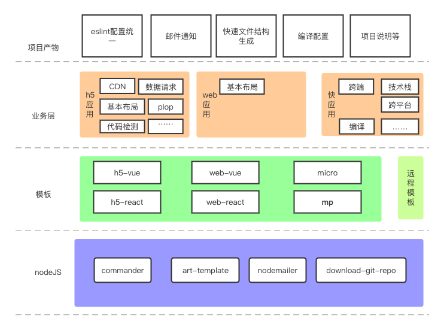

# 脚手架开发

开发过一些项目之后，有了自己的开发习惯，以及代码习惯，但是非常讨厌每次新做项目的时候，还需要copy之前的配置，甚至整个项目copy然后再删除，这个过程太恶心了，所以开发了一个脚手架

## 技术思维



做事情我喜欢的方式是从结果来看，至于怎么实现只是手段，我需要的东西很明确：

1. 可以生成一个项目，里面包括我所有的配置和开发习惯，并可以快速进入开发
2. 配置好cdn
3. 能快速配置好一个文件的结构

对于脚手架本身：

1. 所有的模板单独维护，不依赖脚手架的发版
2. 邮件通知，组内人新创建模板项目需要通过邮件让相关人员知道基本信息

## 代码建设

### **`入口文件`**

```js
#!/usr/bin/env node
// NOTE: 说明node的执行环境

let fs = require('fs')
let path = require('path')
let program = require('commander') // NOTE: 获取命令信息
const packageConfig = require('../package.json')

program.command('init <type>').action(function (type) {
  handleType(type)
})

function handleType (type) {
  let isExsit = fs.existsSync(path.resolve(__dirname, `./${type}/index.js`))
  if (!isExsit) {
    require('./help.js')()
  } else {
    require(`./${type}/index.js`)()
  }
}

program.command('usage').action(function () {
  require('./help.js')()
})

program.version(packageConfig.version).option('--no-sauce', 'Remove sauce').parse(process.argv)
if (!program.args.length) {
  program.help()
}
```

### **`help.js`**

```js
module.exports = async function (params) {
  console.log(
    '\n nic init [type]\n' +
    '\n h5项目: nic init h5 \n' +
    '\n web项目: nic init web \n' +
    '\n 微前端项目: nic init micro \n' +
    '\n node项目: nic init node \n' +
    '\n 小程序: nic init mp \n'
  )
}
```

### **`utils.js`**

```js
const chalk = require('chalk')
const nodemailer = require('nodemailer')
const ejs = require('ejs')
const path = require('path')
const fse = require('fs-extra')
const fs = require('fs')
const download = require('download-git-repo')
const template = require('art-template')
const { exec } = require('child_process')
const username = require('username')
template.defaults.rules.shift() // 移除ejs支持

/**
 * 关于颜色的方法
 */
const loading = text => chalk.bgGreen(chalk.white(text))

const success = text => chalk.green(text)

const warning = text => chalk.yellow(text)

const info = text => chalk.blue(text)

const c_loading = text => console.log(chalk.bgGreen(chalk.white(text)))

const c_success = text => console.log(chalk.green(text))

const c_warning = text => console.log(chalk.yellow(text))

const c_info = text => console.log(chalk.blue(text))

/**
 * 邮件发送
 */
const Mail = '1066788870@qq.com'
const mailTemplate = ejs.compile(
    fs.readFileSync(path.resolve(__dirname, 'mail.ejs'), 'utf8')
)
let transporter = nodemailer.createTransport({
    service: 'qq',
    port: 465,
    secureConnection: true,
    auth: {
        user: '',
        pass: '' // NOTE: 邮箱的相关配置
    }
})
const mail = config => {
const html = mailTemplate(
    Object.assign(
        {
            title: `welcome ${config.mails} into nic-cli`
        },
        config
    )
)
return new Promise((resolve,reject) => {
        nodemailer.createTestAccount(err => {
            if (err) {
                reject(err)
            }
            let mailOptions = {
                from: '1066788870@qq.com',
                to: `${Mail},${config.mails}`,
                subject: 'git配置信息',
                html: html
            }
            transporter.sendMail(mailOptions, error => {
                if (error) {
                    reject(error)
                }
                resolve('Message sent successly')
            })
        })
    })
}

/**
 *创建项目目录
 *
 * @param {*} projectName
 */
async function createProject (projectName, projectPath) {
    projectPath = projectPath || process.env.PWD
    const dir = await fse.ensureDir(projectPath + '/' + projectName)
    return dir
}
  
/**
 *检查是否能创建DIR
 *
 * @param {*} projectName 项目名称
 * @param {*} projectPath 项目地址
 * @returns
 */
const ensureDir = (projectName, projectPath) => {
    projectPath = projectPath || process.env.PWD
    const dir = fs.existsSync(projectPath + '/' + projectName)
    return dir
} 

/**
 *
 * 复制远程模板
 * @param {*} type  h5-vue  h5-react web-vue web-react node applet
 * @param {*} target
 * @returns
 */
async function copyTemplate (type, target) {
    const error = await copyGitTemplace(type, target)
    return error
}


/**
 * 复制远程模板
 * type: 在之前已经拼成了和远程的name相同了
 */
function copyGitTemplace (type, target) {
    info('\n 开始拉取远程模板\n')
    let url = 'https://github.com:0227vera/' + type + '#master' // 模板的git地址
    if (type === 'standard') {
        url = 'https://gitee.com:panjiachen/vue-element-admin#master'
    }
    return new Promise((resolve, reject) => {
        download(url, target, { clone: true }, function (err) {
            if (!err) {
                info('\n 拉取远程模板完成\n')
            } else {
                info('\n 拉取远程模板失败，查看是否拥有模板权限，或联系脚手架管理人员\n')
            }
            err ? reject(err) : resolve(true)
        })
    })
}

/**
 * 复制一个文件或者文件夹到另一个目录
 * @param {string} src 文件或者文件夹路径
 * @param {string} dest 文件夹路径
 */
async function copy (src, dir) {
    const err = await fse.copy(src, dir)
    return err
}


/**
 * 将模板中的变量替换成指定值
 */
async function rewriteTemplate (data, files) {
    await files.forEach((file) => {
        let newFile = template(file, data)
        fs.writeFile(file, newFile, function () {})
    })
}

/**
 * 执行命令
 */
async function execCmd (cmd) {
    let res = await exec(cmd, async (error, stdout, stderr) => {
        if (error) return error
        return stderr
    })
    return res
}

/**
 * 获取当前项目用户
 */
async function getUsername () {
    const name = await username()
    return name
}

module.exports = {
    color: {
        loading,
        success,
        warning,
        info,
        c_loading,
        c_success,
        c_warning,
        c_info,
    },
    mail,
    rewriteTemplate,
    createProject,
    copyTemplate,
    getUsername,
    ensureDir,
    execCmd,
    copy
}
```

### 拿一个H5的模板来说

**`h5/index.js`**

```js
/**
 * 创建H5模板
 * inquirer: 交互使用的工具
 * ora: 交互loading
 */
let inquirer = require('inquirer')
const ora = require('ora')
const path = require('path')

const {
  rewriteTemplate,
  createProject,
  copyTemplate,
  getUsername,
  ensureDir,
  execCmd,
  color,
  mail
} = require('../utils')

let base = [
  {
    type: 'input',
    name: 'projectName',
    message: color.info('请输入项目名称'),
    validate: function(value) {
      if (ensureDir(value)) {
        return '此目录已经存在，请重新输入'
      }
      return true
    },
    default: function() {
      return 'h5-template'
    }
  },
  {
    type: 'input',
    name: 'description',
    message: color.info('请输入项目描述'),
    default: function() {
      return 'h5开发模版'
    }
  },
  {
    type: 'input',
    name: 'mails',
    message: color.info('请输入开发人员邮箱(请输入真实有效的邮箱)，如果是多人使用英文 "," 分割'),
    default: function() {
      return 'xxx@xxxx.com'
    }
  },
  {
    type: 'list',
    name: 'langType',
    message: color.info('请选择使用vue/react编写'),
    choices: [{ name: 'vue', value: 1 }, { name: 'react', value: 2 }],
    default: 0 // 默认是下标为0的选项
  },
  {
    type: 'input',
    name: 'projectContext',
    message: color.info('请输入项目上下文(用于项目中的代理)'),
    default: function() {
      return '/context'
    }
  },
  {
    type: 'input',
    name: 'projectProxyUrl',
    message: color.info('请输入项目需要代理到的服务器(api文档地址))'),
    default: function() {
      return 'http://api.xxx.com/mock/xxx/'
    }
  },
  {
    type: 'confirm',
    name: 'needInitGit',
    message: color.warning('项目初始化之后是否直接通过命令上传第一次git'),
    default: function() {
      return true
    }
  },
  {
    type: 'input',
    name: 'gitAddress',
    message: color.warning('请输入项目git地址，用于项目init，确保真实有效'),
    default: function() {
      return 'https://github.com/'
    },
    when(answer) {
      return answer.needInitGit
    }
  },
  {
    type: 'confirm',
    name: 'isAddCI',
    message: color.warning('是否现在填写CI信息？'),
    default: true,
    when(answer) {
      return answer.langType === 0 // NOTE: 暂时隐藏ci的功能，使用misc的功能
    }
  },
  {
    type: 'input',
    name: 'productionAddress',
    message: color.warning(
      '请输入项目打包之后的地址(前缀会自动加上https://misc.xxx.com/app/)'
    ),
    default: function() {
      return 'bi/xxx'
    }
  }
]

let vueAddCi = [
  {
    type: 'input',
    name: 'parkName',
    message: color.warning('请输入构建时输出补丁的压缩包名称(tar.gz)'),
    default: function() {
      return 'app.front.tar.gz'
    }
  },
  {
    type: 'input',
    name: 'host',
    message: color.warning('请输入SFTP服务器地址'),
    default: function() {
      return '127.0.0.1'
    }
  },
  {
    type: 'input',
    name: 'port',
    message: color.warning('请输入SFTP服务器端口'),
    default: function() {
      return '80'
    }
  },
  {
    type: 'input',
    name: 'username',
    message: color.warning('请输入SFTP用户名'),
    default: function() {
      return 'xxx'
    }
  },
  {
    type: 'input',
    name: 'password',
    message: color.warning('请输入SFTP密码'),
    default: function() {
      return 'xxx'
    }
  },
  {
    type: 'input',
    name: 'sftpProjectPath',
    message: color.warning('请输入SFTP上传目录'),
    default: function() {
      return '/xxx/xxx/xxx_demo_V1.0.0_000_20200331_name_前端全部补丁'
    }
  }
]

module.exports = async function() {
  let answer = await inquirer.prompt(base)
  const type = answer.langType === 1 ? 'vue' : 'react'
  // NOTE: 根据基本信息的答案，判断接下来需要问的问题
  // NOTE: 如果是需要vue的模版，需要考虑到原来的数据是否需要添加ci，不添加给默认值
  if (answer.isAddCI) {
    Object.assign(answer, await inquirer.prompt(vueAddCi))
  } else {
    answer.parkName = 'app.front.tar.gz'
    answer.host = '127.0.0.1'
    answer.port = '80'
    answer.username = 'xxxx'
    answer.password = 'xxx'
    answer.sftpProjectPath =
      '/xxx/xxx/xxx_demo_V1.0.0_000_20200331_name_前端全部补丁'
  }

  const spinner = ora(color.loading('building for production...\n'))
  spinner.start()
  answer.username = await getUsername()
  let dir = await createProject(answer.projectName)
  await copyTemplate('h5-' + type, dir)
  let awiatArr =
    type === 'vue'
      ? [
          path.resolve(dir, './package.json'),
          path.resolve(dir, './vue.config.js'),
          path.resolve(dir, './.env.temp'),
          path.resolve(dir, './src/services/services.js')
        ]
      : [
          path.resolve(dir, './package.json'),
          path.resolve(dir, './src/services/commenPromise.js'),
          path.resolve(dir, './devProxy.js'),
          path.resolve(dir, './webpack.config.js')
        ]
  if (answer.needInitGit) {
    awiatArr.push(path.resolve(dir, './init.sh'))
  } else {
    execCmd('rm -rf ' + path.resolve(dir, './init.sh'))
  }
  await rewriteTemplate(answer, awiatArr)
  await execCmd(
    'mv ' + path.resolve(dir, './.env.temp') + ' ' + path.resolve(dir, './.env')
  )
  spinner.stop()
  color.c_success(`\n 项目初始化完成.\n 位置----> ${dir}\n`)

  // NOTE: 配置了git并且需要初始化信息的时候通过邮箱告知相关人员添加配置
  const sending = ora(color.loading('正在为将您的信息发送邮件给相关人，请稍等……'))
  sending.start()
  const msg = await mail(answer)
  color.c_info(`\n ${msg} \n `)
  sending.stop()
  color.c_success(`\n 已将您的项目信息发送给相关人员 \n `)
  color.c_info('-----------------------------------------------------------')

  // NOTE: 如果有git相关信息，直接通过命令初始化git，如果没有需要自己去初始化
  if (answer.needInitGit) {
    color.c_success(`\n cd ${answer.projectName} \n npm run init`)
  } else {
    color.c_success(`\n cd ${answer.projectName} \n npm i \n npm start/npm run dev \n`)
  }
}

```

<gitask />
