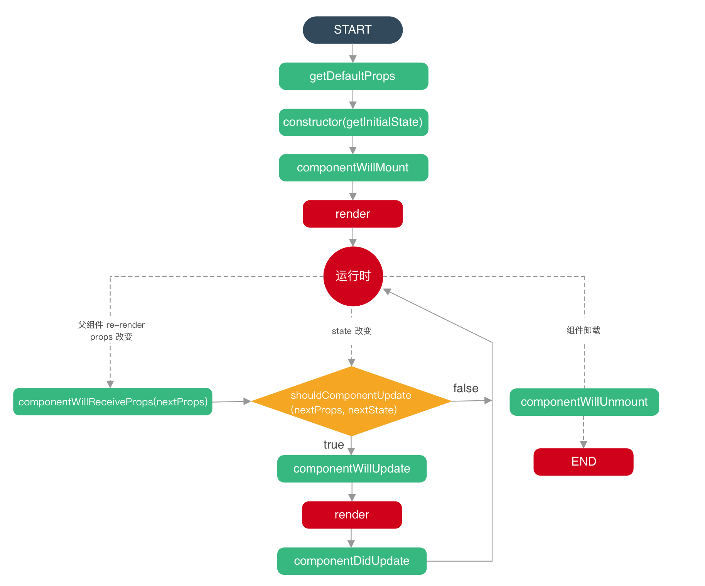

# 学习 react 需要注意的点

## 1. props 的数据不可修改，在当前组件中受到保护

保护单向数据流的设计理念

## 2. onClick bind

`onClick = { this.handleClick }`

解决方案两个：

1. bind，绑定当前的组件中否则 this 是被调用时候的对象(这里指的是调用当前组件的组件)

2. 把 handleClick 中的 this 穿透到当前(这里指的是当前的组件)中去

## 3. react 的生命周期



个人感觉 react 的生命周期是简单的

## 4. setState 的同步异步问题

疑问：如何让 setState 同步执行

注意：在异步的情况下，第二个参数，也就是回调的使用

## 5. 受控组件和非受控组件

在表单输入中

受控组件：使 React 的 state 成为“唯一数据源”。渲染表单的 React 组件还控制着用户输入过程中表单发生的操作。被 React 以这种方式控制取值的表单输入元素就叫做“受控组件”。可以理解为表单组件的 value 只能够使用 setState()来控制

非受控组件：可以理解为不与 state 相关联，而是单纯的使用 ref 或者操作 dom 的方式去改变，也可以理解为内容过完全由用去定义，代码不做设置

## 6. redux 上面的方法和数据获取

这只是其中的一种处理方法

`this.props[methods]`:

`this.props.currentuser`

`this.props.fetchCurrentUser()`

`export default withRouter(connect(mapStateToProps, mapDispatchToProps)(Home))`在 router 中调用 redux 的方法。添加属性和方法，以这一种方式导出具体的某一个组件

```js
const mapStateToProps = state => ({
  currentuser: state.currentuser.data,
  ...
});
const mapDispatchToProps = dispatch => ({
  fetchCurrentUser: payload => dispatch({
    type: actionTypes.FETCH_CURRENT_USER,
    payload,
  }),
  ...
});
```

## 7. 如何获取 query 和 params 上面的数据

`this.props.match.params[prop]`

`this.props.match.query[prop]`

## 8. state 的数据改动

state 的改动如果没有动址，则可以直接改动，eg:

```js
this.state.obj.a = 3;
```

> 注意：这种并不会触发生命周期函数中的 componentWillUpdate 的钩子，还是需要 setState 来触发

如果改变的是值，则需要使用 setState，eg:

```js
this.setState({ a: 3 });
```

## 9. store 中的 state 的三大原则

- 单一的数据源 --- object tree

- state 是只读的 --- 改变 state 的唯一方法就是触发 action

- 使用纯函数来修改 state --- reducers，改变之后返回给的是 state，而不是相关的业务组件，这个一定要搞清楚

补充一点：严格的单向数据流是 Redux 架构的设计核心。

## 10. Action

Action 是把数据从应用（这里之所以不叫 view 是因为这些数据有可能是服务器响应，用户输入或其它非 view 的数据 ）传到 store 的有效载荷。它是 store 数据的唯一来源。一般来说你会通过 store.dispatch() 将 action 传到 store。

## 11. Reducer

reducer 就是一个纯函数，接收旧的 state 和 action，返回新的 state

为了保持 reducer 的纯洁，注意不要在 reducer 里面做如下的事情：

- 修改传入参数；
- 执行有副作用的操作，如 API 请求和路由跳转；
- 调用非纯函数，如 Date.now() 或 Math.random()。

目的：只要传入参数相同，返回计算得到的下一个 state 就一定相同。没有特殊情况、没有副作用，没有 API 请求、没有变量修改，单纯执行计算。

## 12. 使用 redux-saga(一个 react 的中间键)时候的顺序

业务 this.props[methods] --> saga 中的 methods(一般是异步的)---> put(相当于 dispatch) ---> reducer ---> store ---> view

## 13. 函数命名

以前自己写项目还好点，感觉 getData、show、visible 这样的也没什么问题，但是这次看了一个新项目，别人这样命名心里喷死他了，这个也和 vue 和 react 之间的区别有关，vue 中可能一个 vue 文件里面只有一个 showdialog，也只有一次请求数据，所以这种命名还好点，但是在 react 中一个文件那么大，上来一个 getData 这个命名完全没什么意义，和 a 没什么差别，所以以后在写代码的时候不管怎么说，命名一定要语义化

## 14. 组合 vs 继承

组合和继承，在 react 的文档中推荐使用组合而非继承来实现组件间的代码重用

包含关系可以理解为 vue 中的插槽的概念

组件可以接受任意 props，包括基本数据类型，React 元素以及函数

## 设计 state 的时候

只保留应用所需的可变 state 的最小集合，其他数据均由它们计算产生，就像在 vue 中我们会有一些 computed 属性一样

以下的情况的数据都不应该放在 state 里面：

1. 该数据是否是由父组件通过 props 传递而来的？如果是，那它应该不是 state。
2. 该数据是否随时间的推移而保持不变？如果是，那它应该也不是 state。
3. 你能否根据其他 state 或 props 计算出该数据的值？如果是，那它也不是 state。

## 15. state 中的值应该如何合理的设计

1. 找到根据这个 state 进行渲染的所有组件。
2. 找到他们的共同所有者（common owner）组件（在组件层级上高于所有需要该 state 的组件）。
3. 该共同所有者组件或者比它层级更高的组件应该拥有该 state。
4. 如果你找不到一个合适的位置来存放该 state，就可以直接创建一个新的组件来存放该 state，并将这一新组件置于高于共同所有者组件层级的位置。

## 16. 高阶组件(HOC)

HOC 不会修改传入的组件，也不会使用继承来复制其行为。相反，HOC 通过将组件包装在容器组件中来组成新组件。HOC 是纯函数，没有副作用。

注意：

1. 不要在 render 方法中使用 HOC

2. 务必复制静态方法

3. Refs 不会被传递

## 17. 声明式和命令式

声明式和命令式是两种编程范式。react 是声明式的，jquery 那样直接操作 dom 是命令式

一般来说，声明式编程关注于发生了啥，而命令式则同时关注于咋发生的

纠正一点自己的想法：

以前总觉得 vue 和 react 一个是声明式的一个是命令式的，其实：vue 和 react 都是声明式的编程，通过操作 model 去改变 view，底层如何实现的 mv 不用去管

## 18. 什么是 Hook

Hook 是能让你在函数组件中“钩入” React 特性的函数。它们名字通常都以 use 开始

> Hook 是 React 16.8 的新增特性。它可以让你在不编写 class 的情况下使用 state 以及其他的 React 特性。

## 19. useState

作用可以相当于 class 中的 state 和 setState

## 20. useEffect

它跟 class 组件中的 componentDidMount、componentDidUpdate 和 componentWillUnmount 具有相同的用途

如果想只调用 componentDidMount

```js
useEffect(() => {}, []);
```

在某种条件下进行 update

```js
useEffect(() => {}, [count]);
```

如果想只调用 componentWillUnmount

每个 effect 都可以返回一个清除函数。如此可以将添加和移除订阅的逻辑放在一起。它们都属于 effect 的一部分。React 会在组件卸载的时候执行清除操作而不是 componentWillUnmount？

```js
useEffect(() => {
  function handleStatusChange(status) {
    setIsOnline(status.isOnline);
  }
  ChatAPI.subscribeToFriendStatus(props.friend.id, handleStatusChange);
  // Specify how to clean up after this effect:
  return function cleanup() {
    ChatAPI.unsubscribeFromFriendStatus(props.friend.id, handleStatusChange);
  };
});
```

## 21. useContext

`const value = useContext(MyContext)`

在数据传递过程中使用，如果出入的 MyContext(可能是父组件传递过来的，也可能是 store 里面的数据)发生变化，那么也会导致当前组件的数据更新

## 22. useCallback

useCallback 的作用在于利用 memoize 减少无效的 re-render，来达到性能优化的作用。还是那句老生常谈的话，“不要过早的性能优化”。从实际开发的经验来看，在做这类性能优化时，一定得观察比较优化的结果，因为某个小角落的 callback 就可能导致优化前功尽弃，甚至是适得其反。

## 23. useRef

通过 ref 拿到相关的数据，ref 的作用相比于 class 的时候作用大了很多

## 24. 如何理解依赖注入（DI）

?

## 25. 使用过的前端代理的方式

1. webpack 中的 proxy，添加 jwt 验证的验证规则

2. 使用 node 的模块(`whistle`)+chrome 的插件(`SwitchyOmega`)共同实现

## 26. hook 中的 useState

如果 useState 的前后两次不变的话，页面不会更新，所以注意在数组时候的处理，也就是关于拷贝和引用的问题
