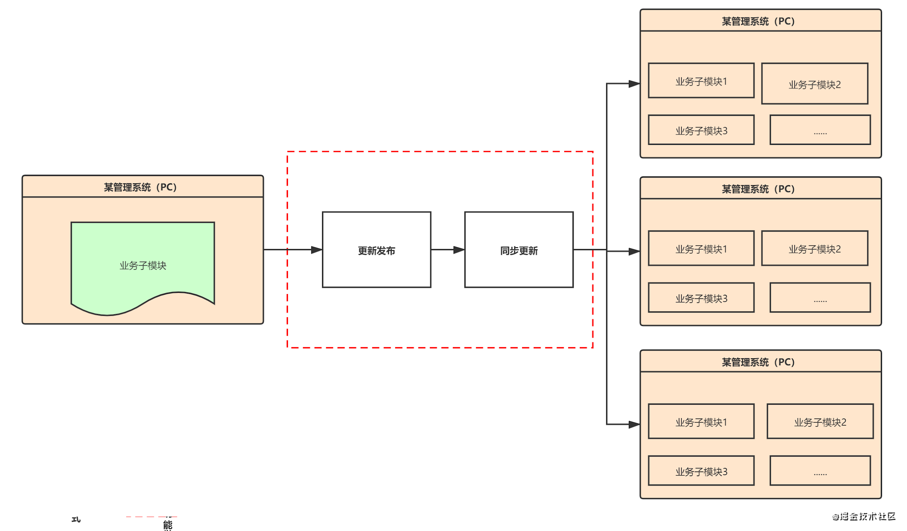
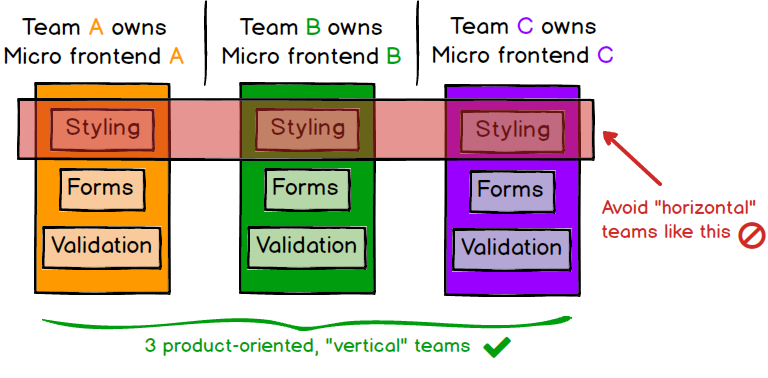

# 微前端

## 什么是微前端

### 1. 背景

做过很多的项目，基本在物理上进行了应用代码隔离，实行单个应用单个库，闭环部署更新测试环境、预发布环境和正式环境。于是，我们的探讨的是，基于不同应用不同库并独立部署的情况下，如何实现多个应用之间的资源共享？

之前比较多的处理方式是npm包形式抽离和引用，比如多个应用项目之间，可能有某业务逻辑模块或者其他是可复用的，便抽离出来以npm包的形式进行管理和使用。但这样却带来了以下几个问题：

* `发布效率低下`。如果需要迭代npm包内的逻辑业务，需要先发布npm包之后，再每个使用了该npm包的应用都更新一次npm包版本，再各自构建发布一次，过程繁琐。如果涉及到的应用更多的话，花费的人力和精力就更多了。

* `多团队协作容易不规范`。包含通用模块的npm包作为共享资产，“每个人”拥有它，但在实践中，这通常意味着没有人拥有它。它很快就会充满杂乱的风格不一致的代码，没有明确的约定或技术愿景。

因为上面的这些原因，因此微前端也就在`2016`年诞生了

### 2. 微前端的概念

> Techniques, strategies and recipes for building a modern web app with multiple teams that can ship features independently.(google翻译：与多个可以独立发布功能的团队一起构建现代Web应用程序的技术，策略和方法。)

微前端概念是从微服务概念扩展而来的，摒弃大型单体方式，将前端整体分解为小而简单的块，这些块可以独立开发、测试和部署，同时仍然聚合为一个产品出现在客户面前。可以理解微前端是一种将多个可独立交付的小型前端应用聚合为一个整体的架构风格。

需要留意的几个点

* 微前端不是一门具体的技术，而是整合了技术、策略和方法，可能会以脚手架、辅助插件和规范约束这种生态圈形式展示出来，是一种宏观上的架构。这种架构目前有多种方案，都有利弊之处，但只要适用当前业务场景的就是好方案。

* 微前端并没有技术栈的约束。每一套微前端方案的设计，都是基于实际需求出发。如果是多团队统一使用了react技术栈，可能对微前端方案的跨技术栈使用并没有要求；如果是多团队同时使用了react和vue技术栈，可能就对微前端的跨技术栈要求比较高。

### 3. 微前端的优势

* 1. 同步更新
  * 对比了npm包方式抽离，让我们意识到更新流程和效率的重要性。微前端由于是多个子应用的聚合，如果多个业务应用依赖同一个服务应用的功能模块，只需要更新服务应用，其他业务应用就可以立马更新，从而缩短了更新流程和节约了更新成本。

* 2. 增量升级
  * 由于历史包袱，有团队依旧存在使用着陈旧而庞大的前端单体模式，被过时的技术栈或赶工完成的代码质量死死拖住后腿，其程度严重到了让人想推翻重写。为了避免完全重写的风险 ，我们更加倾向于将旧的应用程序逐步地翻新，与此同时不受影响地继续为我们的客户提供新功能。
  * 微前端能使我们更加自由地对产品的各个部分做出独立的决策，让团队能做到持续地增加新功能并且对原有的整体几乎不做修改，使我们的架构、依赖以及用户体验都能够增量升级。
  * 如果主框架中有一个非兼容性的重要更新，每个微前端可以选择在合适的时候更新，而不是被迫中止当前的开发并立即更新。如果我们想要尝试新的技术，或者是新的交互模式，对整体的影响也会更小。

* 3. 简单、解耦的代码库
  * 每个单独的微前端项目的源代码库会远远小于一个单体前端项目的源代码库。这些小的代码库将会更易于开发。更值得一提的是，我们避免了不相关联的组件之间无意造成的不适当的耦合。通过增强应用程序的边界来减少这种意外耦合的情况的出现。
  * 当然了，一个独立的、高级的架构方式（例如微前端），不是用来取代规范整洁的优秀老代码的。我们不是想要逃避代码优化和代码质量提升。相反，我们加大做出错误决策的难度，增加正确决策的可能性，从而使我们进入成功的陷阱。例如，我们将跨边界共享域模型变得很困难，所以开发者不太可能这样做。同样，微前端会促使您明确并慎重地了解数据和事件如何在应用程序的不同部分之间传递，这本是我们早就应该开始做的事情！
* 4. 独立部署
  * 与微服务一样，微前端的独立可部署性是关键。它减少了部署的范围，从而降低了相关风险。无论您的前端代码在何处托管，每个微前端都应该有自己的连续交付通道，该通道可以构建、测试并将其一直部署到生产环境中。我们应当能够在不考虑其他代码库或者是通道的情况下来部署每个微服务。做到即使原来的单体项目是固定的按照季度手动发布版本，或者其他团队提交了未完成的或者是有问题的代码到他们的主分支上，也不会对当前项目产生影响。如果一个微前端项目已准备好投入生产，它应该具备这种能力，而决定权就在构建并且维护它的团队手中。

* 5. 自主的团队
  * 将我们的代码库和发布周期分离的更高阶的好处，是使我们拥有了完全独立的团队，可以参与到自己产品的构思、生产及后续的过程。每个团队都拥有为客户提供价值所需的全部资源，这就使得他们可以快速且有效地行动。为了达到这个目的，我们的团队需要根据业务功能纵向地划分，而不是根据技术种类。一种简单的方法是根据最终用户将看到的内容来分割产品，因此每个微前端都封装了应用程序的单个页面，并由一个团队全权负责。与根据技术种类或“横向”关注点（如样式、表单或验证）来组成团队相比，这会使得团队工作更有凝聚力。

### 4. 微前端方案种类

* 1. 基座模式：通过搭建基座、配置中心来管理子应用。如基于SIngle Spa的偏通用的[乾坤](https://qiankun.umijs.org/zh/guide)方案，也有基于本身团队业务量身定制的方案。

* 自组织模式： 通过约定进行互调，但会遇到处理第三方依赖等问题。

* 去中心模式： 脱离基座模式，每个应用之间都可以彼此分享资源。如基于Webpack 5 Module Federation实现的[EMP微前端方案](https://github.com/efoxTeam/emp/blob/main/README-zh_CN.md)，可以实现多个应用彼此共享资源分享。

[资料来源](https://github.com/efoxTeam/emp/wiki/%E3%80%8A%E4%BB%80%E4%B9%88%E6%98%AF%E5%BE%AE%E5%89%8D%E7%AB%AF%E3%80%8B)

