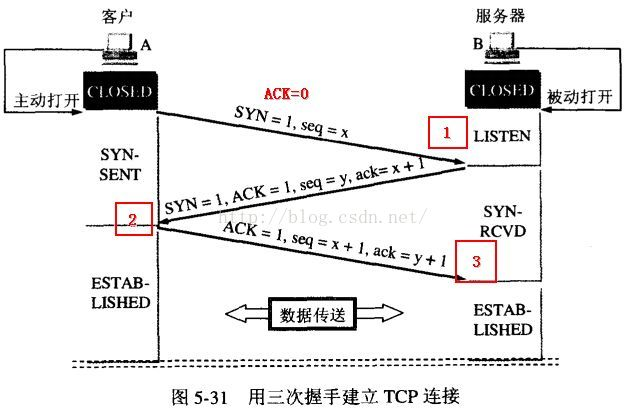
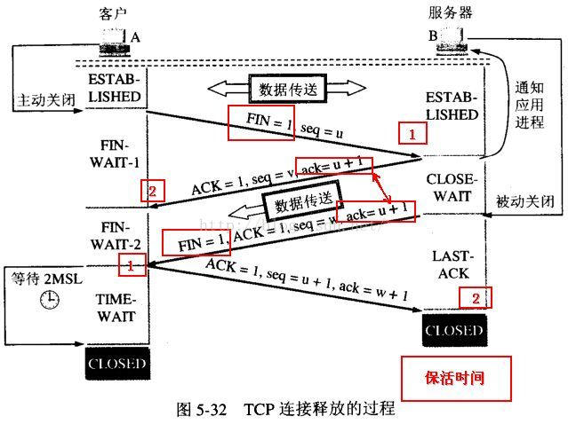

# TCP 的三次握手四次挥手的相关知识

偶尔的时间读过一些这方面的知识

将简书上的某位大佬的理解搬一下[链接](https://www.jianshu.com/p/affaea21818c)，我自己也学习一些

## 1. 建立连接协议(三次握手)

1. 第一次握手是客户端发送一个带 SYN 标志的 TCP 报文 1。
2. 第二次是服务器端回应客户端，这是三次握手中的第 2 个报文，这个报文同时带 ACK 标志和 SYN 标志。它表示对刚才客户端 SYN 报文的回应，同时又标志 SYN 给客户端，询问客户端是否准备好进行数据通讯。
3. 第三次是客户端必须再次回应服务端一个 ACK 报文。

## 2. 为什么需要三次握手

当 client 发出的第一个连接请求报文段 SYN 并没有丢失，而是在某个网络节点长时间的滞留，以导致延误时间释放以后的某个时间才到达 server。时间一过，这个报文段是已经失效的。

但是 server 收到此失效的连接报文段后，就会以为是 client 再次发出了一个新的连接请求，于是就向 client 发出确认报文段 ACK 和 SYN，同意建立连接。

加入不采取‘三次握手’，只要 server 发出确认，新的连接就建立了。由于现在 client 并没有发出建立连接的请求，因此不会理睬 server 的确认，也不会向 server 发送数据。但 server 却以为新的运输连接已经建立，并一直等待 client 发来数据。这样，server 的很多资源就白白浪费掉了。

采用‘三次握手’就可以防止上述现象发生。例如刚才那种情况，client 不会向 server 的确认发出确认，server 由于收不到确认，就知道 client 并没有要求建立连接。主要目的是防止 server 一直等待，浪费资源。

## 3. 连接终止协议(四次挥手)

1. 第一次是 TCP 客户端发送一个 FIN，用来关闭客户到服务器的数据传送（报文段 4）
2. 第二次是服务器收到这个 FIN 后，它发回一个 ACK,确认序号为收到的序号加 1（报文段 5）。和 SYN 一样，一个 FIN 将占有一个序号。
3. 第三次是服务器关闭客户端的连接，发送一个 FIN 给客户端（报文段 6）。
4. 第四次客户端发回 ACK 报文确认，并将确认序号设置为收到序号家 1（报文段 7）。

## 4. 为什么需要四次挥手

前面连接也只有三次，为什么服务器在收到客户端的 FIN 后，不一起发送 ACK 和 FIN 呢？

答：原因是因为 tcp 是全双工模式，server 接受到 FIN 时意味将没有数据再发来，但是还是可以继续发送数据。
什么是 tcp 全双工？

就是 client 和 server 都可以接收和发送数据，当 server 接受到 FIN 是 sever 可能不会立即关闭 socket，所以只能先回复一个 ACK 报文，告诉 client，你发的 FIN 报文我收到了。只有等 server 所有的报文都发送完了，server 才发生 FIN 报文，因此不能一起发送，所以需要四步挥手。
