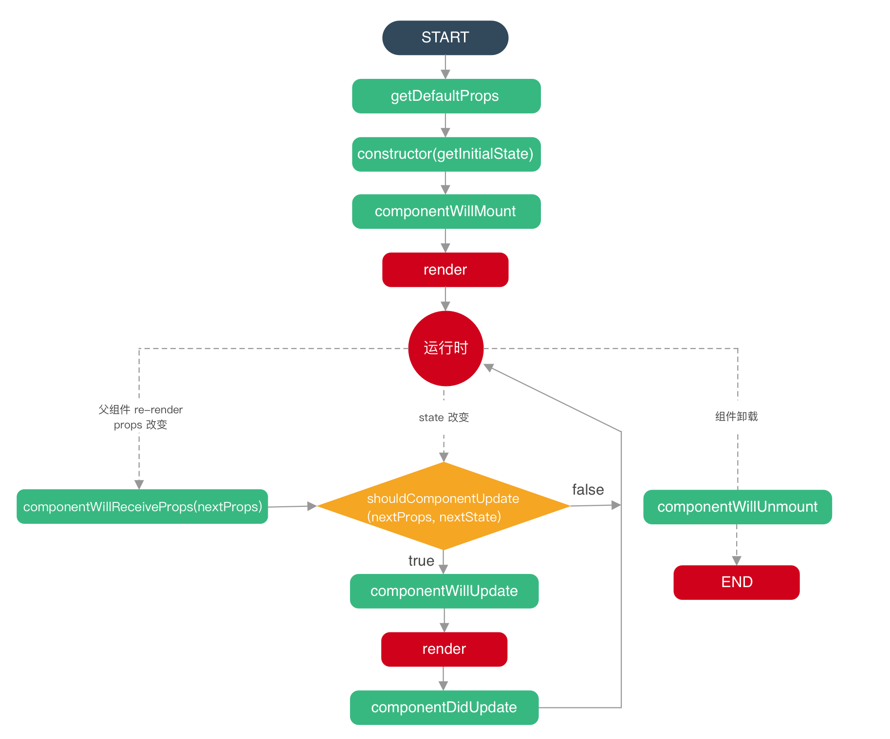

# 学习react需要注意的点

## 1. props的数据不可修改，在当前组件中收到保护

保护单向数据流的设计理念

## 2. onClick bind

`onClick = { this.handleClick }`

解决方案两个：

1. bind，绑定当前的组件中否则this是被调用时候的对象(这里指的是调用当前组件的组件)

2. 把handleClick中的this“穿透到当前(这里指的是当前的组件)中去

## 3. react的生命周期

个人感觉react的生命周期是简单的

## 4. setState的同步异步问题

疑问：如何让setState同步执行

注意：在异步的情况下，第二个参数，也就是回调的使用

## 5. 受控组件和非受控组件
