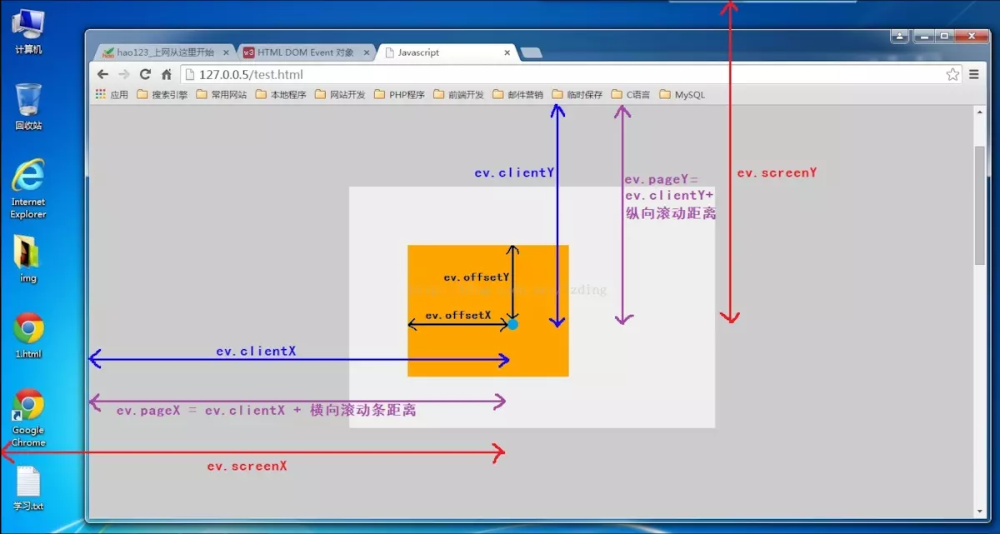
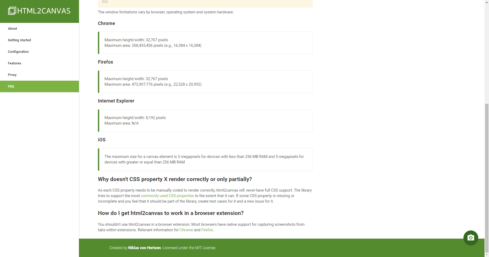
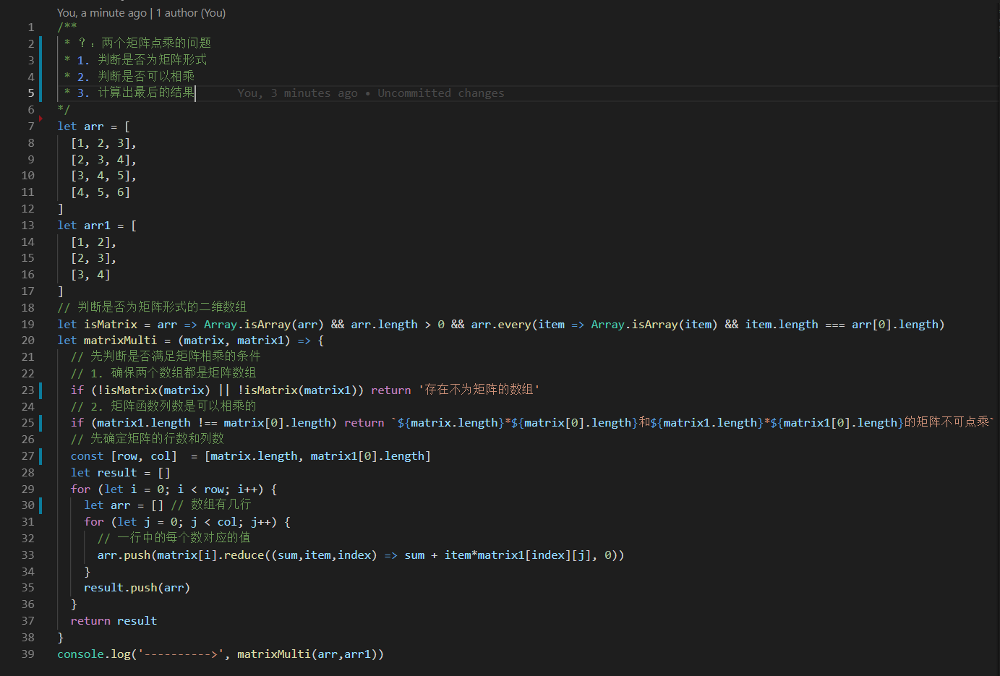
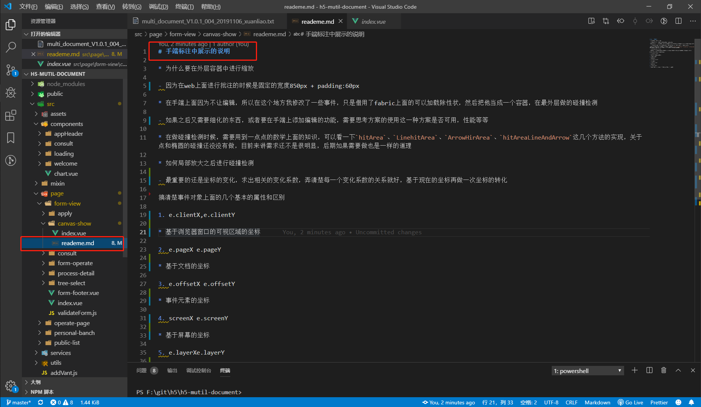

# js中的问题
js，vue，react的问题就都写在这个地方了，因为vue和react也是可以拆分为html、css、js的

## 1. react中setState的第二个参数

最近在表单设计器中，需要在打印的时候去改变页面样式，再打印完成之后再修改回来，所以需要一个值去判断用哪一种样式渲染，什么时候修改完成，<font color=red>setState有第二个参数表示页面更新之后的回调</font>，这个地方的第二个参数同`vue`中的`nextTick()`函数

>扩展一点：setState()方法在正常的声明周期里面是异步的，但是在setTImeout等中式同步的,主要因为isBatchingUpdates为false，会直接更新数据

## 2. 鼠标的坐标问题

刚做了一个关于元素拖动的东西，以前也做过一些关于位置的东西，总是搞容易搞混淆一些含义，今天有点时间，想把这个东西搞得透一点

1. clientX/clientY ------ 相对于浏览器可视区左上角（0，0）的坐标

2. screenX/screenY ------ 相对于设备屏幕左上角（0，0）的坐标  （在这个地方，也就是说，clientY-screenY是一个定值，一般使用clientY，和client都要注意滚动条的情况）

3. offsetX/offsetY ------ 相对于事件源左上角（0，0）的坐标（target和currentTarget的区别）（这个用的也是比较多的）

4. pageX/pageY ---------- 相对于整个网页的左上角（0，0）的坐标

5. X/Y ------------------ 本来是IE的属性，相对于用css动态定位（position）的最内层包含元素



## 3. html2canvas还是canvas的所占内存的问题，在转化为canvas的时候有一个最大的宽高的问题



针对这个问题在打印的时候做了分段打印的改变，开始做的是每一页调用一次html2canvas，但是发现了另一个问题，html2canvas没调用一次都会请求页面上所有的静态资源（除了js），所以减小颗粒度，每次在不超多最大宽高的时候调用一次，但是在调用超过3次的时候，需要等待的时间很长，整个生成的时候就到20秒左右，因为是图片系统打印的时间有还需要一段时间，大概也是10s左右，这个是无法忍受的，所以最后我选择弃用了这种方案

## 4. `git push 10054` git提交的时候因为提交文件过大，报错（按照道理来讲不该把git的问题放在这的，但是又懒得单独去开一个tab）

1. `git config http.postBuffer 524288000` 默认只有1M的上传大小，在这先设成500M

2. `git filter-branch --index-filter 'git rm -r --cached --ignore-unmatch <file/dir>' HEAD` 把缓存清一下

3. `git config --global   http.sslVerify "false"` 这个是干嘛的，我还真不知道，反正他生效了

## 5. `git push` 403 权限问题

1. `ssh-keygen -t rsa -C "1066788870@qq.com"` 生成ssh

2. 将`.ssh/id_rsa.pub`里面的内容添加到github中的ssh中

3. 修改项目内的`.git/config`中的url为：`url = https://用户名:密码@github.com/0227vera/blog.git`

可以先按照这三步试一下

## 6. 做完公文流转之后的收获和反思

1. 先说一下收获吧

① `keep-alive`的使用，因为自己平常写代码，习惯不是很好，在写组件的时候不喜欢加上`name`属性，在文档中有明显的说明 
<font color=red>匹配首先检查组件自身的`name`选项，如果`name`选项不可用，
则匹配它的局部注册名称 (父组件`components`选项的键值)。匿名组件不能被匹配。</font>也即是说我自己写的组件是匿名组件，
`keep-alive`不会识别，也不会缓存，<font color=red> `include`中的name为组件内部的name而非router中的name</font>

② 针对视图上面的一些处理，canvas还是有很多好用的组件或者是库，eg：`echarts.js`、`fabric.js`

③ 具备基本的数学思想，在计算canvas中的一些问题的时候会方便一些，eg：算一个点和一个矩形是否相交（碰撞）

```js
let hitArea = (point, plane) =>
!!(
    (point.x > plane.left && point.x < plane.left + plane.width)
    &&
    (point.y > plane.top && point.y < plane.top + plane.height)
  )
```

④ 合理的使用`slot`，个人的理解：如果某个`vue`子组件中使用了过多的`$emit`，我个人觉得或许可以尝试着去使用一下`slot`，
比较方便后期的维护和扩展eg：构造自己的`dialog`的时候，如果使用`slot`既可以保证自己使用的调用的方便，
又可以保证其灵活性，更重要是可以保证整个项目中的dialog风格是一致的

⑤ 不要滥用 `vuex store`，这个纯属是自己的习惯，就是觉得如果使用太多store之后不太方面后来人的维护，
但有一些对于整个项目用的比较少的请求，又建议写在`action`里面去，在适当的时候去调取

⑥ 项目发版打一下分支，并且锁一下`package.json`里面的版本

⑦ git提交规范

2. 当然，更多的地方是需要取反思的

① 有一些公共的方法们应该使用`mixins`的，但是没有使用，eg：在打开详情的时候所有的方法其实都是一样的，只是有一些判断的不一致，完全可以使用`mixins`

② 在开始项目之前没有充分去了解项目一些需求，导致后面的项目扩展和维护比较被动

③ 项目中的注释比较少，不方面后来者去维护，当然后来有所改变，个人建议，根据自己习惯写一下，不然很容易过段时间自己都看不懂自己写的代码




④ 该封装组件的地方一定要封装，该封装方法的时候一定要封装方法，真的是为了自己之后的维护好，也省得被之后维护的同学喷

<back-to-top />

<gitask />