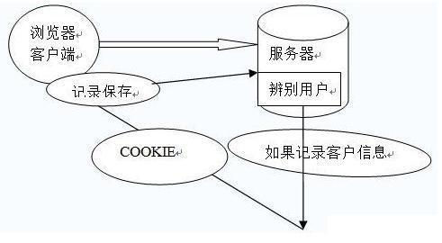

# JSON WEB TOKEN

其实在之前都没有听说这个知识点，但是现在jwt应该是目前最流行的跨域身份验证解决方案，现在我做的项目中也是使用jwt，所以想把这个搞懂一下

## 1. 跨域身份验证

Internet服务无法与用户身份验证分开，一般过程如下

1. 用户向服务端发送用户名和密码
2. 验证服务器后，相关数据（如用户角色，登录时间等）将保存在当前会话中
3. 服务器向用户返回session_id，session信息都会写入到用户的Cookie
4. 用户的每个后续请求都将通过在cookie中取出session_id传给服务器。
5. 服务器收到session_id并对比之前保存的数据，确认用户的身份

这种模式最大的问题是，没有分布式架构，无法支持很想发展，如果使用一个服务器，该模式完全没有问题。但是如果他是服务器群集活面向服务的跨域体系结构的话，则需要一个统一的session数据库来保存会话数据实现共享，这样负载均衡下的每个服务器才可以正确的验证身份。

eg: 常见的单点登陆需求，站点A和站点B提供同一公司的相关服务。现在要求是用户只需要登陆其中一个网站，然后他就会自动登陆到另一个网站，怎么做？

一种解决方案是持续化session数据，写入数据库或文件持久层等，收到请求后，验证服务从持久层请求数据，该解决方案的有点在于架构清晰，但是缺点是架构修改比较麻烦，整个服务的验证逻辑层都需要重写，工作量大，而且由于依赖于持久层的数据库或者问题系统，会有单点风险，如果持久层失败，整个认证体系都会挂掉

[详情](https://baijiahao.baidu.com/s?id=1608021814182894637&wfr=spider&for=pc)

<back-to-top />