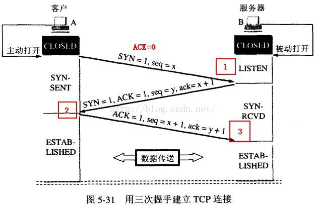
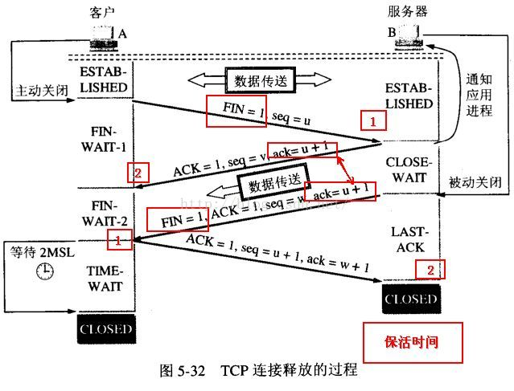

# TCP的三次握手四次挥手的相关知识

偶尔的时间读过一些这方面的知识

将简书上的某位大佬的理解搬一下[链接](https://www.jianshu.com/p/affaea21818c)，我自己也学习一些

## 1. 建立连接协议(三次握手)

1. 第一次握手是客户端发送一个带SYN标志的TCP报文1。
2. 第二次是服务器端回应客户端，这是三次握手中的第2个报文，这个报文同时带ACK标志和SYN标志。它表示对刚才客户端SYN报文的回应，同时又标志SYN给客户端，询问客户端是否准备好进行数据通讯。
3. 第三次是客户端必须再次回应服务端一个ACK报文。

## 2. 为什么需要三次握手

当client发出的第一个连接请求报文段SYN并没有丢失，而是在某个网络节点长时间的滞留，以导致延误时间释放以后的某个时间才到达server。时间一过，这个报文段是已经失效的。

但是server收到此失效的连接报文段后，就会以为是client再次发出了一个新的连接请求，于是就向client发出确认报文段ACK和SYN，同意建立连接。

加入不采取‘三次握手’，只要server发出确认，新的连接就建立了。由于现在client并没有发出建立连接的请求，因此不会理睬server的确认，也不会向server发送数据。但server却以为新的运输连接已经建立，并一直等待client发来数据。这样，server的很多资源就白白浪费掉了。

采用‘三次握手’就可以防止上述现象发生。例如刚才那种情况，client不会向server的确认发出确认，server由于收不到确认，就知道client并没有要求建立连接。主要目的是防止server一直等待，浪费资源。

## 3. 连接终止协议(四次挥手)

1. 第一次是TCP客户端发送一个FIN，用来关闭客户到服务器的数据传送（报文段4）
2. 第二次是服务器收到这个FIN后，它发回一个ACK,确认序号为收到的序号加1（报文段5）。和SYN一样，一个FIN将占有一个序号。
3. 第三次是服务器关闭客户端的连接，发送一个FIN给客户端（报文段6）。
4. 第四次客户端发回ACK报文确认，并将确认序号设置为收到序号家1（报文段7）。

## 4. 为什么需要四次挥手

前面连接也只有三次，为什么服务器在收到客户端的FIN后，不一起发送ACK和FIN呢？

答：原因是因为tcp是全双工模式，server接受到FIN时意味将没有数据再发来，但是还是可以继续发送数据。
什么是tcp全双工？

就是client和server都可以接收和发送数据，当server接受到FIN是sever可能不会立即关闭socket，所以只能先回复一个ACK报文，告诉client，你发的FIN报文我收到了。只有等server所有的报文都发送完了，server才发生FIN报文，因此不能一起发送，所以需要四步挥手。

